# AI Agents Guide

Ye file AI agents ko beginner se intermediate level tak Hinglish me samjhane ke liye banayi gayi hai.

Goal:

- AI agent kya hota hai
- agent aur normal chatbot me difference kya hai
- AI agent ka internal loop kaise kaam karta hai
- kaunse components use hote hain
- kaunse frameworks useful hote hain
- multi-agent systems kya hote hain
- generative AI aur agents ka relation kya hai
- student is topic ko kaise seekh sakta hai

## 1. AI Agent Kya Hota Hai

AI agent ek aisa software system hota hai jo:

- goal samajhta hai
- context dekhta hai
- decision leta hai
- tools use kar sakta hai
- steps me kaam kar sakta hai
- aur output de sakta hai

Simple line:

`Chatbot sirf jawab de sakta hai, agent kaam bhi kar sakta hai.`

## 2. Chatbot vs AI Agent

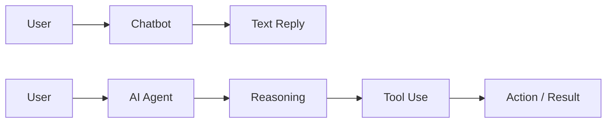

Chatbot:

- mostly text generate karta hai
- usually ek hi response deta hai

AI agent:

- plan bana sakta hai
- tools use kar sakta hai
- multiple steps me kaam kar sakta hai
- result la sakta hai

## 3. Generative AI Aur AI Agents Ka Relation

Generative AI wo technology hai jo naya content bana sakti hai.

Examples:

- text generate karna
- image generate karna
- code likhna
- summary banana

AI agents aksar generative AI models par based hote hain.

Simple relation:

- Generative AI = content banane ki capability
- AI Agent = decision + action + tool use wali capability

Yani:

`Har agent me generative AI ho sakta hai, lekin har generative AI system agent nahi hota.`

## 4. AI Agent Ka Big Picture

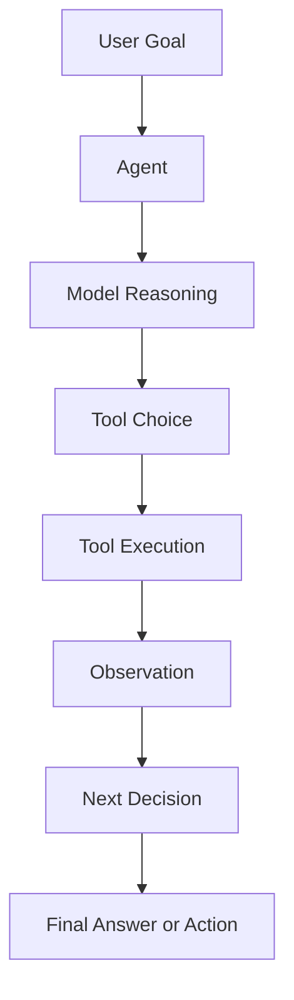

Is diagram me agent loop dikh raha hai.

Agent:

- user ka goal leta hai
- sochta hai kya karna hai
- tool choose karta hai
- result dekhkar next step decide karta hai
- last me answer ya action deta hai

## 5. AI Agent Ke Main Components

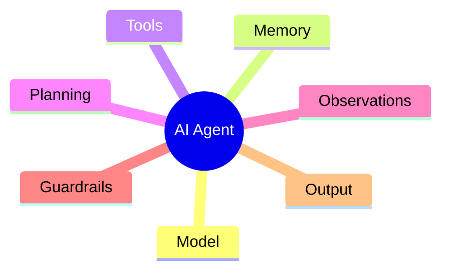

### Model

Ye reasoning ya language understanding ka brain hota hai.

### Memory

Ye past conversation, state ya task context store kar sakta hai.

### Tools

Ye external actions ke liye hote hain.

Examples:

- search
- calculator
- database
- email
- file system

### Planning

Agent ko decide karna hota hai task ko kaise todna hai.

### Observations

Tool result ya environment se jo feedback aata hai usse observation bol sakte hain.

### Guardrails

Ye safety aur behavior control karte hain.

## 6. AI Agent Ka Internal Loop

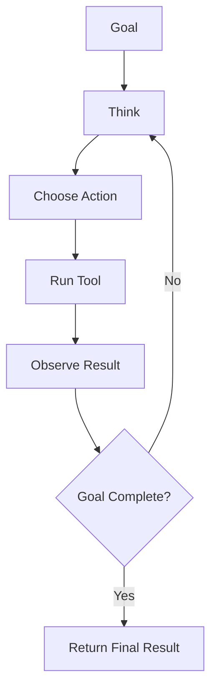

Ye sabse important diagram hai.

Agent ka core loop hota hai:

- think
- act
- observe
- repeat

Isi wajah se agent static chatbot se zyada powerful hota hai.

## 7. AI Agent Kaise Decide Karta Hai

Agent usually ye factors dekhta hai:

- user goal kya hai
- mere paas kaunse tools hain
- kya mujhe aur data chahiye
- kya task complete ho gaya
- kya answer dena safe hai

Yani agent kaam blindly nahi karta.
Wo context aur available actions ke hisaab se step choose karta hai.

## 8. AI Agent Me Tools Ka Role

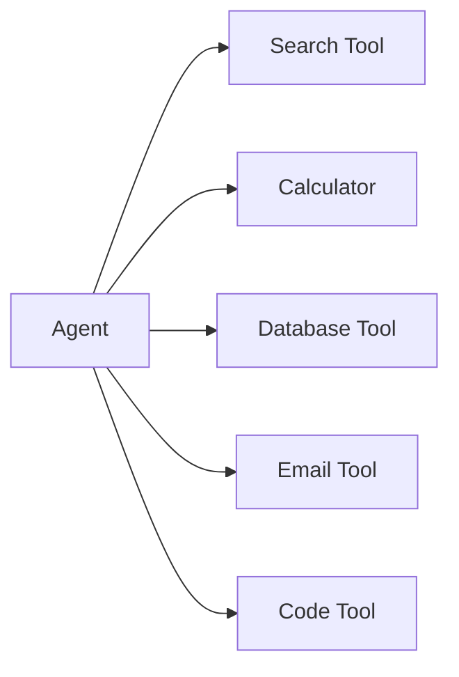

Tools hi agent ko useful banate hain.

Without tools:

- agent sirf text generator jaisa lag sakta hai

With tools:

- agent real actions kar sakta hai
- fresh data la sakta hai
- calculations kar sakta hai
- files read/write kar sakta hai

## 9. AI Agent Me Memory Ka Role

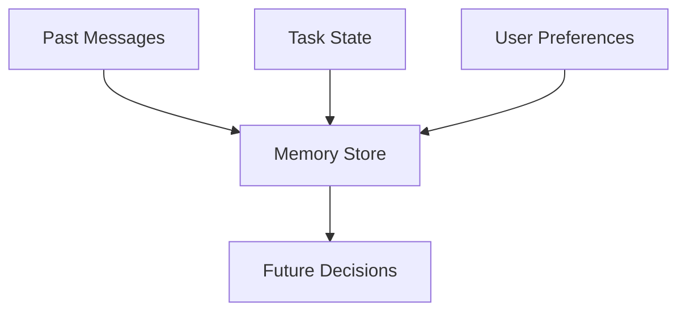

Memory useful hoti hai taaki agent:

- repeat context na puche
- task state yaad rakhe
- user preference yaad rakhe
- long workflow sambhale

## 10. Planning Kya Hota Hai

Planning ka matlab:

- bade task ko chhote steps me todna

Example:

User bole:
`Mujhe market research report banao`

Agent planning kar sakta hai:

1. data gather karo
2. competitors identify karo
3. report outline banao
4. draft likho
5. summary do

## 11. AI Agent Ka Execution Flow

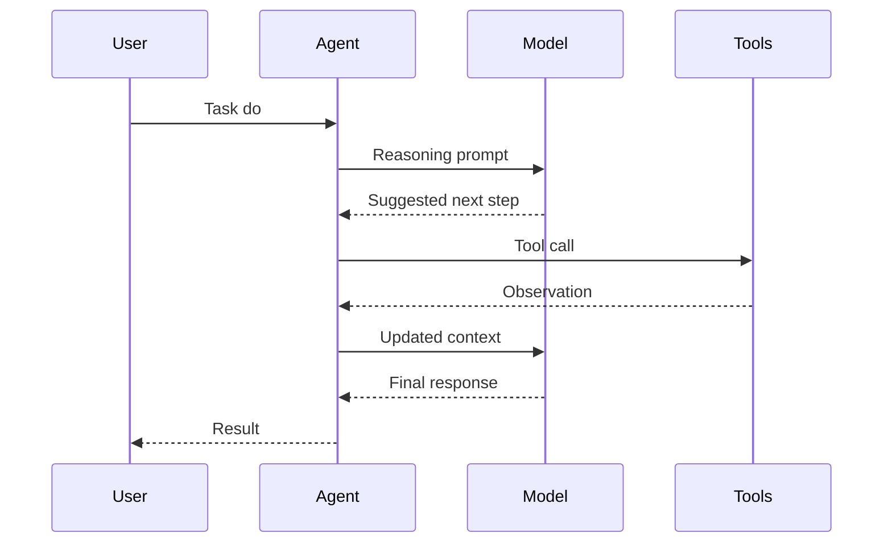

Is flow se samajh aata hai ki agent aur model same cheez nahi hote.

Model:

- sochne ya generate karne me help karta hai

Agent:

- poora system hota hai jo tools aur workflow manage karta hai

## 12. AI Agents Ke Types

High level par common agent types:

- conversational agent
- research agent
- coding agent
- support agent
- workflow automation agent
- retrieval agent
- analysis agent

Har type ka focus alag hota hai,
lekin base loop similar hota hai.

## 13. Single-Agent vs Multi-Agent

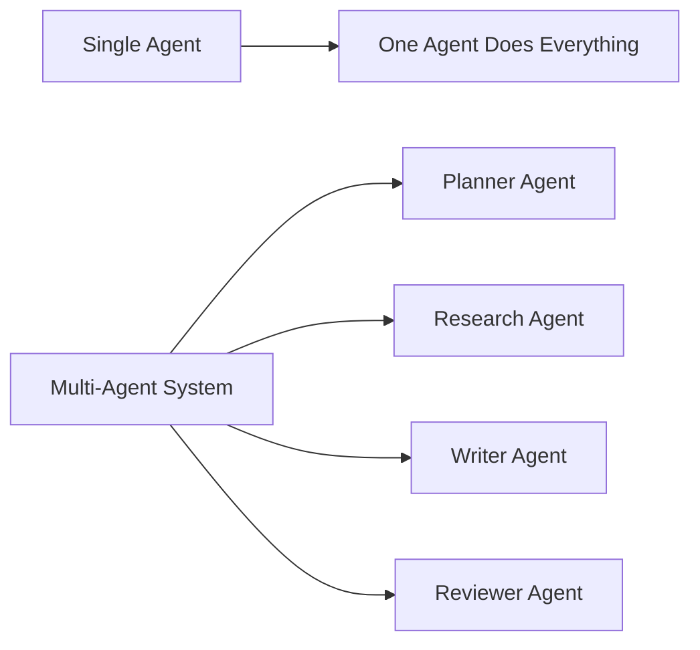

### Single Agent

Ek hi agent task ke saare parts handle karta hai.

Fayda:

- simple hota hai
- build karna easy hota hai

### Multi-Agent

Multiple specialized agents milkar kaam karte hain.

Fayda:

- specialization milti hai
- bada task cleanly divide hota hai
- teamwork jaisa behavior milta hai

## 14. Multi-AI Agents Ka Concept

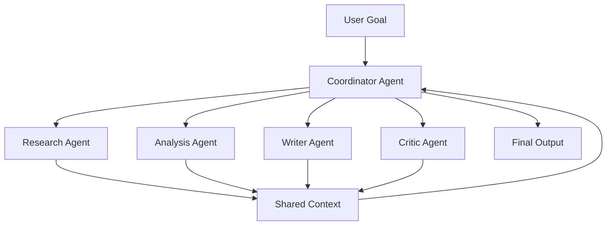

Multi-agent system me:

- ek coordinator hota hai
- alag agents alag role lete hain
- shared context ya messages exchange hote hain
- final output combine hota hai

Example:

- research agent data lata hai
- analysis agent insight nikalta hai
- writer agent polished answer likhta hai
- critic agent mistakes pakadta hai

## 15. Multi-Agent Kab Useful Hota Hai

Multi-agent approach tab useful hoti hai jab:

- task complex ho
- multiple skills chahiye ho
- review loop chahiye ho
- parallel work possible ho

Lekin har jagah multi-agent banana zaruri nahi.

Kabhi-kabhi single good agent better hota hai,
kyunki system simpler rehta hai.

## 16. AI Agent Ka Brain Kis Par Chalta Hai

Usually agent ka reasoning layer kisi LLM ya generative model par based hota hai.

Examples:

- language model
- code model
- multimodal model

Important:

Agent = sirf model nahi

Agent = model + tools + memory + control loop + guardrails

## 17. AI Agent Build Karne Ke Liye Kya Chahiye

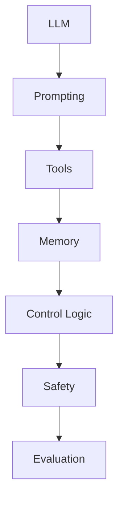

Agent build karne ke liye commonly ye layers chahiye hoti hain:

- model
- prompts
- tools
- orchestration logic
- memory/state
- safety rules
- evaluation

## 18. Kaunse Frameworks Helpful Hain

AI agents ke liye commonly used ecosystem ideas:

- OpenAI Agents SDK
- LangChain / LangGraph
- AutoGen
- CrewAI
- custom Python orchestration

Framework choose karte waqt dekho:

- simple project hai ya complex
- multi-agent chahiye ya nahi
- tracing chahiye ya nahi
- deployment kaisa hoga
- control kitna chahiye

## 19. AI Agent Safety Kyu Important Hai

Agent actions kar sakta hai,
isliye risk normal chatbot se zyada ho sakta hai.

Risks:

- wrong tool call
- harmful action
- data leak
- hallucinated decisions
- over-automation

Controls:

- permissions
- confirmations
- allowlist tools
- rate limits
- human approval
- logging

## 20. AI Agent Evaluation Kaise Hoti Hai

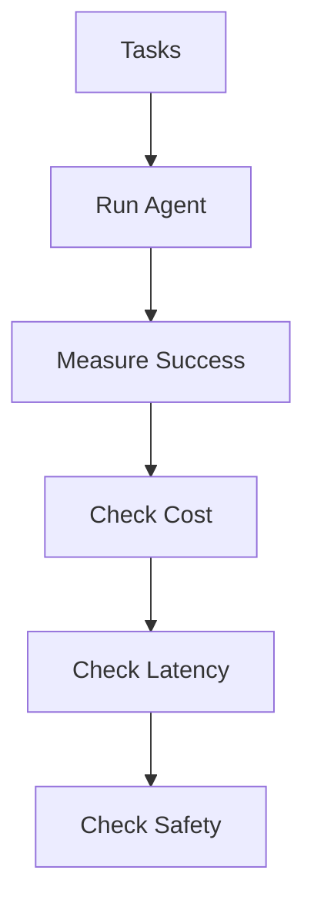

Agent evaluation me sirf answer quality nahi dekhte.

Hum dekhte hain:

- task success rate
- tool correctness
- cost
- latency
- safety
- reliability

## 21. Student Learning Path

Best path:

1. generative AI basics samjho
2. prompting samjho
3. tools ka idea samjho
4. single-agent loop banao
5. memory add karo
6. evaluation add karo
7. phir multi-agent explore karo

## 22. AI Agents Se Kaunsi Skills Milti Hain

Is topic ko samajhne ke baad student ye skills le sakta hai:

- LLM application design
- tool integration
- workflow orchestration
- memory design
- agent evaluation
- safety thinking
- prompt engineering
- multi-agent architecture understanding

## 23. Kahan Se Seekhen

Strong resources:

- OpenAI Agents SDK docs:
  `https://platform.openai.com/docs/guides/agents-sdk/`
- Anthropic agent engineering article:
  `https://www.anthropic.com/engineering/building-agents-with-the-claude-agent-sdk/`
- Anthropic effective agents resource:
  `https://resources.anthropic.com/hubfs/Building%20Effective%20AI%20Agents-%20Architecture%20Patterns%20and%20Implementation%20Frameworks.pdf?hsLang=en`
- Microsoft AutoGen docs:
  `https://microsoft.github.io/autogen/`

## 24. Final Summary

AI agent ek aisa system hai jo model ki intelligence ko tools, memory aur control loop ke saath combine karta hai.

Single-agent systems simple aur practical hote hain.
Multi-agent systems specialization aur teamwork jaisa behavior dete hain.

Student ke liye sabse important baat:

`Agent banana matlab sirf model use karna nahi,`
`balki model ke around ek intelligent system design karna hai.`
