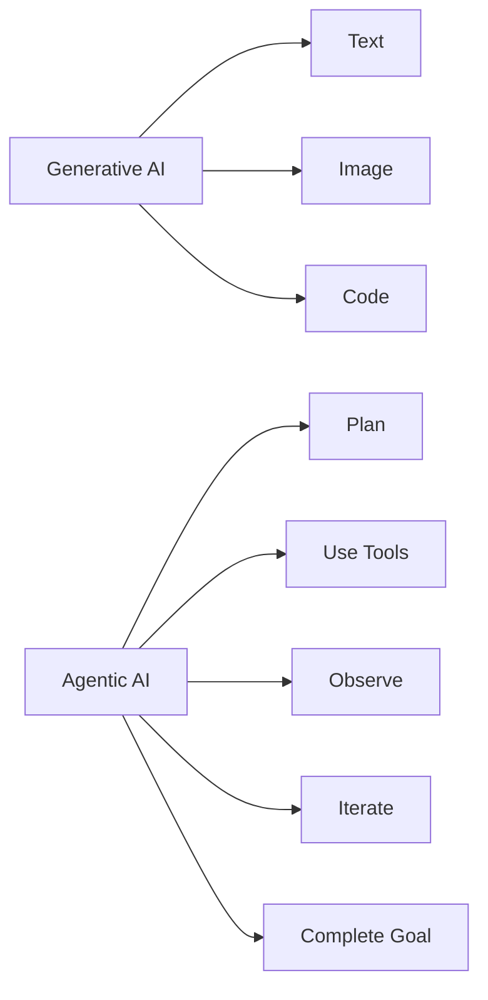
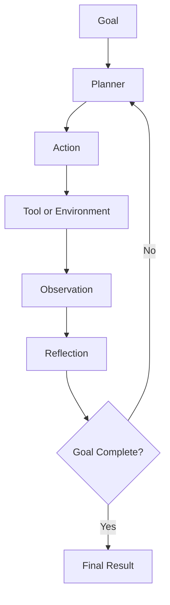
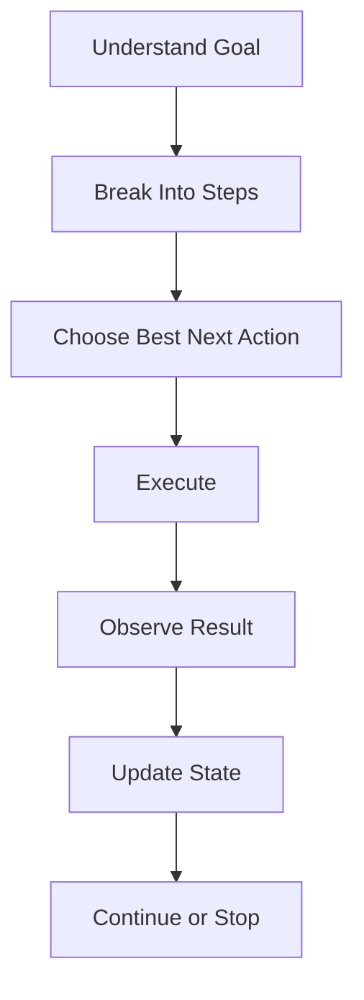
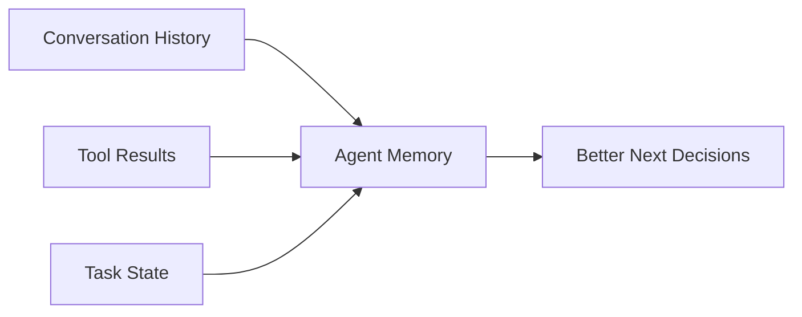
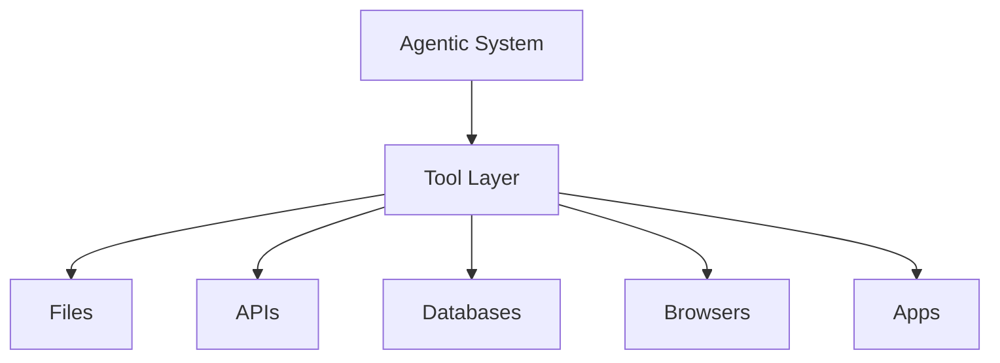
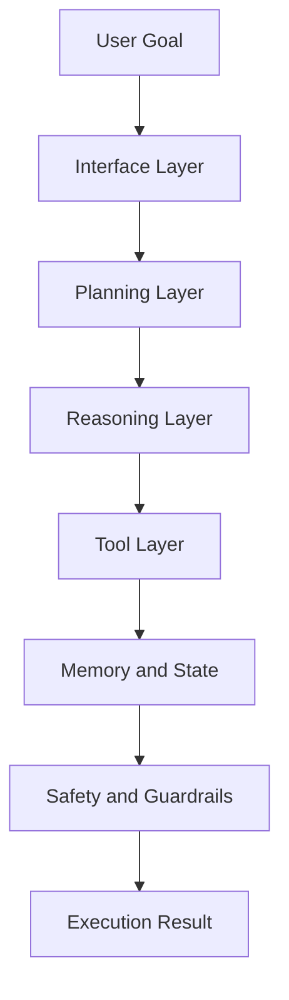
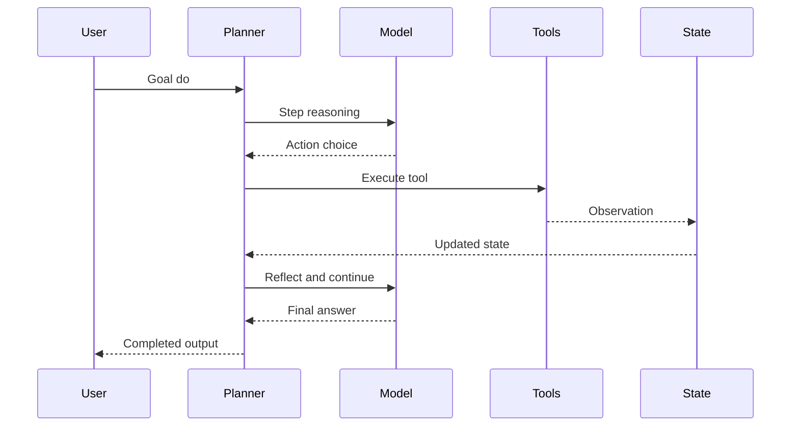
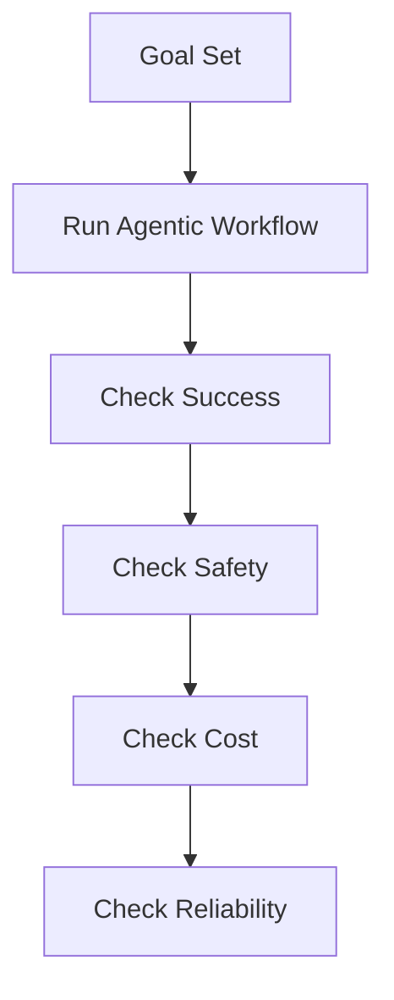
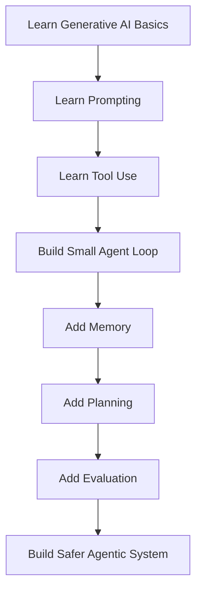

# Agentic AI Guide

Ye file `Agentic AI` ko simple se advanced tak Hinglish me samjhane ke liye banayi gayi hai.

Is file ka goal:

- Agentic AI kya hota hai
- generative AI se iska difference kya hai
- agentic systems kaise kaam karte hain
- planning, tool use, feedback loop aur autonomy ka role kya hai
- real-world architecture kaise sochi jati hai
- student ko kya-kya seekhna chahiye

## 1. Agentic AI Kya Hota Hai

Agentic AI ka matlab hota hai aise AI systems jo:

- goals ke saath kaam kar sakein
- multi-step decisions le sakein
- tools use kar sakein
- apne results dekhkar next step choose kar sakein
- kuch had tak autonomous behavior dikha sakein

Simple line:

`Generative AI content banata hai, Agentic AI kaam complete karne ki koshish karta hai.`

## 2. Generative AI vs Agentic AI

### Generative AI

Generative AI ka main kaam hota hai naya content banana.

Examples:

- essay likhna
- image banana
- code likhna
- summary banana

### Agentic AI

Agentic AI ka main kaam hota hai goal-oriented workflow chalana.

Examples:

- research karna
- task plan karna
- multiple tools use karna
- report complete karna

## 3. Agentic AI Ka Core Formula

Agentic AI ko aap roughly aise samajh sakte ho:

`Model + Tools + Memory + Planning + Feedback Loop + Goal`

In sabko combine karne par ek static model se dynamic system banta hai.

## 4. Agentic AI Ka Big Picture

Ye agentic loop ka heart hai.

System:

- goal leta hai
- action choose karta hai
- result dekhta hai
- reflect karta hai
- repeat karta hai

## 5. Agentic AI Me Autonomy Kya Hoti Hai

Autonomy ka matlab hota hai system har chhoti cheez ke liye human ke next message ka wait na kare.

Lekin autonomy ke levels hote hain:

- low autonomy
  AI suggestion deta hai, human approve karta hai
- medium autonomy
  AI kuch tools chalata hai, risky actions me approval leta hai
- high autonomy
  AI multiple steps khud se run karta hai

Important:

High autonomy hamesha better nahi hoti.
Safe aur controllable autonomy zyada important hoti hai.

## 6. Agentic AI Ka Decision Loop

Is flow se samajh aata hai ki agentic AI one-shot system nahi hota.
Ye iterative hota hai.

## 7. Reflection Kya Hota Hai

Reflection ka matlab hota hai:

- jo result mila usko dekhkar sochna
- kya ye sahi direction me tha
- next step kya hona chahiye

Reflection ki wajah se system apni mistakes reduce kar sakta hai.

## 8. Planning Kya Hota Hai

Planning ka matlab:

- goal ko structured steps me todna

Example:

Goal:
`Startup ke liye competitor research report banao`

Plan:

1. competitors list karo
2. data gather karo
3. compare features
4. summarize findings
5. final report likho

## 9. Memory Kya Karti Hai

Memory agentic system me bahut important hoti hai.

Ye help karti hai:

- task ka current state yaad rakhne me
- previous results use karne me
- same kaam repeat na karne me
- long workflows manage karne me

## 10. Tool Use Kyu Zaruri Hai

Without tools, agentic AI kaafi limited ho jata hai.

Tools allow karte hain:

- web search
- calculator
- code execution
- file access
- database access
- APIs
- emails / tickets / reports

Yani tool use AI ko text-only system se action-capable system banata hai.

## 11. Agentic AI Aur Environment

Agentic AI vacuum me kaam nahi karta.
Use kisi environment ke saath interact karna hota hai.

Environment ho sakta hai:

- file system
- browser
- enterprise software
- CRM
- helpdesk
- coding repo

## 12. Agentic AI Architecture Layers

Real-world agentic systems me commonly ye layers hoti hain:

- interface
- planner
- reasoning
- tool execution
- memory
- safety
- evaluation

## 13. Agentic AI Ka Real-World Flow

Ye diagram batata hai ki agentic AI me planning aur state management kitna important hota hai.

## 14. Agentic AI Me Failure Kahan Hota Hai

Common failure points:

- galat plan
- galat tool selection
- hallucinated observation
- unsafe action
- task ko too early complete maan lena
- memory confusion

Isliye agentic systems me testing aur evaluation bahut important hoti hai.

## 15. Agentic AI Evaluation Kaise Sochi Jati Hai

Agentic AI ko judge karte waqt ye dekhte hain:

- task success
- correctness
- safety
- latency
- cost
- consistency

## 16. Agentic AI vs Workflow Automation

Workflow automation me usually fixed rules hoti hain.

Agentic AI me:

- system dynamic decisions leta hai
- uncertain cases handle kar sakta hai
- different paths choose kar sakta hai

Simple difference:

- automation = predefined path
- agentic AI = adaptive path

## 17. Kya Har Jagah Agentic AI Chahiye

Nahi.

Kabhi simple solution better hota hai:

- normal script
- fixed workflow
- search + answer system
- plain chatbot

Agentic AI tab use karo jab:

- task multi-step ho
- environment dynamic ho
- decision making chahiye ho
- tool orchestration useful ho

## 18. Student Ke Liye Build Path

Best path:

1. generative AI basics
2. prompting
3. tools
4. simple agent loop
5. memory
6. planning
7. evaluation
8. safety

## 19. Agentic AI Se Kaunsi Skills Milti Hain

Is topic ko samajhne ke baad student ye skills le sakta hai:

- goal decomposition
- tool orchestration
- memory/state design
- iterative reasoning understanding
- autonomy control
- safety thinking
- agent evaluation
- AI product system design

## 20. Generative AI Is File Me Kyu Important Hai

Generative AI ko samjhe bina agentic AI ko fully samajhna mushkil hota hai,
kyunki agentic systems ka reasoning aur response layer aksar generative models par hi based hota hai.

Yani:

- generative AI foundation hai
- agentic AI applied intelligent system hai

## 21. Kahan Se Seekhen

Helpful resources:

- OpenAI Agents SDK overview:
  `https://platform.openai.com/docs/guides/agents-sdk/`
- OpenAI in-house data agent article:
  `https://openai.com/index/inside-our-in-house-data-agent/`
- Anthropic alignment auditing agents article:
  `https://alignment.anthropic.com/2025/automated-auditing/`
- Anthropic effective agents resource:
  `https://resources.anthropic.com/hubfs/Building%20Effective%20AI%20Agents-%20Architecture%20Patterns%20and%20Implementation%20Frameworks.pdf?hsLang=en`

## 22. Final Summary

Agentic AI aise AI systems ka idea hai jo sirf generate nahi karte,
balki goals ko pursue karte hain, tools use karte hain, results observe karte hain aur multi-step flow me kaam karte hain.

Student ke liye ye topic bahut powerful hai,
kyunki isse AI ko ek real working system ke roop me dekhna aata hai,
na ki sirf ek text generator ke roop me.
