# MCP Guide

Ye file student ke liye Model Context Protocol yani `MCP` ko simple aur deep dono level par samjhane ke liye banayi gayi hai.

Goal ye hai ki is file ko padhne ke baad aapko ye clear ho jaye:

- MCP kya hota hai
- ye kyu bana
- ye kaise kaam karta hai
- MCP client, host aur server ka role kya hai
- MCP server kaise banta hai
- kaunse frameworks, SDKs aur tools use hote hain
- security aur permissions ka role kya hai
- MCP ko kahan-kahan use kar sakte ho
- aur aage is topic ko aur kahan se seekh sakte ho

## 1. MCP Kya Hota Hai

MCP ka full form hai `Model Context Protocol`.

Simple language me:

MCP ek standard protocol hai jo AI apps ko tools, data sources, prompts aur resources ke saath connect karne ka common tareeka deta hai.

Aap ise aise samjho:

- AI model akela soch sakta hai
- lekin usse external duniya se baat karne ke liye connectors chahiye hote hain
- MCP woh standard bridge hai

MCP ka main fayda:

- har tool ke liye alag custom integration likhne ki zarurat kam hoti hai
- host apps aur servers ek common language me baat kar sakte hain
- reusable ecosystem banta hai

## 2. MCP Kyu Important Hai

AI applications me ek common problem hoti hai:

- model ko file chahiye
- database chahiye
- API chahiye
- prompt templates chahiye
- local tools chahiye

Agar har app har integration alag tarike se banaye,
to system messy ho jata hai.

MCP is problem ko solve karta hai by standardizing:

- tool discovery
- resource discovery
- prompt discovery
- request/response structure
- host-server communication

## 3. MCP Ka Big Picture

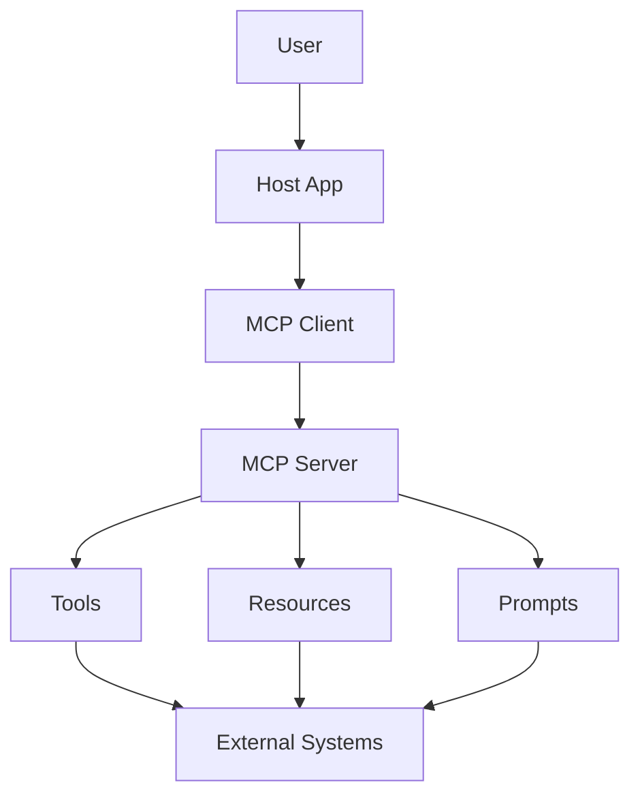

Is diagram ka matlab:

- user host app me request deta hai
- host ke andar MCP client hota hai
- client MCP server se connect hota hai
- server tools, resources aur prompts expose karta hai
- fir wo external systems se data ya actions la sakta hai

## 4. MCP Architecture Ke Main Parts

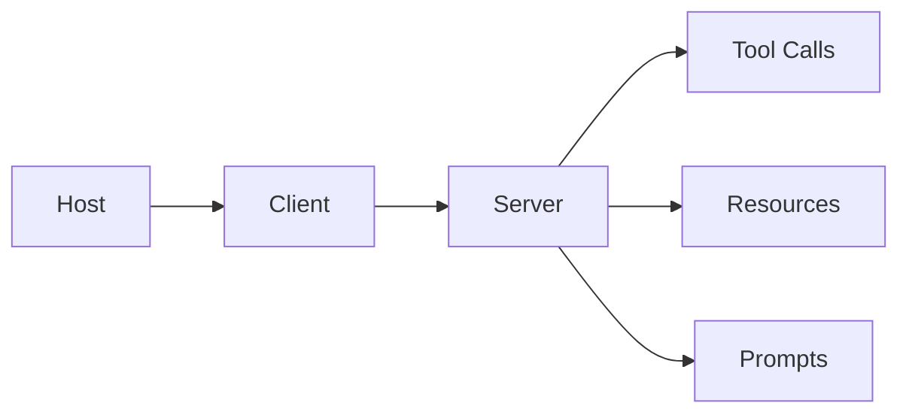

### Host

Host wo app hoti hai jisme user ka actual experience hota hai.

Examples:

- IDE
- desktop app
- CLI tool
- chat app

Host ka role:

- user interaction handle karna
- connection manage karna
- permissions control karna
- AI model aur MCP clients ko coordinate karna

### Client

Client host ke andar chalne wala communication layer hota hai.

Iska role:

- server se session banana
- protocol messages bhejna
- replies receive karna
- host aur server ke beech bridge banna

### Server

Server actual MCP functionality expose karta hai.

Ye bata sakta hai:

- mere paas kaunse tools hain
- mere paas kaunse resources hain
- mere paas kaunse prompts hain

## 5. MCP Ka Core Idea

MCP ka core idea hai:

`AI app ko external context aur actions ke saath standardized tarike se jodna`

Is standardized system me teen major cheezein commonly milti hain:

- `Tools`
- `Resources`
- `Prompts`

## 6. Tools, Resources Aur Prompts Kya Hote Hain

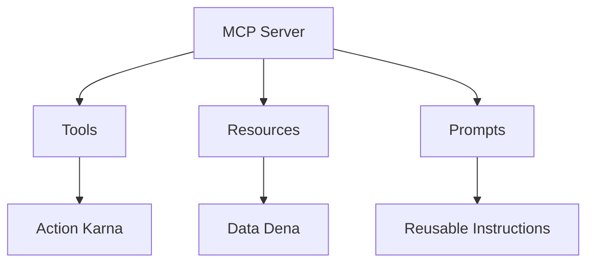

### Tools

Tools wo operations hote hain jo kuch kaam karte hain.

Examples:

- weather fetch karna
- file create karna
- database query chalana
- email bhejna

### Resources

Resources wo data/context hote hain jo model ko diya ja sakta hai.

Examples:

- files
- docs
- schemas
- tickets
- notes

### Prompts

Prompts reusable instructions ya templates hote hain jo host use kar sakta hai.

Examples:

- code review prompt
- summarization prompt
- domain-specific guidance

## 7. MCP Request Flow Kaise Chalta Hai

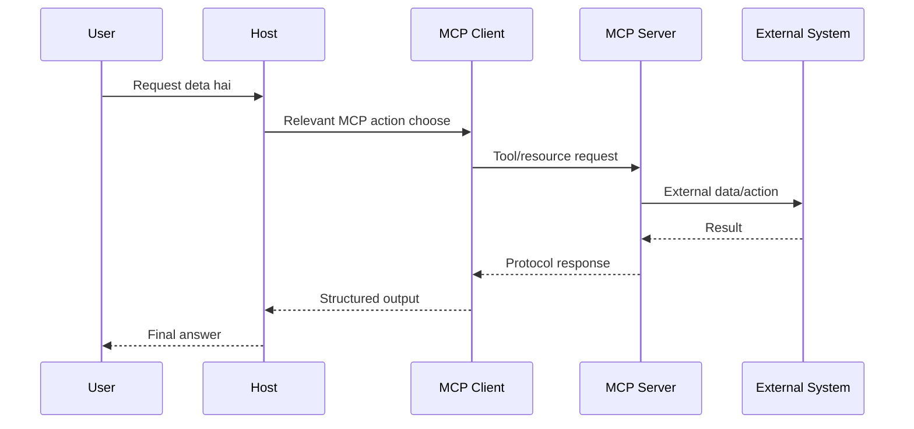

Is flow me:

- user request karta hai
- host decide karta hai MCP use karna hai ya nahi
- client server ko request bhejta hai
- server external system se baat karta hai
- result wapas host ko milta hai

## 8. MCP Kis Protocol Par Bana Hota Hai

High level par MCP JSON-RPC based communication style use karta hai.

Iska matlab:

- requests structured hoti hain
- responses structured hoti hain
- methods ka concept hota hai
- errors bhi standard shape me aate hain

Ye loose custom messaging se better hota hai,
kyunki systems predictable tarike se baat kar pate hain.

## 9. MCP Me Session Kyu Important Hai

MCP stateful session model use kar sakta hai.

Iska fayda:

- initialization ke time capabilities negotiate ho sakti hain
- host ko pata hota hai server kya support karta hai
- permissions aur lifecycle control karna easy hota hai

Simple meaning:

Connection shuru hone par dono sides pehle decide karte hain:

- kaunsa version use hoga
- kya-kya supported hai
- aage kaise baat karni hai

## 10. Capabilities Kya Hoti Hain

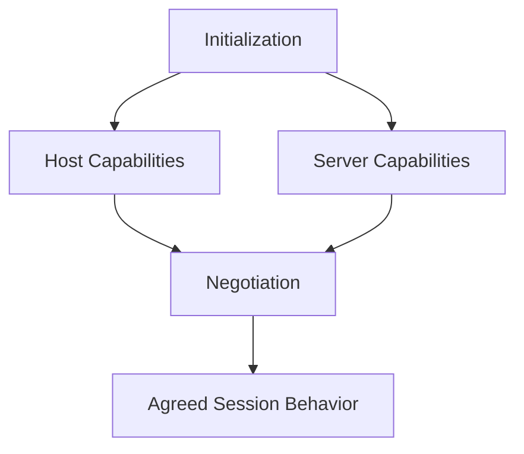

Capabilities ka matlab:

- server kya de sakta hai
- client kya handle kar sakta hai

Examples:

- tools support
- resources support
- prompts support
- streaming ya notifications support

Ye negotiation compatibility ensure karti hai.

## 11. MCP Server Kaise Banta Hai

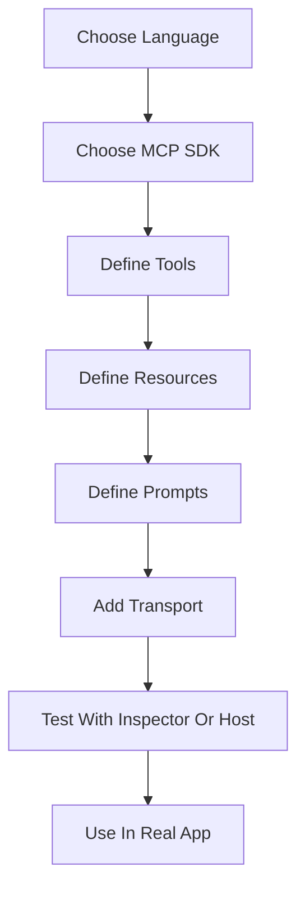

MCP server banane ka practical flow:

1. language choose karo
2. MCP SDK choose karo
3. tools define karo
4. resources define karo
5. prompts define karo
6. transport configure karo
7. test karo
8. host app me use karo

## 12. MCP Server Ke Andar Kya Code Hota Hai

Ek typical MCP server me ye cheezein hoti hain:

- server bootstrap
- tool registration
- resource registration
- prompt registration
- input validation
- permission handling
- transport setup
- logging / debugging

Simple samjho:

MCP server ek structured adapter hota hai jo real duniya ke systems ko AI world ke liye expose karta hai.

## 13. MCP Me Kaunse Frameworks Ya SDKs Use Hote Hain

Student ke liye most practical options ye hote hain:

- official MCP SDKs
- TypeScript / JavaScript ecosystem
- Python ecosystem
- C# ecosystem

Conceptually aap ye stack use kar sakte ho:

- `Python`
  fast prototyping ke liye
- `TypeScript`
  production integrations aur tooling ke liye
- `Node.js`
  server runtime ke liye
- `FastAPI` ya `Flask`
  agar aap MCP ke saath extra web layer banana chaho
- `Pydantic`
  input validation ke liye
- `Zod`
  TypeScript side validation ke liye

Important:
MCP khud ek protocol/spec hai.
Frameworks us protocol ko implement karne me help karte hain.

## 14. MCP Me Transport Kya Hota Hai

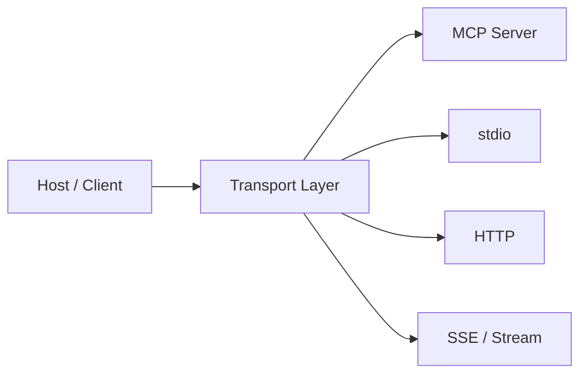

Transport ka matlab:

client aur server actual data kaise bhej rahe hain

Common options:

- `stdio`
  local process integration ke liye useful
- `HTTP`
  network based communication ke liye
- `streaming transports`
  long-running updates ya streamed responses ke liye

## 15. MCP Inspector Ya Testing Tools Kyu Important Hain

Jab aap server bana rahe ho to testing bahut important hoti hai.

Testing se aap dekhte ho:

- tools sahi register hue ya nahi
- inputs validate ho rahe hain ya nahi
- response shape sahi hai ya nahi
- errors readable hain ya nahi

MCP ecosystem me development/testing tools ka role isi liye important hota hai.

## 16. MCP Security Kaise Sochni Chahiye

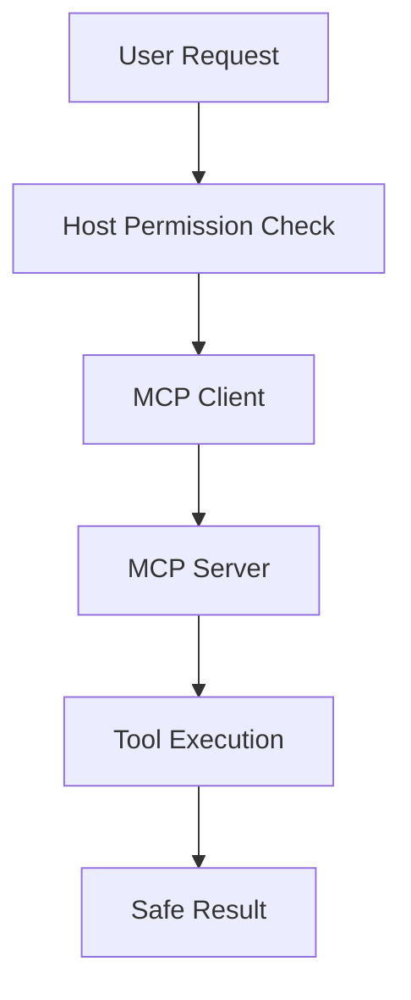

MCP me security bahut important hai,
kyunki server real actions kar sakta hai.

Security points:

- least privilege
- input validation
- allowlist tools
- user consent
- secret management
- logging
- audit trail

Simple rule:

jo tool dangerous ho sakta hai,
usse bina permission ke expose mat karo.

## 17. MCP Kis Kaam Me Use Ho Sakta Hai

MCP bahut jagah useful ho sakta hai:

- IDE assistants
- enterprise document search
- database assistants
- file management agents
- customer support copilots
- research assistants
- reporting systems
- internal knowledge bots

## 18. MCP Aur Normal API Integration Me Difference

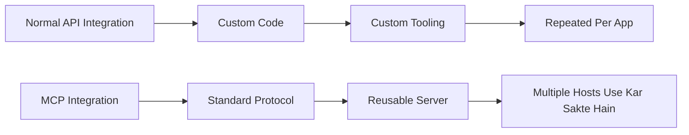

Normal API integration me:

- har app apna custom wrapper likhti hai

MCP me:

- ek standard protocol hota hai
- reusable integration ban sakti hai
- multiple hosts same server use kar sakte hain

## 19. MCP Build Karne Ke Liye Student Kya Sikhe

MCP build karne ke liye student ko ye cheezein aani chahiye:

- Python ya TypeScript
- JSON basics
- API basics
- request/response thinking
- validation
- authentication basics
- structured tool design
- permissions mindset

Extra helpful skills:

- CLI development
- web backends
- schema design
- debugging

## 20. MCP Build Learning Path

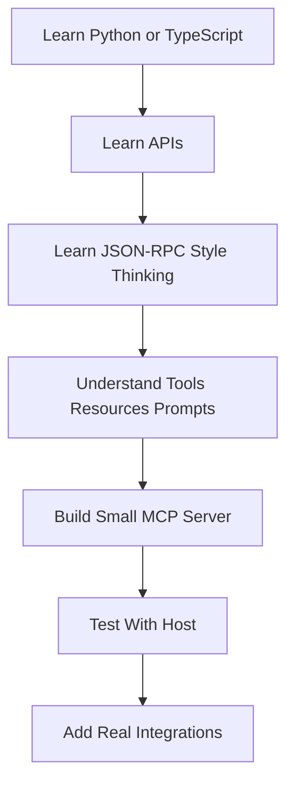

Best learning path:

1. language seekho
2. APIs samjho
3. MCP architecture samjho
4. small server banao
5. test karo
6. real-world tools add karo

## 21. MCP Student Example

Maan lo aap ek `notes MCP server` banana chahte ho.

Isme aap expose kar sakte ho:

- tool: `create_note`
- tool: `search_notes`
- resource: `all_notes`
- prompt: `summarize_notes`

Phir koi host app isse connect karke notes assistant bana sakta hai.

## 22. MCP Ka End-To-End Diagram

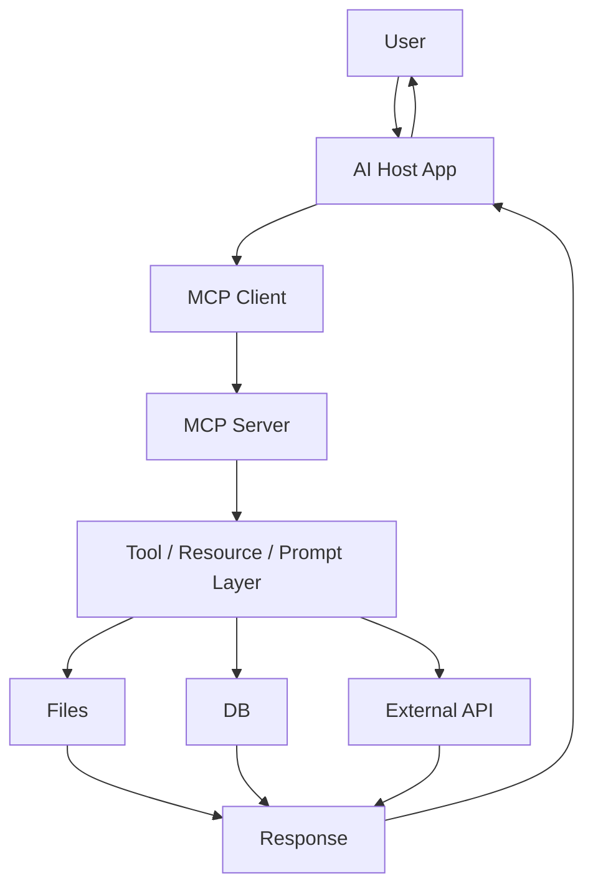

Ye full picture batata hai ki MCP AI system ko real-world systems ke saath kaise jodta hai.

## 23. Student Ko Is File Se Kaunsi Skills Milengi

Is file ko samajhne ke baad student ye skills le sakta hai:

- protocol thinking
- host-client-server architecture understanding
- tool/resource/prompt design
- integration mindset
- structured server building
- permissions and safety thinking
- AI infrastructure basics

## 24. Kahan Se Seekhen

Ye official aur strong resources useful hain:

- Official MCP docs:
  `https://modelcontextprotocol.io/docs/learn/architecture`
- MCP specification:
  `https://modelcontextprotocol.io/specification/`
- MCP architecture reference:
  `https://modelcontextprotocol.io/specification/2024-11-05/architecture`
- MCP C# SDK conceptual docs:
  `https://csharp.sdk.modelcontextprotocol.io/concepts/index.html`

Best तरीका:

- pehle architecture docs padho
- phir specification dekho
- phir small server build karo

## 25. Final Summary

MCP ek aisa standard hai jo AI applications ko tools, resources aur prompts ke saath connect karne ka structured tareeka deta hai.

Isse aap reusable AI integrations bana sakte ho.
Student ke liye ye bahut powerful topic hai,
kyunki ye AI apps ko real systems se jodne ki soch develop karta hai.
