# 🤖 MyLLM — SusaGPT Hinglish Learning Guide

> **Ek chhota GPT-style language model — scratch se build, Hinglish me samjhaya**

---

## 🗺️ Project Ka Big Picture

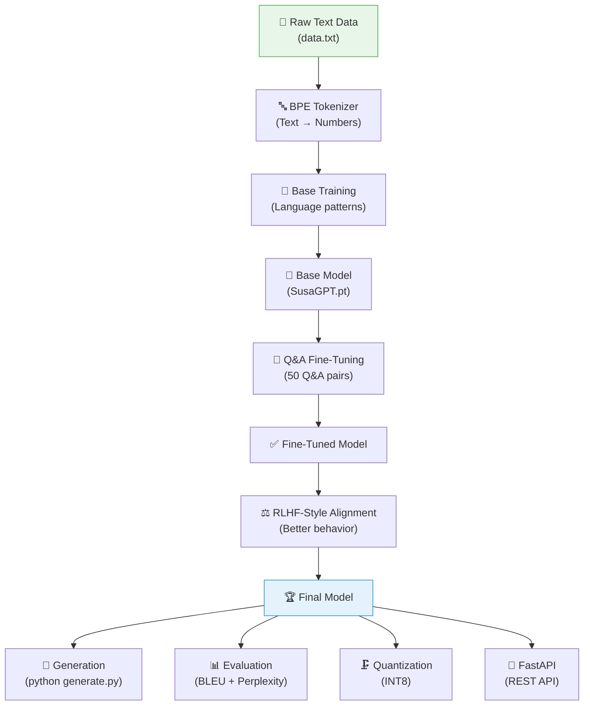

**Is project me kya hota hai:**
1. 📄 Base text data par train hota hai
2. ❓ Q&A pairs par fine-tune hota hai
3. ⚖️ Preference data par RLHF-style alignment karta hai
4. 📝 Better sampling ke saath text generate karta hai
5. 🗜️ INT8 quantized version me compress ho sakta hai
6. 🚀 REST API ke form me serve ho sakta hai
7. 📊 BLEU aur perplexity se evaluate ho sakta hai

> **Is README ka goal:** Beginner bhi padhe to samajh aaye — concept kya hai, kahan use hua hai, kaise chalana hai.

---

## ▶️ Sirf Ek Command — Sab Kuch Run Karo!

> **MD files parhne ke baad code ko right here run karo — kahi aur jana zaroori nahi!**

```bash
# 🎮 Ek command se saare interactive demos + exercises shuru karo:
python docs/exercises/run_me.py
```

**Ya koi bhi specific topic directly:**

```bash
python docs/exercises/tokenizer_demo.py    # BPE aur tokenizer
python docs/exercises/architecture_demo.py  # RoPE, SwiGLU, GQA, RMSNorm
python docs/exercises/training_demo.py      # Loss, AdamW, LR Scheduler
python docs/exercises/sampling_demo.py      # Top-K, Top-P, KV Cache
python docs/exercises/evaluation_demo.py    # BLEU, Perplexity
python docs/exercises/ai_agents_demo.py     # Weather Agent, Research Agent
python docs/exercises/agentic_ai_demo.py    # Competitor Research, Reflection
python docs/exercises/mcp_demo.py           # Live MCP Notes Server
```

> 📁 See [`docs/exercises/README.md`](docs/exercises/README.md) for full guide.

---

## 🏃 Quick Start — Jaldi Shuru Karo

```bash
# Step 0: Dependencies install karo
pip install -r requirements.txt

# Step 1: Base training
python train.py

# Step 2: Q&A fine-tuning
python fine_tune.py

# Step 3: RLHF-style alignment
python rlhf.py

# Step 4: Chat / Generate
python generate.py

# Step 5: Evaluation
python evaluate.py

# Step 6: INT8 quantization
python quantize.py

# Step 7: REST API
uvicorn api:app --host 127.0.0.1 --port 8000 --reload
# Phir browser me: http://127.0.0.1:8000/docs
```

---

## 📁 File Structure

```mermaid
flowchart TD
    ROOT["📁 MyLLM/"] --> SRC["📁 src/susagpt/\n(Core source code)"]
    ROOT --> DATA["📁 data/\n(Training data)"]
    ROOT --> ARTIFACTS["📁 artifacts/\n(Saved models)"]
    ROOT --> DOCS["📁 docs/\n(Learning guides)"]
    ROOT --> LAUNCH["📄 train.py, generate.py...\n(Root launchers)"]

    SRC --> M["model.py — Architecture"]
    SRC --> T["tokenizer.py — BPE Tokenizer"]
    SRC --> C["config.py — All settings"]
    SRC --> TR["train.py — Training loop"]
    SRC --> FT["fine_tune.py — Q&A training"]
    SRC --> RL["rlhf.py — Alignment"]
    SRC --> G["generate.py — Text gen"]
    SRC --> E["evaluate.py — Metrics"]
    SRC --> Q["quantize.py — INT8"]
    SRC --> A["api.py — FastAPI"]

    DATA --> DT["data.txt — Base corpus"]
    DATA --> QA["qa_pairs.json — 50 Q&A"]
    DATA --> PP["preference_pairs.json — RLHF data"]

    ARTIFACTS --> TOK["tokenizer/ — Saved BPE"]
    ARTIFACTS --> MOD["models/ — Checkpoints"]
```

### 📄 Files Ki Summary

| File | Kya Karta Hai |
|------|--------------|
| `src/susagpt/model.py` | Model architecture define karta hai |
| `src/susagpt/tokenizer.py` | Text ↔ Token IDs conversion |
| `src/susagpt/config.py` | Sare important configs ek jagah |
| `src/susagpt/train.py` | Base training implementation |
| `src/susagpt/fine_tune.py` | Q&A fine-tuning |
| `src/susagpt/rlhf.py` | RLHF-style alignment |
| `src/susagpt/generate.py` | Text generation logic |
| `src/susagpt/evaluate.py` | BLEU + perplexity evaluation |
| `src/susagpt/quantize.py` | INT8 quantization |
| `src/susagpt/api.py` | FastAPI server |
| `data/data.txt` | Base text corpus |
| `data/qa_pairs.json` | 50 Q&A supervised data |
| `data/preference_pairs.json` | RLHF chosen vs rejected |

---

## 🎯 Project Flow — 5 Stages

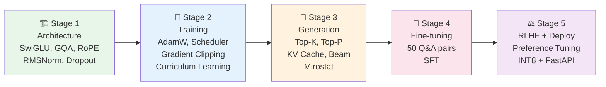

---

## 📚 Concepts Explained

### 🔤 Core Language Model Concepts

---

#### 1. 🐍 PyTorch kya hai

PyTorch ek deep learning framework hai. Is project me ye model banane, tensors handle karne, training chalane aur gradients calculate karne ke liye use hua hai.

**Simple line:** PyTorch wo toolkit hai jisse neural network code likha jata hai.

```python
import torch

# Tensor = multi-dimensional number container
scalar = torch.tensor(42)                    # 0D: ek number
vector = torch.tensor([1, 2, 3])             # 1D: numbers ki line
matrix = torch.tensor([[1, 2], [3, 4]])      # 2D: table
tensor_3d = torch.randn(2, 3, 4)            # 3D: aur bhi general

print(f"Scalar: {scalar}")
print(f"Vector: {vector}")
print(f"Matrix shape: {matrix.shape}")
print(f"3D Tensor shape: {tensor_3d.shape}")
```

---

#### 2. 🔤 Tokenizer kya karta hai

Tokenizer text ko numbers me convert karta hai. Model words directly nahi samajhta — isliye text ko token ids me convert karna padta hai.

```
"hello world"  →  Tokenizer  →  [12, 97]
    [12, 97]  →  Tokenizer  →  "hello world"
```

**Is project me:** Byte-level BPE tokenizer use hota hai (word-level nahi).

```python
# Tokenizer ka basic flow (conceptual)
text = "AI kya hai?"

# Step 1: UTF-8 bytes me convert
bytes_data = list(text.encode('utf-8'))
print("Bytes:", bytes_data[:6], "...")

# Step 2: BPE merges apply karo (common pairs merge hote hain)
# "AI" → ek token, " kya" → ek token, " hai" → ek token, "?" → ek token

# Step 3: Final token IDs
# [234, 891, 456, 12]  (hypothetical)

# Reverse: IDs → Text
# [234, 891, 456, 12] → "AI kya hai?"
```

---

#### 3. 🧠 BPE — Byte Pair Encoding

BPE tokenizer pehle text ko bytes me todta hai, phir common byte pairs ko merge karke subword tokens banata hai.

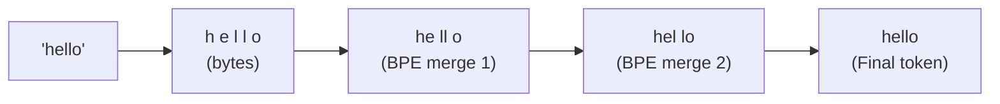

**Fayda:**
- Rare words bhi tokenize ho jaate hain (no `<UNK>`)
- Hindi, Urdu, English mixed text handle hota hai
- Long words meaningful pieces me toot sakte hain

---

#### 4. 📊 Embedding kya hota hai

Embedding ek learnable vector representation hoti hai. Token id ko model ek vector me convert karta hai.

```python
import torch.nn as nn

# Word ID → Dense Vector
vocab_size = 1000
embed_dim = 64

embedding = nn.Embedding(vocab_size, embed_dim)

token_id = torch.tensor([25])
vector = embedding(token_id)

print(f"Token ID: 25")
print(f"Embedding vector shape: {vector.shape}")  # (1, 64)
print(f"First 5 values: {vector[0][:5].tolist()}")
# Token 25 → [0.12, -0.77, 0.41, 0.23, -0.95, ...]
# Isse model words ke beech relations seekh pata hai!
```

---

#### 5. 👁️ Attention kya hota hai

Attention ka matlab: model decide kare kaunsa word kis dusre word par kitna focus kare.

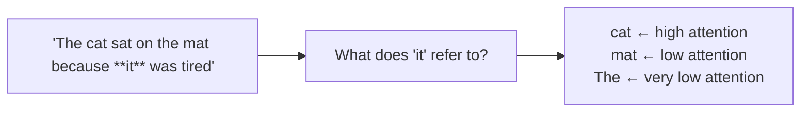

**Real code concept:**

```python
import torch
import torch.nn.functional as F
import math

def self_attention(Q, K, V):
    d_k = Q.shape[-1]
    # Q aur K se similarity score nikalo
    scores = Q @ K.transpose(-2, -1) / math.sqrt(d_k)
    # Probabilities banao
    weights = F.softmax(scores, dim=-1)
    # Values ka weighted sum lo
    return weights @ V

# Simple attention ka result:
# Har token ko context-aware representation milti hai
# "it" → cat ke baare me zyada focus karta hai
```

---

#### 6. 🔗 GQA — Grouped Query Attention

GQA me Query heads zyada hote hain, lekin Key/Value heads kam. K aur V groups se share hote hain.

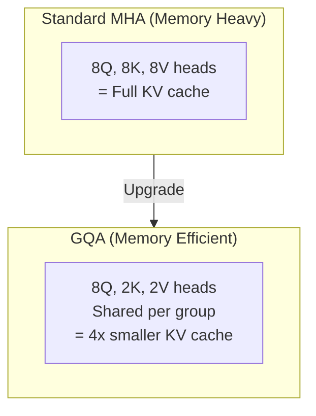

**Fayda:** Memory kam lagti hai, generation faster hoti hai.

---

#### 7. ⚡ SwiGLU kya hota hai

SwiGLU feed-forward network ka upgraded version. Ek branch gate banati hai, doosri branch content. Dono multiply hote hain.

```python
import torch.nn.functional as F

def swiglu_forward(x, w1, w2, w3):
    # Gate stream
    gate = F.silu(w1(x))      # Swish activation
    # Content stream
    content = w3(x)
    # Gating: decide karo kya pass karna hai
    gated = gate * content
    return w2(gated)           # Final projection

# GELU se better practical behavior
# Modern LLMs (LLaMA, Mistral) me use hota hai
```

---

#### 8. 🌀 RoPE kya hota hai

RoPE = Rotary Positional Embedding. Position information ko Q aur K vectors me rotate karke inject karta hai.

**Fayda:**
- Relative positions better samajh aati hain
- Long-range context handling improve hoti hai
- Modern transformer designs me bahut common hai

---

#### 9. 📏 RMSNorm kya hota hai

RMSNorm normalization ka lightweight version. Input ka scale stable rakhta hai.

```
LayerNorm: Mean + Variance + Normalize  (heavy)
RMSNorm:   RMS calculate + Normalize    (simpler, faster)
```

Most modern LLMs (LLaMA, Mistral) RMSNorm use karte hain.

---

#### 10. 📉 Loss kya hota hai

Loss batata hai model kitna galat hai.

| Loss Value | Meaning |
|-----------|---------|
| High | Model ki prediction weak hai |
| Low | Model sahi direction me seekh raha hai |

Is project me `CrossEntropyLoss` use hui hai — next-token prediction classification problem hota hai.

---

#### 11. 🔧 AdamW Optimizer kya hota hai

AdamW model ke parameters update karta hai. Loss dekhkar weights improve hote hain.

```python
import torch.optim as optim

optimizer = optim.AdamW(
    model.parameters(),
    lr=3e-4,          # Learning rate: har step ka update size
    weight_decay=0.1  # Regularization: uncontrolled growth rokta hai
)

# Training step:
optimizer.zero_grad()  # Old gradients clear karo
loss.backward()        # Gradients calculate karo
optimizer.step()       # Weights update karo
```

---

#### 12. ✂️ Gradient Clipping kya hota hai

Kabhi-kabhi gradients bahut bade ho jate hain — training unstable ho sakti hai.

```python
# Gradient clipping: max norm se zyada ho to limit karo
torch.nn.utils.clip_grad_norm_(model.parameters(), max_norm=1.0)
# After this, no gradient will be larger than 1.0
```

---

#### 13. 📊 LR Scheduler kya hota hai

Learning rate batata hai model har step me kitna update kare. Scheduler training ke different phases me LR change karta hai.

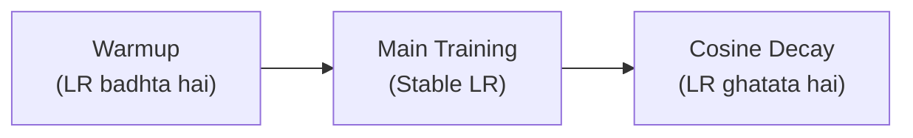

**Fayda:** Starting smooth, middle me achhi learning, end me fine adjustment.

---

#### 14. 🪜 Gradient Accumulation kya hota hai

Multiple chhote batches ka gradient collect karo, phir ek baar update karo.

```python
accumulation_steps = 4  # 4 batches ke baad update

for i, batch in enumerate(dataloader):
    loss = model(batch) / accumulation_steps  # Scale down
    loss.backward()  # Gradient accumulate

    if (i + 1) % accumulation_steps == 0:
        optimizer.step()   # Update
        optimizer.zero_grad()  # Reset

# Fayda: Effective batch size = 4x, same memory
```

---

#### 15. ⚡ Mixed Precision kya hota hai

Kuch operations float16 me chalao — GPU memory kam, training fast.

```python
from torch.cuda.amp import autocast, GradScaler

scaler = GradScaler()

with autocast():  # float16 me compute karo
    loss = model(input_ids)

scaler.scale(loss).backward()
scaler.step(optimizer)
scaler.update()
```

---

#### 16. 📈 Data Curriculum kya hota hai

Model ko pehle easy examples, baad me hard examples dikhana.

```
Easy: "AI is good."  (short, simple)
  ↓
Medium: "Machine learning algorithms process data."
  ↓
Hard: "Transformer-based architectures नें NLP को revolutionize किया।"
```

**Fayda:** Model pehle stable hota hai, phir complex patterns absorb karta hai.

---

### 🎲 Generation Concepts

---

#### 17. 🎯 Top-K Sampling

Sirf top-K most likely tokens me se choose karo.

```python
def top_k_sampling(logits, k=50):
    top_values, top_indices = torch.topk(logits, k)
    probs = F.softmax(top_values, dim=-1)
    chosen_relative = torch.multinomial(probs, 1)
    return top_indices[chosen_relative]

# k=1: Greedy (deterministic)
# k=50: More random/creative
```

---

#### 18. 🎲 Top-P (Nucleus) Sampling

Cumulative probability P tak ke tokens rakho, baaki remove karo.

```python
def top_p_sampling(logits, p=0.9):
    sorted_probs, sorted_indices = torch.sort(F.softmax(logits, dim=-1), descending=True)
    cumsum = torch.cumsum(sorted_probs, dim=-1)
    # P threshold ke baad ke tokens remove karo
    mask = cumsum - sorted_probs < p
    filtered = sorted_probs * mask
    return sorted_indices[torch.multinomial(filtered, 1)]
```

---

#### 19. 🔄 KV Cache kya hota hai

Purane tokens ke Key aur Value tensors save karo — har step par poora context recompute mat karo.

```
Without Cache: Token 50 generate karne ke liye 1+2+...+50 = 1275 computations
With Cache:    Token 50 ke liye sirf 1 computation! (new token only)
```

**Speedup:** 50+ tokens ke liye 25x+ faster!

---

#### 20. 🔭 Beam Search kya hota hai

Ek hi token sample karne ki jagah multiple candidate sequences track karo.

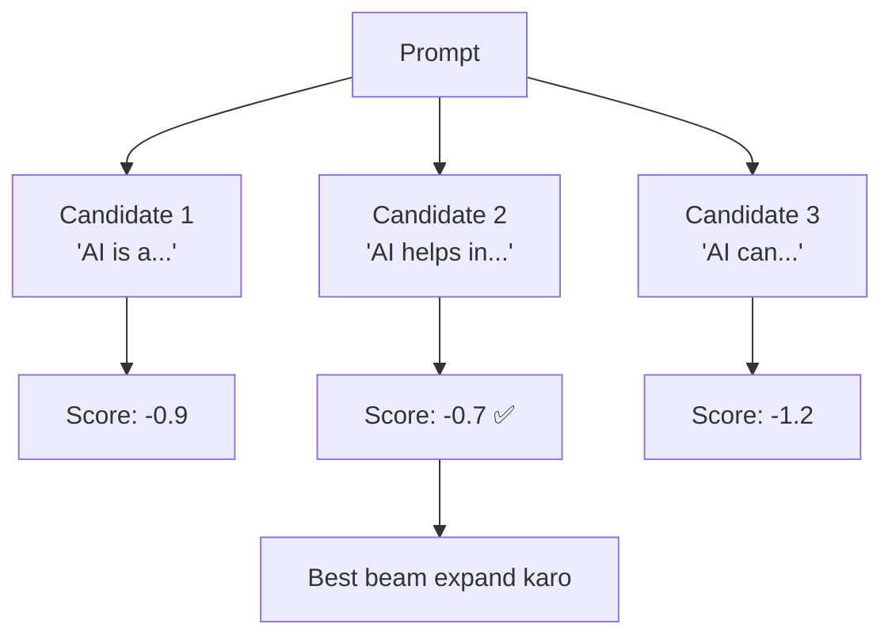

**Use case:** Q&A, formal responses, more deterministic output.

---

#### 21. 🎭 Mirostat kya hota hai

Adaptive sampling — output ki randomness ko target surprise level ke around maintain karta hai.

```
Top-K: Static rule (always top 50 tokens)
Top-P: Static rule (always 90% probability)
Mirostat: Dynamic rule (har token ke baad adjust karta hai)
```

**Fayda:** Long generation me output quality consistent rehti hai.

---

#### 22. 🔁 Repetition Penalty

Already used tokens ke logits ko punish karo — same word baar-baar aane ka chance kam hota hai.

```python
def apply_repetition_penalty(logits, past_tokens, penalty=1.2):
    for token_id in set(past_tokens):
        if logits[token_id] > 0:
            logits[token_id] /= penalty   # Positive logits: reduce
        else:
            logits[token_id] *= penalty   # Negative logits: more negative
    return logits
```

---

### 📊 Evaluation Concepts

---

#### 23. 📉 Perplexity kya hota hai

Model kitna confused hai next token predict karne me.

```python
import math

# Low perplexity = confident model = better!
def perplexity(log_probs):
    avg_neg_log_prob = -sum(log_probs) / len(log_probs)
    return math.exp(avg_neg_log_prob)

# Confident model:
print(perplexity([math.log(0.9), math.log(0.85)]))  # ~1.17 (good!)

# Confused model:
print(perplexity([math.log(0.1), math.log(0.05)]))  # ~12.6 (bad!)
```

**Rule:** Lower perplexity = better language model.

---

#### 24. 📊 BLEU Score kya hota hai

Generated answer aur reference answer me kitna n-gram overlap hai.

```
Reference: "PyTorch ek deep learning framework hai"
Generated: "PyTorch ek machine learning framework hai"
BLEU ≈ 0.75 (high overlap)

Generated: "Python mujhe pasand hai"
BLEU ≈ 0.10 (low overlap)
```

**Note:** BLEU meaning ka perfect judge nahi — wording different ho sakta hai lekin answer sahi bhi ho sakta hai.

---

### 🔧 Fine-tuning Concepts

---

#### 25. 🎯 Fine-tuning kya hota hai

Base model ko specific task ke liye aur train karna.

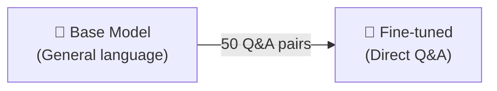

**Kab zaruri hai:** Jab base model ramble karta ho, direct answer nahi deta.

---

#### 26. ⚖️ RLHF kya hota hai

RLHF = Reinforcement Learning from Human Feedback.

**Industry RLHF pipeline:**
1. Base model
2. Supervised fine-tuning
3. Human preference data
4. Reward model
5. PPO optimization

**Is project me:** Simplified preference tuning (chosen vs rejected). Full PPO nahi — learning purpose ke liye practical version.

```python
# Preference data format
preference = {
    "prompt": "AI kya hai?",
    "chosen": "AI Artificial Intelligence ka short form hai...",  # Better
    "rejected": "AI matlab robot."                               # Weaker
}
# Model sikho ki chosen response prefer karo!
```

---

### 💾 Deployment Concepts

---

#### 27. 🗜️ INT8 Quantization

Model ke weights ko float32 se int8 me convert karo.

```
float32: 4 bytes per weight
int8:    1 byte per weight
Result:  ~4x smaller model, faster CPU inference
```

**Use case:** CPU par inference, model sharing, deployment.

---

#### 28. 🚀 FastAPI + REST API

FastAPI se model ko HTTP API ke through serve karo.

```bash
# Server chalao
uvicorn api:app --host 127.0.0.1 --port 8000

# Test karo
curl -X POST http://127.0.0.1:8000/generate \
  -H "Content-Type: application/json" \
  -d '{"prompt": "AI kya hai?", "max_tokens": 100}'

# API docs (auto-generated!)
# http://127.0.0.1:8000/docs
```

**Endpoints:**
- `GET /health` → Server status
- `GET /model-info` → Architecture info
- `POST /generate` → Text generate karo

---

## 📋 Scripts Summary

| Script | Kya Karta Hai | Run Command |
|--------|--------------|-------------|
| `train.py` | Base model train karo | `python train.py` |
| `fine_tune.py` | Q&A fine-tuning | `python fine_tune.py` |
| `rlhf.py` | RLHF-style alignment | `python rlhf.py` |
| `generate.py` | Text generate karo / chat | `python generate.py` |
| `evaluate.py` | BLEU + perplexity | `python evaluate.py` |
| `quantize.py` | INT8 quantization | `python quantize.py` |
| `api.py` | FastAPI server | `uvicorn api:app --reload` |

### `train.py` — Kya Karta Hai

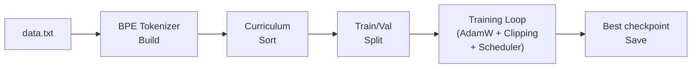

### `generate.py` — Kya Karta Hai

- Best available model load karta hai (RLHF > fine-tuned > base)
- Top-K, Top-P, Mirostat, Beam Search support
- Repetition penalty + KV cache = fast, quality generation
- Interactive chat mode

---

## 📖 Docs Se Kya Seekh Sakte Ho

| Doc File | Kya Milta Hai |
|----------|--------------|
| [SusaGPT_Architecture.md](docs/susagpt/SusaGPT_Architecture.md) | GPT-2 vs LLaMA vs SusaGPT comparison, code examples |
| [SusaGPT_Skills.md](docs/susagpt/SusaGPT_Skills.md) | Skills with working demos, exercises |
| [SusaGPT_Diagram_Guide.md](docs/susagpt/SusaGPT_Diagram_Guide.md) | Visual diagrams + exercises |
| [MCP_Guide.md](docs/ai/MCP_Guide.md) | Protocol architecture, working server code |
| [AI_Agents_Guide.md](docs/ai/AI_Agents_Guide.md) | Agents guide with real examples |
| [Agentic_AI_Guide.md](docs/ai/Agentic_AI_Guide.md) | Agentic system design |

---

## 🎓 Recommended Learning Order

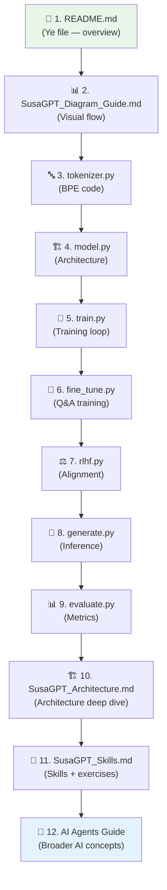

---

## ⚠️ Important Notes

> [!NOTE]
> Tokenizer byte-level BPE hai, word-level tokenizer nahi. Old `artifacts/tokenizer/tokenizer.json` naye code ke saath regenerate karna zaruri hai.

> [!NOTE]
> Purane model checkpoints ko ideally dubara train karna chahiye, kyunki tokenizer aur architecture change ho sakti hai.

> [!NOTE]
> RLHF implementation simplified hai — full production PPO pipeline nahi. Ye learning purpose ke liye practical version hai.

> [!NOTE]
> Ye project educational understanding ke liye strong hai. Production-ready full stack nahi — lekin concepts bilkul real hain.

---

## 🧪 Quick Self-Test — Samjha Kya?

**Q1: Byte-level BPE word-level tokenizer se better kyu hai?**
<details><summary>Answer</summary>

Byte-level BPE UTF-8 bytes se start karta hai, isliye:
- Hindi, Urdu, English — koi bhi text tokenize hota hai
- `<UNK>` token ki problem nahi hoti
- Rare words tootkar represent ho jaate hain

</details>

**Q2: KV Cache generation ko kaise fast karta hai?**
<details><summary>Answer</summary>

Purane tokens ke Key aur Value tensors cache me save ho jaate hain. Har naye token ke liye sirf ek new computation hoti hai — pura context recompute nahi karna padta. 50+ tokens ke liye ~25x speedup!

</details>

**Q3: RLHF-style alignment ka kya purpose hai?**
<details><summary>Answer</summary>

Chosen vs rejected answer pairs se model ko sikhate hain ki better response prefer karo. Isse:
- Model zyada helpful responses deta hai
- Vague ya wrong answers less preferred hote hain
- Behavior improve hoti hai without full PPO

</details>

---

## 🏆 Is Project Se Kaunsi Skills Milti Hain

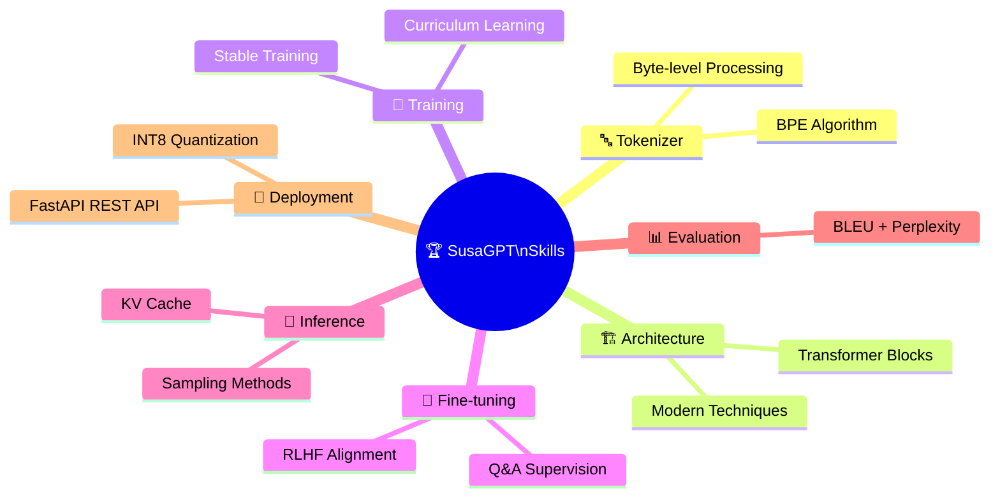

**Ye project samajhna matlab:**

`Tokenize → Train → Fine-tune → Align → Generate → Evaluate → Compress → Deploy`

poori pipeline practically samajhna — beginners se intermediate AI engineers ke liye perfect foundation!

---

## 👨‍💻 Credit

**sameer malik** — MyLLM / SusaGPT project
