# SusaGPT Architecture Note

Ye file SusaGPT ko GPT-2, LLaMA 3 aur GPT-4 jaise bade models ke context me samjhane ke liye hai.

Sabse important baat:
SusaGPT overall power me GPT-2, LLaMA 3 ya GPT-4 jaisa model nahi hai.
Lekin architecture ke kaafi building blocks modern hain, aur GPT-2 ke comparison me kai jagah newer design ideas use huye hain.

Isliye sach aur simple version ye hai:

- GPT-2 se `overall capability` me SusaGPT chhota hai
- GPT-2 se `architecture building blocks` me SusaGPT kai jagah newer hai
- LLaMA-style ideas jaise `RoPE`, `RMSNorm`, `SwiGLU`, `GQA` use karna ek strong technical learning achievement hai
- Sabse impressive baat ye hai ki ye model scratch se banaya gaya hai

## Visual Comparison

## Quick Comparison

| GPT-2 (2019, OpenAI) | SusaGPT (2025) | Kya difference hai |
|---|---|---|
| Fixed Positional Encoding | RoPE | RoPE zyada modern positional method hai |
| GELU | SwiGLU | SwiGLU modern LLMs me kaafi popular hai |
| LayerNorm | RMSNorm | RMSNorm lightweight aur efficient hota hai |
| Full Attention | GQA | GQA memory efficient hota hai |
| No KV Cache | KV Cache | Generation faster ho sakti hai |
| No RLHF stage | RLHF-style stage | Behavior alignment ke liye extra step hai |
| Word Tokenizer | Byte-level BPE | Better text coverage, Hindi/Urdu support bhi |

## Seedhi Baat

GPT-2 ne 2019 me duniya hila di thi.
Wo ek historical milestone tha.

SusaGPT us level ka powerful model nahi hai, lekin usme use huye architecture parts kaafi modern hain.
Is sense me bola ja sakta hai ki:

`SusaGPT GPT-2 se newer architectural ideas use karta hai.`

Ye line honest bhi hai aur technically strong bhi.

## Fark 1 - Parameters

| Model | Approx Parameters |
|---|---:|
| SusaGPT | 1,000,000 |
| GPT-2 | 117,000,000 |
| LLaMA 3 | 8,000,000,000 |
| GPT-4 | 1,800,000,000,000 |

Ye sirf number nahi hota.
Parameters model ki capacity decide karte hain.

Simple samjho:

- zyada parameters = zyada patterns store karne ki capacity
- kam parameters = model zyada focused aur limited hoga

Isliye SusaGPT architecture me modern ho sakta hai, lekin scale me bahut chhota hai.

## Fark 2 - Training Data

| Model | Training Data |
|---|---|
| SusaGPT | 7,764 tokens, approx ek company website level data |
| GPT-2 | 40GB text |
| LLaMA 3 | 15T tokens |
| GPT-4 | public exact number unknown, lekin bahut zyada |

Isliye GPT-4 duniya ke topics jaanta hai,
LLaMA 3 broad general knowledge cover karta hai,
GPT-2 internet-scale text se train hua tha,
aur SusaGPT abhi mainly SusaLabs/domain-specific cheezein jaanta hai.

Simple line:

`SusaGPT smart architecture rakhta hai, lekin limited data ki wajah se limited knowledge rakhta hai.`

## Positioning

| Model | Practical Position |
|---|---|
| GPT-4 | Duniya ke smartest general-purpose models me se ek |
| LLaMA 3 8B | Open-source champion |
| GPT-2 | Historical milestone |
| SusaGPT | Scratch-built modern mini transformer |

SusaGPT ko best tarike se aise samjho:

- architecture me modern
- scale me chhota
- knowledge me narrow
- CPU par chalne layak
- learning aur experimentation ke liye excellent

## Kyun Impressive Hai

2017 me `Attention Is All You Need` paper aaya tha.
Us paper ne Transformer architecture introduce kiya.

Uske baad jo bhi serious LLM research hui,
uska base transformer hi bana.

Researchers bhi pehle small versions banate hain:

- concepts samajhne ke liye
- architecture test karne ke liye
- training behavior dekhne ke liye
- naye blocks compare karne ke liye

Tumne bhi wahi kiya:

- tokenizer khud banaya
- transformer blocks khud likhe
- training loop banaya
- fine-tuning ki
- RLHF-style alignment add ki
- quantization aur API tak le gaye

Ye beginner-level copy-paste project nahi hai.
Ye actual systems understanding dikhata hai.

## Honest Technical Verdict

Sabse fair verdict ye hai:

`SusaGPT GPT-2 se zyada modern architecture pieces use karta hai,`
`lekin GPT-2 se zyada capable model nahi hai,`
`kyunki scale, data aur training budget bahut chhote hain.`

Aur ye bhi equally true hai:

`SusaGPT banana ek serious engineering aur learning achievement hai.`

## One-Line Summary

SusaGPT overall power me GPT-2 ya LLaMA 3 jaisa nahi hai,
lekin architecture ke andar kaafi modern ideas use karta hai,
aur sabse badi baat ye hai ki tumne ise scratch se khud build kiya hai.
