# SusaGPT Diagram Guide

Ye file SusaGPT ko diagram ki help se samjhane ke liye banayi gayi hai.

Goal simple hai:

- beginner ko visual flow samajh aaye
- har important module ka role clear ho
- training se lekar API tak poora system dikh jaye
- student ko ye bhi samajh aaye ki is project se kaunsi skills milti hain

Note:
Agar aapke markdown viewer me Mermaid diagrams render hote hain to ye file aur achchhi dikhegi.
Agar Mermaid render na ho to tension nahi, har diagram ke niche Hinglish explanation bhi likhi hui hai.


## 1. SusaGPT Ka Big Picture

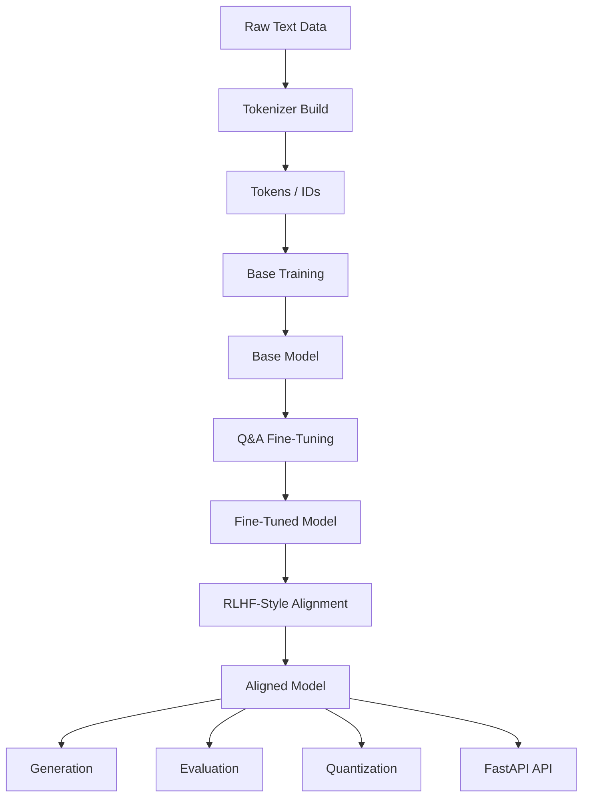

Is diagram ka matlab:

- pehle text data aata hai
- fir tokenizer banta hai
- text token ids me convert hota hai
- fir base model train hota hai
- uske baad Q&A fine-tuning hoti hai
- fir RLHF-style alignment hoti hai
- final model generation, evaluation, quantization aur API me use hota hai


## 2. Tokenizer Kaise Kaam Karta Hai

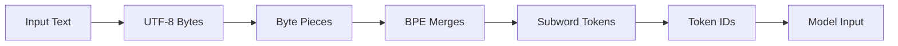

Tokenizer ka kaam:

- text ko directly model ko nahi dete
- pehle usse bytes me todte hain
- fir BPE common byte pairs ko merge karta hai
- fir useful subword tokens bante hain
- last me tokens ko ids me convert kar diya jata hai

Iska fayda:

- unknown word problem kam hoti hai
- Hindi, Urdu, English mixed text handle hota hai
- rare words bhi tootkar represent ho jate hain


## 3. BPE Training Flow

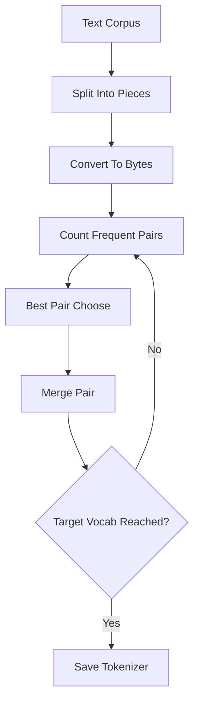

Yahan BPE vocabulary dheere-dheere build hoti hai.

Simple samjho:

- sabse pehle base bytes hote hain
- fir model dekhta hai kaunsa pair sabse zyada repeat hua
- us pair ko ek naya token bana deta hai
- ye process baar-baar hoti hai
- end me better subword vocabulary milti hai


## 4. Model Architecture Ka Core Flow

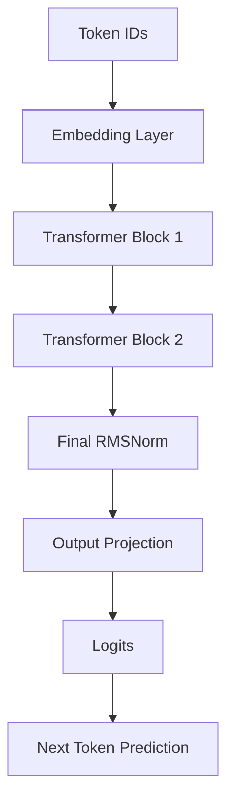

Ye language model ka high-level skeleton hai.

Matlab:

- token id ko vector me badla jata hai
- vector transformer blocks se pass hota hai
- final hidden state se logits nikalte hain
- logits batate hain next token ka chance kitna hai


## 5. Transformer Block Ke Andar Kya Hota Hai

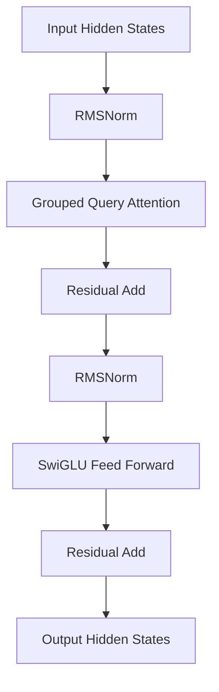

Ye har transformer block ka internal flow hai.

Is block me 2 main parts hote hain:

- attention
- feed-forward network

Residual add ka matlab:
input ko output ke saath jod diya jata hai taaki information stable rahe aur training easier ho.


## 6. Attention Kaise Kaam Karti Hai

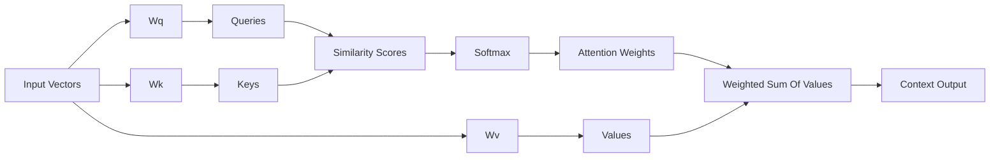

Attention ka basic idea:

- query poochti hai: mujhe kis token ko dekhna chahiye?
- key batata hai: mere paas kaunsi information hai?
- value actual information hoti hai

Phir:

- query aur key compare hote hain
- score banta hai
- softmax us score ko probability jaisa banata hai
- value vectors ka weighted mix output me jata hai


## 7. GQA Kya Karta Hai

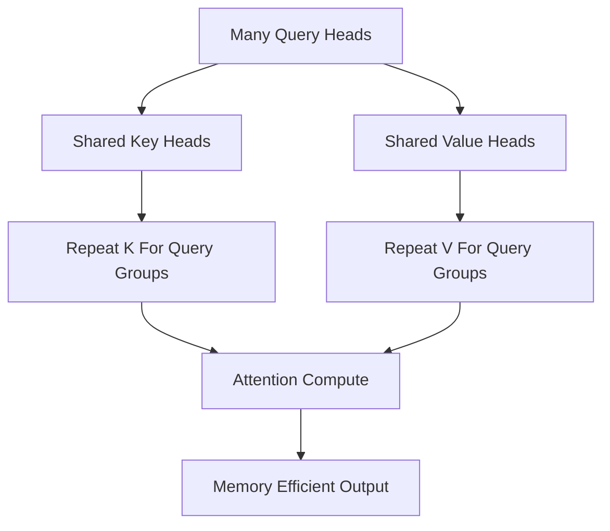

GQA yani Grouped Query Attention me:

- queries ke heads zyada ho sakte hain
- lekin keys aur values ke heads kam rakhe jate hain
- fir K aur V ko query groups ke across share kiya jata hai

Fayda:

- memory kam lagti hai
- KV cache halka hota hai
- generation efficient hoti hai


## 8. RoPE Kya Karta Hai

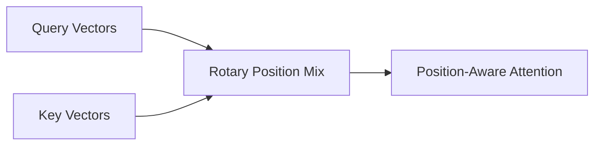

RoPE positional information ko directly attention ke andar inject karta hai.

Isse model ko samajh aata hai:

- token kis position par hai
- kaun kis ke baad aa raha hai
- relative order kya hai

Ye fixed positional encoding se zyada modern approach mani jati hai.


## 9. RMSNorm Kya Karta Hai

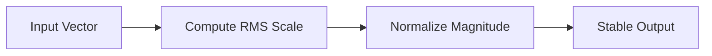

RMSNorm input ka scale stable rakhta hai.

Student level simple meaning:

- vectors bahut zyada explode na karein
- training smoother ho
- transformer block stable rahe


## 10. SwiGLU Kya Karta Hai

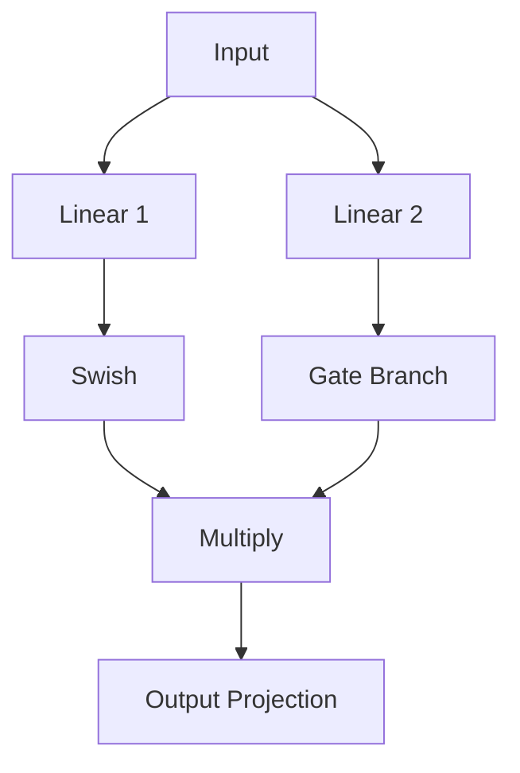

SwiGLU feed-forward network ka smarter version hai.

Matlab:

- ek branch content banati hai
- ek branch gate ka kaam karti hai
- dono multiply hote hain
- model decide karta hai kitni information aage bhejni hai

Ye GELU se zyada modern design hai aur kai LLMs me use hota hai.


## 11. Weight Tying Kya Hota Hai

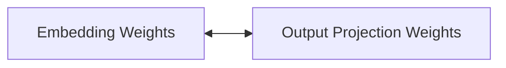

Weight tying ka matlab:

- input embedding aur output projection same weights share karte hain

Iska fayda:

- parameters bach jate hain
- input-output token space aligned rehti hai


## 12. Base Training Flow

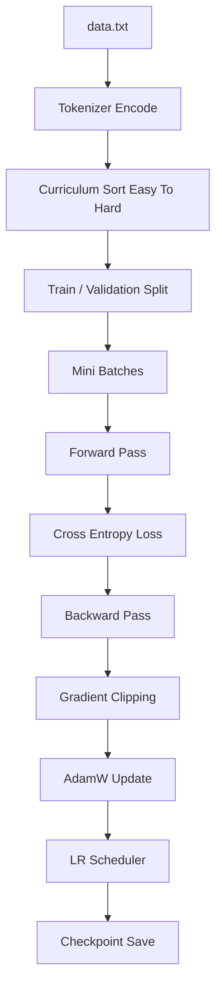

Training me kya hota hai:

- text ko tokens me convert kiya jata hai
- easier examples pehle dikhaye jate hain
- batches bante hain
- model prediction karta hai
- loss nikalta hai
- gradients se weights update hote hain

Yahan stable training ke liye:

- AdamW
- gradient clipping
- LR scheduler
- gradient accumulation
- mixed precision

use hota hai.


## 13. Fine-Tuning Flow

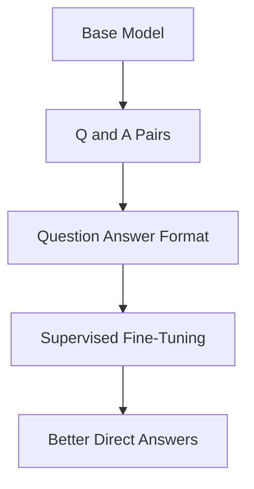

Fine-tuning ka matlab:

- base language model ko specific task sikhana

Yahan:

- question diya jata hai
- answer target hota hai
- model ko direct jawab dena sikhaya jata hai


## 14. RLHF-Style Alignment Flow

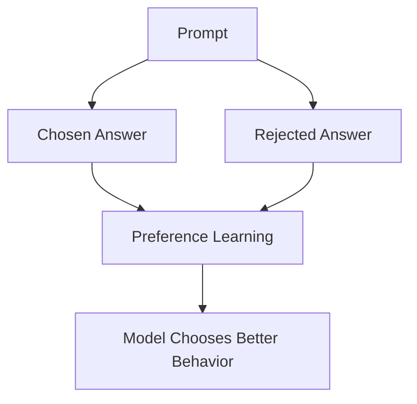

RLHF-style alignment me:

- ek achchha answer hota hai
- ek weak answer hota hai
- model ko push kiya jata hai ki better answer ko prefer kare

Ye full PPO wali industrial RLHF nahi hai,
lekin concept samajhne ke liye strong practical version hai.


## 15. Generation Flow

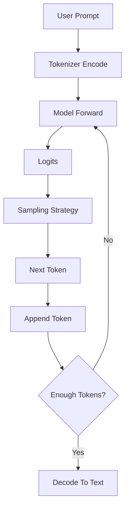

Generation loop me:

- prompt tokens me jata hai
- model next token predict karta hai
- sampling rule decide karta hai kaunsa token choose hoga
- token append hota hai
- loop repeat hota hai


## 16. Sampling Options Ka Diagram

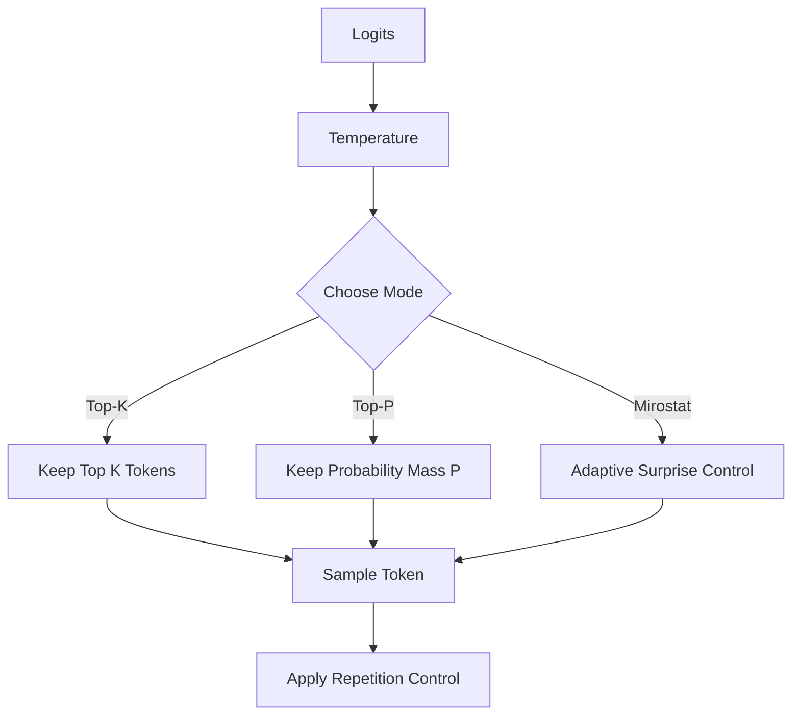

Different sampling modes ka matlab:

- Top-K: sirf top K options me se choose karo
- Top-P: utne tokens rakho jinki total probability P tak ho
- Mirostat: randomness ko dynamically control karo

Ye output quality aur diversity ko control karta hai.


## 17. KV Cache Ka Diagram

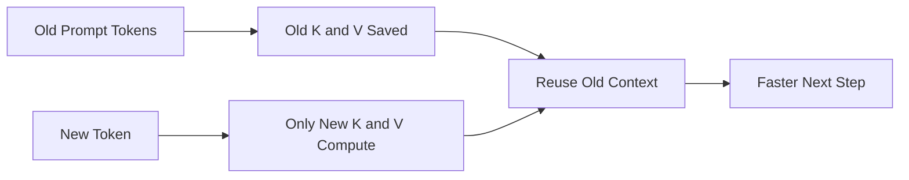

KV cache ka matlab:

- har step par pura prompt dubara compute nahi karna
- purane K aur V tensors save rehte hain
- bas naya token ka part compute hota hai

Isliye generation fast hoti hai.


## 18. Beam Search Ka Diagram

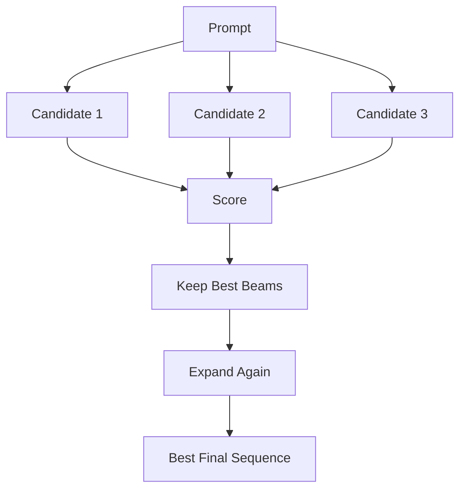

Beam search ek hi random token choose nahi karta.

Ye multiple sequences ko track karta hai aur best-scoring output choose karta hai.

Use case:

- Q&A
- formal response
- more deterministic output


## 19. Evaluation Flow

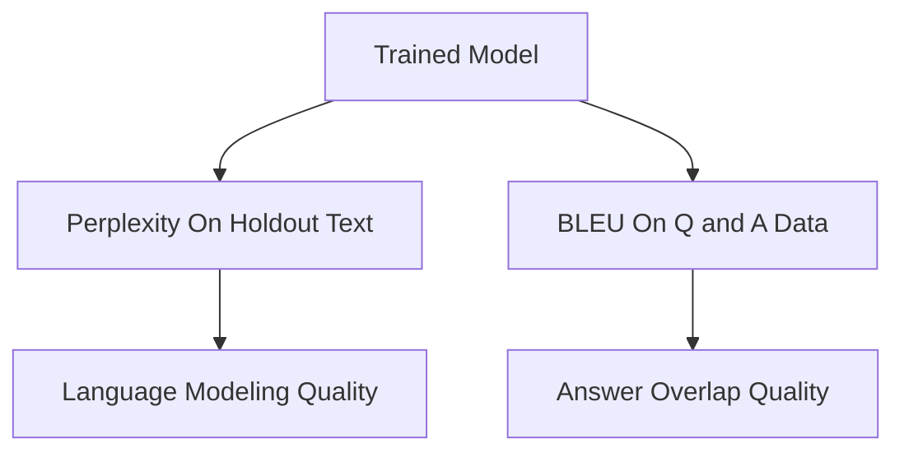

Evaluation me 2 cheezein dekhte hain:

- Perplexity:
  model next token ko kitna confidently predict kar raha hai
- BLEU:
  generated answer reference answer se kitna overlap karta hai

Simple yaad rakho:

- low perplexity better
- high BLEU generally better


## 20. Quantization Flow

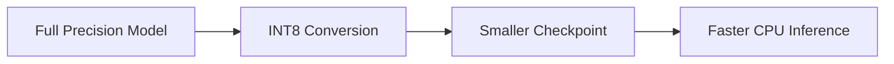

Quantization ka role:

- model ko chhota banana
- CPU inference ko practical banana
- sharing aur deployment easy karna


## 21. API Flow

```mermaid
flowchart TD
    A[User App / Frontend] --> B[FastAPI Endpoint]
    B --> C[Load Model]
    C --> D[Generate Text]
    D --> E[JSON Response]
    E --> A
```

API ka purpose:

- model ko service banana
- website ya app se connect karna
- portfolio-ready backend banana


## 22. Evaluation Se Learning Kaise Hoti Hai

```mermaid
flowchart TD
    A[Train Model] --> B[Measure Metrics]
    B --> C{Metrics Good?}
    C -- No --> D[Improve Data / Model / Training]
    D --> A
    C -- Yes --> E[Deploy Or Fine-Tune More]
```

Ye diagram research mindset sikhata hai.

Machine learning me process hota hai:

- kuch build karo
- numbers dekho
- improve karo
- dubara evaluate karo


## 23. SusaGPT Se Kaunsi Skills Milti Hain

```mermaid
mindmap
  root((SusaGPT Skills))
    Python Project Structure
    Tokenizer Design
    BPE Understanding
    Transformer Basics
    Attention and GQA
    RoPE and RMSNorm
    SwiGLU
    Training Engineering
    Fine-Tuning
    RLHF Style Alignment
    Text Generation
    Evaluation Metrics
    Quantization
    FastAPI Deployment
```

Is project ko samajhkar student ye practical skills le sakta hai:

- Python project structure
- tokenizer design
- BPE understanding
- transformer basics
- attention aur GQA
- training engineering
- fine-tuning
- RLHF-style alignment
- evaluation
- deployment


## 24. Skills Ka Working Map

```mermaid
flowchart TD
    A[Tokenizer Skill] --> B[Data Ko Model Input Banana]
    C[Model Skill] --> D[Prediction Engine Samajhna]
    E[Training Skill] --> F[Model Ko Sikhana]
    G[Fine-Tuning Skill] --> H[Specific Task Behavior]
    I[RLHF Skill] --> J[Better Preference Alignment]
    K[Generation Skill] --> L[Better Output Control]
    M[Evaluation Skill] --> N[Result Measure Karna]
    O[Deployment Skill] --> P[Real World Use]
```

Ye diagram batata hai ki har skill alag hai,
lekin sab milkar ek complete AI system banati hain.


## 25. Student Learning Path

```mermaid
flowchart TD
    A[Step 1: Read Tokenizer] --> B[Step 2: Read Model]
    B --> C[Step 3: Read Train Script]
    C --> D[Step 4: Read Fine-Tune]
    D --> E[Step 5: Read RLHF]
    E --> F[Step 6: Read Generate]
    F --> G[Step 7: Read Evaluate]
    G --> H[Step 8: Read API and Quantize]
```

Best understanding ke liye student ko ye order follow karna chahiye:

1. tokenizer
2. model
3. train
4. fine-tune
5. rlhf
6. generate
7. evaluate
8. api and quantize


## 26. End-To-End SusaGPT Kaise Kaam Karta Hai

```mermaid
flowchart TD
    A[Text Data] --> B[BPE Tokenizer]
    B --> C[Token IDs]
    C --> D[Transformer Model]
    D --> E[Base Training]
    E --> F[Fine-Tuning]
    F --> G[RLHF-Style Alignment]
    G --> H[Inference Engine]
    H --> I[Sampling / Beam / KV Cache]
    I --> J[Generated Response]
    G --> K[Evaluation]
    G --> L[Quantization]
    G --> M[API Deployment]
```

Ye poore project ka final summary diagram hai.

Last simple explanation:

- data se tokenizer banta hai
- tokenizer text ko ids me badalta hai
- ids transformer model ko jate hain
- model train hota hai
- phir usse fine-tune aur align kiya jata hai
- final model se better text generate hota hai
- usse evaluate, optimize aur deploy bhi kiya ja sakta hai


## 27. Final Student Summary

Agar koi student is file ke diagrams aur SusaGPT project dono samajh leta hai,
to usse ye clear ho jata hai:

- text se token kaise bante hain
- token se transformer prediction kaise hoti hai
- training model ko kaise improve karti hai
- fine-tuning behavior ko kaise badalti hai
- RLHF-style stage preference kaise sikhati hai
- sampling output ko kaise control karti hai
- evaluation progress ko kaise measure karti hai
- quantization model ko chhota kaise banati hai
- API model ko real-world service kaise banati hai

Yani student ko sirf theory nahi,
balki ek complete mini-LLM system ka visual understanding mil jata hai.
