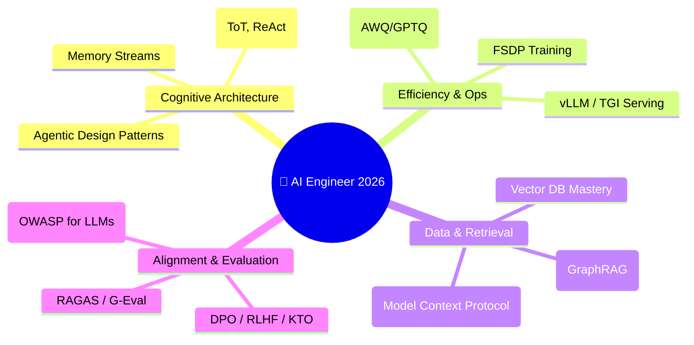

# 🚀 The Ultimate AI Engineer Roadmap (Mastery 2026)
> **Level:** Zero to Professional | **Language:** Hinglish | **Goal:** Become a top 1% AI Engineer in the 2026 market.

---

## 🧭 The 2026 Vision

2026 mein AI Engineering ka matlab sirf "Chatbot banana" nahi hai. Ab focus **Agentic Workflows**, **Hardware Efficiency**, aur **Multi-modal Intelligence** par hai. Ye roadmap aapko un skills ki taraf le jayega jo FAANG aur Top AI Startups dhoond rahe hain.

---

## 🏗️ The 4 Mastery Pillars

---

## 📅 The 6-Month Execution Plan

### 🟦 Month 1: Foundations & The "Brain"
- **Focus:** Python Async, NumPy, PyTorch Internals.
- **Goal:** Transformer Architecture ko "Inside Out" samjhna.
- **Key Files:** `docs/llm_learning/Transformer_Architecture_Inside_Out.md`
- **Project:** Scratch se ek chota GPT model build karna (Matrix multiplication level par).

### 🟩 Month 2: Retrieval & Context (The Memory)
- **Focus:** Vector Embeddings, Hybrid Search, aur Advanced RAG.
- **Goal:** Context window ko efficiently manage karna.
- **Key Files:** `docs/llm_learning/RAG_Guide.md`, `docs/dbms/SQL_Mastery_Postgres.md` (pgvector).
- **Project:** Ek "Knowledge Base" chatbot jo 10,000+ files par fast search kare.

### 🟨 Month 3: Agentic Engineering (The Hands)
- **Focus:** Multi-agent systems, Tool use, aur MCP.
- **Goal:** Aise agents banana jo autonomously tasks complete karein.
- **Key Files:** `docs/ai_agents_learning/AI_Agents_Guide.md`, `docs/ai_agents_learning/CrewAI_Guide.md`
- **Project:** Ek "AI Research Team" banana jo topic research kare, code likhe, aur summary bhej de.

### 🟧 Month 4: Fine-Tuning & Alignment (The Personality)
- **Focus:** PEFT (LoRA/QLoRA), DPO, aur SFT data quality.
- **Goal:** Model ko specific domains ya "Style" ke liye customize karna.
- **Key Files:** `docs/llm_learning/FineTuning_RLHF_Mastery.md`
- **Project:** Ek model ko "Legal Assistant" ya "Medical Specialist" style mein fine-tune karna.

### 🟥 Month 5: Infrastructure & Optimization (The Muscle)
- **Focus:** vLLM, TGI, Docker, aur Cloud GPUs.
- **Goal:** Model ko high-traffic environment mein serve karna.
- **Key Files:** `docs/system_design/Scalable_AI_Architecture.md`, `docs/llm_learning/Hardware_for_AI.md`
- **Project:** 70B parameter model ko Quantization ke saath deploy karna with streaming responses.

### 🟪 Month 6: Security & Evaluation (The Safety)
- **Focus:** OWASP Top 10 for LLMs, RAGAS, aur Red Teaming.
- **Goal:** System ko secure aur measurable banana.
- **Key Files:** `docs/exercises/Mock_Interview_Scenarios.md`, `docs/AI_Engineer_Portfolio_Guide.md`
- **Project:** Ek Automated Evaluation pipeline banana jo har model update ko score kare.

---

## 🏆 The "Job-Ready" Portfolio Checklist

1. **[ ] Agentic RAG System:** GraphRAG + ReAct loops with 95%+ accuracy.
2. **[ ] Fine-tuned Adapter:** A LoRA adapter for a specific business use case.
3. **[ ] Scalable API:** FastAPI backend serving an LLM with vLLM and caching.
4. **[ ] MCP Server:** A custom MCP server connecting AI to a private database.
5. **[ ] Security Audit:** A complete red-teaming report of an AI application.

---

## 🧭 Pro Tips for 2026
1. **Model Agnostic Bano:** Aaj Llama hai, kal Claude hoga. Architectures par focus karo, specific model names par nahi.
2. **Build in Public:** LinkedIn/Twitter par apne logic diagrams share karo.
3. **Evaluation is Everything:** In 2026, the engineer who can **prove** their model is better wins.

> **Final Note:** AI Engineer banna ek continuous journey hai. Har mahine naye papers aayenge, lekin "Attention" aur "Gradient Descent" hamesha vahi rahenge. Basics strong rakho.
