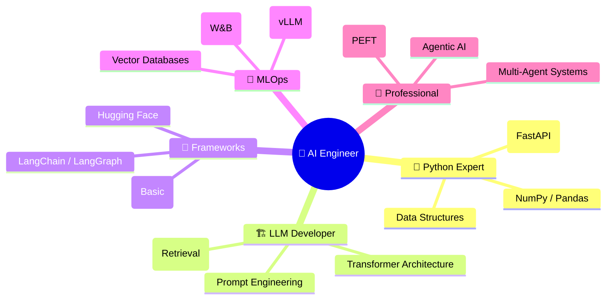

# 🚀 Full AI Engineer Roadmap — 2026 Edition
> **Goal:** Zero Se Hero AI Engineer Bano | **Language:** Hinglish | **Estimated Time:** 3-6 Months

---

## 🏆 Kamyabi Ka Raasta (The 5 Pillars)



---

## 📅 Step-by-Step Learning Plan

### 🟦 Month 1: The Foundation (Python & Math)
- **Topic 1:** Python for AI (Lists, Dicts, NumPy, PyTorch Tensors).
- **Topic 2:** Probability & Linear Algebra (Dot Product, Softmax).
- **Doc:** [AI_Math_Primer.md](docs/ai/AI_Math_Primer.md)
- **Project:** 🧠 Simple Neural Network from scratch in Python.

---

### 🟩 Month 2: LLM Internals (The Transformer)
- **Topic 1:** Transformer Architecture (Attention, RoPE, RMSNorm).
- **Topic 2:** Tokenization (BPE, Subword).
- **Doc:** [SusaGPT_Architecture.md](docs/susagpt/SusaGPT_Architecture.md)
- **Project:** 🏗️ Build SusaGPT Architecture and train on small data.

---

### 🟨 Month 3: RAG & Agentic AI (Building Apps)
- **Topic 1:** Advanced RAG (Chunking, Vector DBs, Hybrid Search).
- **Topic 2:** Prompt Engineering (CoT, ReAct).
- **Topic 3:** Agents (Tools, Memory, Planning).
- **Docs:** [RAG_Guide.md](docs/ai/RAG_Guide.md), [Agentic_AI_Guide.md](docs/ai/Agentic_AI_Guide.md), [Prompt_Engineering_Guide.md](docs/ai/Prompt_Engineering_Guide.md)
- **Project:** 📊 PDF Chatbot using ChromaDB + any LLM.

---

### 🟧 Month 4: Fine-tuning & PEFT
- **Topic 1:** Efficient Fine-tuning (LoRA/QLoRA).
- **Topic 2:** Supervised Fine-tuning (SFT) & RLHF basics.
- **Doc:** [LoRA_QLoRA_Guide.md](docs/ai/LoRA_QLoRA_Guide.md)
- **Project:** 🌀 Fine-tune Llama-3-8B on custom data using QLoRA.

---

### 🟥 Month 5: MLOps & Production
- **Topic 1:** Model Serving (vLLM, TGI, Docker).
- **Topic 2:** Multi-modal AI (Vision & Audio).
- **Docs:** [MLOps_Guide.md](docs/ai/MLOps_Guide.md), [Multimodal_AI_Guide.md](docs/ai/Multimodal_AI_Guide.md)
- **Project:** 🚀 Deploy a full-stack AI App with monitoring and caching.

---

## 🏗️ 5 Must-Have Projects (Portfolio Checklist)

1. **[ ] The Searcher:** Vector Similarity Search Engine for Images (CLIP + Chroma).
2. **[ ] The Coder:** Personal AI Assistant that uses tools (Python REPL, File API).
3. **[ ] The Expert:** RAG system for private Enterprise Internal Docs.
4. **[ ] The Finetuner:** Model jo specific "style" mein baat karta hai (LoRA).
5. **[ ] The Production App:** E-commerce AI Chatbot API (FastAPI + vLLM + Docker).

---

## 🧭 Pro Tips for Success

1. **Don't Just Read, Code!:** Agar doc padha hai, toh uska `demo.py` zaroor run karo.
2. **Hugging Face is Your Friend:** Explore Models & Datasets daily.
3. **Twitter/X & ArXiv:** Follow AI researchers to keep up with papers.
4. **Build in Public:** Share your progress on LinkedIn/Twitter.

---

## 🏆 Final Summary

> **"AI Engineer banna ek marathon hai, sprint nahi."** 
> Concepts ko samjho, tools badalte rahenge, lekin architecture aur logic hamesha remain same.

```
AI Engineer = 
   (Software Developer) 
 + (ML Knowledge) 
 + (Product Sense) 
 + (Iteration Speed)
```

---

## 🔗 Final Resource List (Summary)
- [Transformer Blog (Illustrated)](https://jalammar.github.io/illustrated-transformer/)
- [The LLM Course (Hands-on Repo)](https://github.com/mlabonne/llm-course)
- [Building LLM Apps (OpenAI Guide)](https://platform.openai.com/docs/guides/llm-apps)
- [DeepLearning.AI (Coursera/DeepLearning.ai)](https://www.deeplearning.ai/short-courses/)

### 📺 Video Roadmaps (Hindi/Urdu)
- [**AI Engineer Roadmap 2026**](https://www.youtube.com/watch?v=XW9_nE_X77s)
- [**Complete Generative AI Course**](https://www.youtube.com/watch?v=vV9W-E4D7_U)
- [**Math for Machine Learning**](https://www.youtube.com/watch?v=V9XW-E4D7_U)
