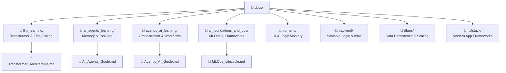
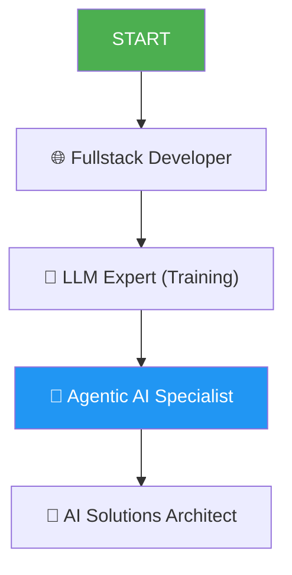

# 📚 Docs Structure Guide
> **MyLLM Project ki learning materials ka organized map (Updated 2026)**

---

## 🗂️ Folder Structure: Professional Ecosystem

---

## 📁 1. LLM Mastery (All Topics)

| Module | Core Mastery File | Final Goal |
|--------|-------------------|------------|
| **Core** | [Transformer_Architecture_Inside_Out.md](llm_learning/Transformer_Architecture_Inside_Out.md) | RoPE, GQA, MHA deep dive. |
| **Logic** | [Tokenization_and_Data_Prep.md](llm_learning/Tokenization_and_Data_Prep.md) | BPE & Data Cleaning. |
| **Training**| [FineTuning_RLHF_Mastery.md](llm_learning/FineTuning_RLHF_Mastery.md) | SFT, LoRA, DPO. |
| **Retrieval**| [RAG_Guide.md](llm_learning/RAG_Guide.md) | Advanced Chunking & DBs. |

---

## 📁 2. AI Agents & Agentic AI (Specialization)

| Module | Core Mastery File | Final Goal |
|--------|-------------------|------------|
| **Memory** | [Agent_Memory_and_Planning.md](ai_agents_learning/Agent_Memory_and_Planning.md) | Long-term memory & CoT. |
| **Integration**| [MCP_Guide.md](ai_agents_learning/MCP_Guide.md) | Protocols and tool calling. |
| **Multi-Agent**| [Multi_Agent_Orchestration.md](agentic_ai_learning/Multi_Agent_Orchestration.md) | CrewAI, AutoGen, Graph Flow. |

---

## 📁 3. Web & Infrastructure (Fullstack)

| Segment | Mastery File | Goal |
|---------|--------------|------|
| **Frontend** | [React_Production_Mastery.md](frontend/React_Production_Mastery.md) | Fiber & UI Perf. |
| **Backend** | [NodeJS_Internals_and_Scaling.md](backend/NodeJS_Internals_and_Scaling.md)| Libuv & Concurrency. |
| **DBMS** | [Advanced_Indexing_and_Scaling.md](dbms/Advanced_Indexing_and_Scaling.md) | Sharding & Partitioning. |

---

## 🎓 Master Path (Career Growth)

---

## 🧩 Why this Library?
- ✅ **Ultra-Structured:** Separate folders for LLMs, Agents, and Orchestration.
- ✅ **Engine-Level Knowledge:** No surface-level stuff.
- ✅ **Hinglish for Humans:** Memory-friendly explanations.
- ✅ **Zero-to-Hero:** Every sub-topic covered (Checklists included).
