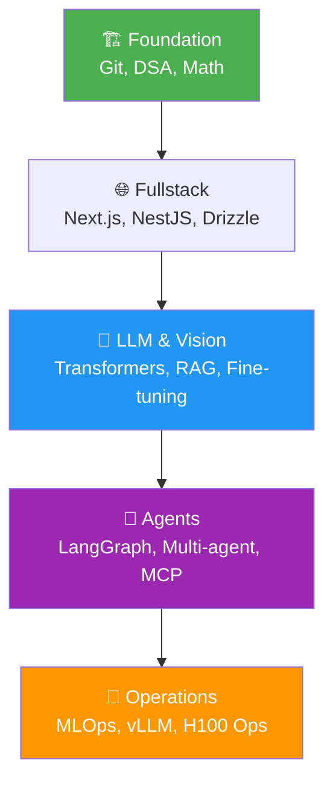

# 🚀 AI Engineering Mastery — The 2026 Complete Stack
> **Objective:** 100% Job Ready for 2026 | **Language:** Hinglish | **Manifesto:** Logic First, Code Second, Scale Always.

---

## 🧭 The 2026 Manifesto

2026 mein technology sirf "use" nahi ki jaati, wo **Orchestrate** ki jaati hai. Ek "Job Ready" engineer ko pata hona chahiye ki AI models ko UI ke saath kaise integrate karein, unhe custom knowledge (RAG) se kaise power dein, aur distributed clusters par kaise scale karein. Ye repository aapka **Master Blueprint** hai.

---

## 🗺️ Unified Knowledge Graph

---

## 📁 The Mastery Index

### 1. [LLM & Cognitive Mastery](llm_learning/README.md)
*From Tokens to Fine-tuning.*
- [Transformer Internals](llm_learning/Transformer_Architecture_Inside_Out.md)
- [RAG & Vector Search](llm_learning/RAG_Guide.md)
- [Fine-tuning & DPO](llm_learning/FineTuning_RLHF_Mastery.md)

### 2. [Autonomous Agents](ai_agents_learning/README.md)
*Building Brains that Act.*
- [LangGraph State Machines](ai_agents_learning/16_Advanced_Agentic_Patterns/Advanced_Agentic_Patterns_Fundamentals.md)
- [MCP Connectivity](ai_agents_learning/05_Tool_Use_and_Action_Execution/Tool_Execution_Fundamentals.md)
- [Agentic Memory](ai_agents_learning/04_Agent_Memory_Systems/Memory_Systems_Fundamentals.md)

### 3. [Fullstack & Systems](fullstack/README.md)
*The Production Ecosystem.*
- [Next.js AI Dashboards](fullstack/NextJS_Production_Mastery.md)
- [Enterprise NestJS](fullstack/NestJS_Microservices_Guide.md)
- [Database & Auth](fullstack/Fullstack_Database_Patterns.md)

### 4. [AI Infrastructure & Ops](ai_foundations_and_ops/README.md)
*Deployment at Scale.*
- [MLOps Lifecycle](ai_foundations_and_ops/MLOps_Lifecycle_Mastery.md)
- [Inference Optimization](system_design/Inference_Optimization_vLLM_TGI.md)
- [Hardware Ops (H100/Blackwell)](llm_learning/LLM_Hardware_Optimization.md)

---

## 🏆 The Capstone Project: SusaGPT
Ye poora repository **SusaGPT** build karne ke liye design kiya gaya hai—ek AI-First platform jo:
- **Speaks:** Hinglish-optimized models.
- **Sees:** Multimodal document analysis.
- **Acts:** Autonomous research & coding agents.
- **Scales:** vLLM-powered global inference.

---

## 🧩 Why this Library?
- ✅ **2026 Standards:** Every file covers the latest tech (Next.js 15, vLLM, Blackwell).
- ✅ **Interview Proof:** 100+ scenarios integrated across docs.
- ✅ **Hinglish Fluency:** Complex math simplified for memory.
- ✅ **Engineering Depth:** We don't skip the "Hard Parts".

> **Final Insight:** Mastery is a **Journey**, not a destination. Follow the roadmap, build the projects, and you will be in the top 1% of AI Engineers worldwide.
