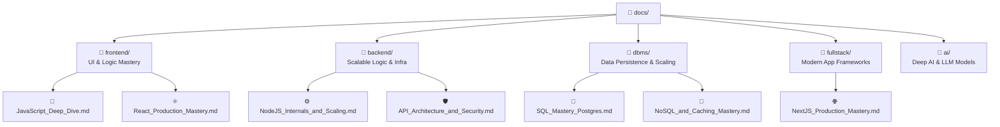
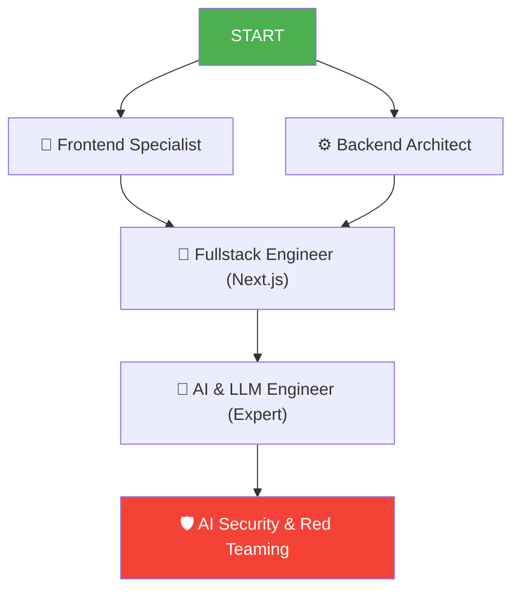

# 📚 Docs Structure Guide
> **MyLLM Project ki learning materials ka organized map (Updated 2026)**

---

## 🗂️ Folder Structure: Professional Ecosystem

---

## 📁 1. Frontend Deep Dive (All Topics)

| Module | Core Mastery File | Final Goal |
|--------|-------------------|------------|
| **Core JS** | [JavaScript_Deep_Dive.md](frontend/JavaScript_Deep_Dive.md) | V8, Event Loop, Closures, Prototypes. |
| **Framework**| [React_Production_Mastery.md](frontend/React_Production_Mastery.md) | Fiber, Reconciliation, Advanced Hooks. |
| **Speed** | [Frontend_Performance_Mastery.md](frontend/Frontend_Performance_Mastery.md)| Web Vitals, Rendering, LCP/FID/CLS. |
| **Storage** | [State_Management_Advanced.md](frontend/State_Management_Advanced.md) | Zustand, Redux, React Query (Caching). |

---

## 📁 2. Backend & Cloud (All Topics)

| Module | Core Mastery File | Final Goal |
|--------|-------------------|------------|
| **Runtime** | [NodeJS_Internals_and_Scaling.md](backend/NodeJS_Internals_and_Scaling.md) | Libuv, Cluster, Worker Threads, Streams. |
| **Security**| [API_Architecture_and_Security.md](backend/API_Architecture_and_Security.md) | JWT/OAuth2, OWASP Defense, GraphQL. |
| **Infra** | [Infrastructure_and_Microservices.md](backend/Infrastructure_and_Microservices.md)| Docker, Kubernetes, CI/CD, AWS/K8s. |

---

## 📁 3. Database Management (All Topics)

| Module | Core Mastery File | Final Goal |
|--------|-------------------|------------|
| **Relational**| [SQL_Mastery_Postgres.md](dbms/SQL_Mastery_Postgres.md) | ACID, Normalization, Joins, WAL. |
| **Flexible** | [NoSQL_and_Caching_Mastery.md](dbms/NoSQL_and_Caching_Mastery.md) | MongoDB Clusters, Redis Patterns. |
| **Scaling** | [Advanced_Indexing_and_Scaling.md](dbms/Advanced_Indexing_and_Scaling.md) | Sharding, Partitioning, CAP Theorem. |

---

## 📁 4. Fullstack Engine (The Modern Way)

- **[NextJS_Production_Mastery.md](fullstack/NextJS_Production_Mastery.md):** SSR, ISR, Server Components, SEO.
- **[Deployment_CI_CD_Mastery.md](fullstack/Fullstack_Mastery_Guide.md):** GitHub Actions & Cloud Ops.

---

## 🎓 Learning Paths (Career Growth)

---

## 🧩 Features of this Docs Library
- ✅ **Deep Knowledge:** Logic explained from the silicon/engine level.
- ✅ **Hinglish Expert Explanations:** Real-world analogies.
- ✅ **Zero to Production:** Includes Docker, CI/CD, and Cloud.
- ✅ **Self-Sufficient:** No need for courses or external guides.
