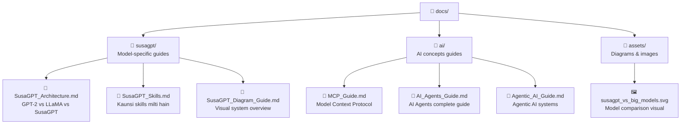
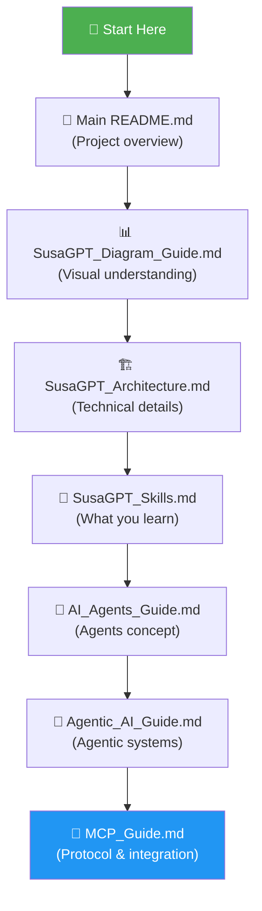

# 📚 Docs Structure Guide
> **MyLLM Project ki learning materials ka organized map**

---

## 🗂️ Folder Structure



---

## 📄 File Quick Reference

| File | Content | Level |
|------|---------|-------|
| [SusaGPT_Architecture.md](susagpt/SusaGPT_Architecture.md) | Architecture comparison, RoPE/SwiGLU/GQA code examples | Intermediate |
| [SusaGPT_Skills.md](susagpt/SusaGPT_Skills.md) | Skills with working code demos | Beginner → Intermediate |
| [SusaGPT_Diagram_Guide.md](susagpt/SusaGPT_Diagram_Guide.md) | Visual diagrams + exercises | Beginner |
| [MCP_Guide.md](ai/MCP_Guide.md) | Model Context Protocol, working server example | Intermediate |
| [AI_Agents_Guide.md](ai/AI_Agents_Guide.md) | AI Agents complete guide with real examples | Beginner → Intermediate |
| [Agentic_AI_Guide.md](ai/Agentic_AI_Guide.md) | Agentic AI concepts + working example | Beginner → Intermediate |

---

## 🎓 Recommended Learning Order



---

## 🧩 Each File Has

- ✅ Mermaid diagrams for visual understanding
- ✅ Real working code examples (Python)
- ✅ Hinglish explanations
- ✅ Exercises with answers
- ✅ Quick knowledge tests
- ✅ Resource links

---

## 🏃 Quick Start

**Pehli baar dekh rahe ho? Yahan se shuru karo:**

```
1. README.md (root) → Project samjho
2. SusaGPT_Diagram_Guide.md → Visual overview lo
3. SusaGPT_Skills.md → Samjho kya sikhoge
4. SusaGPT_Architecture.md → Technical depth lo
```

**AI concepts sikhna hai? Yahan se:**
```
1. AI_Agents_Guide.md → Agents kya hote hain
2. Agentic_AI_Guide.md → Agentic systems
3. MCP_Guide.md → Protocol aur integration
```
