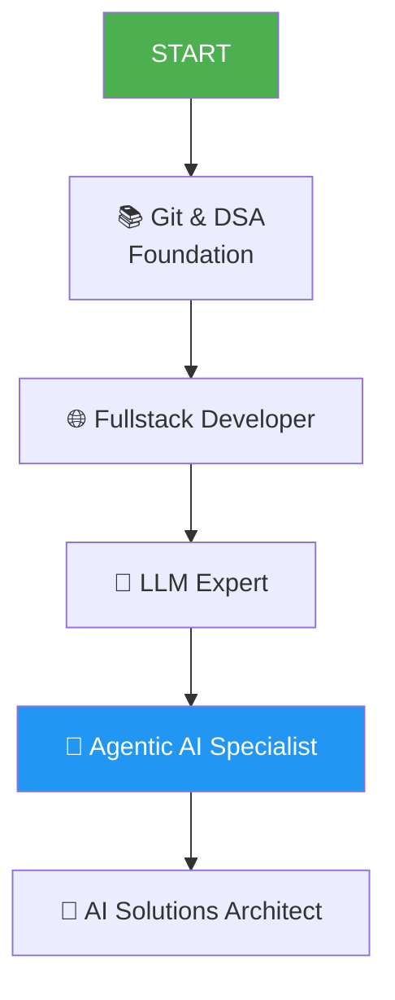

# 📚 Docs Structure Guide
> **MyLLM Project ki learning materials ka organized map (Updated 2026)**

---

## 🗂️ Folder Structure: Complete Ecosystem

```mermaid
flowchart TD
    DOCS["📁 docs/"] --> AI_LLM["📁 llm_learning/\nTransformer & Fine-Tuning"]
    DOCS --> AI_AGENTS["📁 ai_agents_learning/\nMemory & Tool-use"]
    DOCS --> AI_AGENTIC["📁 agentic_ai_learning/\nOrchestration & Workflows"]
    DOCS --> AI_OPS["📁 ai_foundations_and_ops/\nMLOps & Frameworks"]
    
    DOCS --> FE["📁 frontend/\nUI & Logic Mastery"]
    DOCS --> BE["📁 backend/\nScalable Logic & Infra"]
    DOCS --> DB["📁 dbms/\nData Persistence & Scaling"]
    DOCS --> FS["📁 fullstack/\nModern App Frameworks"]
    DOCS --> SEC["📁 security/\nSecurity Best Practices"]
    DOCS --> SYS["📁 system_design/\nSystem Architecture"]
    DOCS --> EX["📁 exercises/\nInteractive Demos"]
    DOCS --> GLOBAL["📁 Git & DSA/\nFoundation Skills"]
```

---

## 📁 1. LLM Mastery (Complete Learning Path)

| Topic | Core Mastery File | Level |
|-------|-------------------|-------|
| **Transformer** | [Transformer_Architecture_Inside_Out.md](llm_learning/Transformer_Architecture_Inside_Out.md) | Beginner → Expert |
| **Neural Networks** | [Neural_Networks_From_Scratch.md](llm_learning/Neural_Networks_From_Scratch.md) | Beginner → Intermediate |
| **Attention** | [Attention_Mechanism_Deep_Dive.md](llm_learning/Attention_Mechanism_Deep_Dive.md) | Intermediate → Expert |
| **Tokenization** | [Tokenization_Complete_Guide.md](llm_learning/Tokenization_Complete_Guide.md) | Beginner → Intermediate |
| **Embeddings** | [Vector_Embeddings_Deep_Dive.md](llm_learning/Vector_Embeddings_Deep_Dive.md) | Intermediate → Expert |
| **Fine-tuning** | [FineTuning_RLHF_Mastery.md](llm_learning/FineTuning_RLHF_Mastery.md) | Intermediate → Expert |
| **Decoding** | [Decoding_Strategies_Guide.md](llm_learning/Decoding_Strategies_Guide.md) | Intermediate → Expert |
| **RAG** | [RAG_Guide.md](llm_learning/RAG_Guide.md) | Intermediate |
| **MoE** | [Mixture_of_Experts_MoE.md](llm_learning/Mixture_of_Experts_MoE.md) | Intermediate → Expert |

---

## 📁 2. AI Agents & Agentic AI

| Topic | Core Mastery File | Level |
|-------|-------------------|-------|
| **AI Agents** | [AI_Agents_Guide.md](ai_agents_learning/AI_Agents_Guide.md) | Beginner → Intermediate |
| **Agentic AI** | [Agentic_AI_Guide.md](agentic_ai_learning/Agentic_AI_Guide.md) | Beginner → Intermediate |
| **MCP Protocol** | [MCP_Guide.md](ai_agents_learning/MCP_Guide.md) | Intermediate |
| **CrewAI** | [CrewAI_Guide.md](ai_agents_learning/CrewAI_Guide.md) | Intermediate |
| **Memory & Planning** | [Agent_Memory_and_Planning.md](ai_agents_learning/Agent_Memory_and_Planning.md) | Intermediate |

---

## 📁 3. AI Foundations & MLOps

| Topic | Core Mastery File | Level |
|-------|-------------------|-------|
| **Python** | [Python_for_AI.md](ai_foundations_and_ops/Python_for_AI.md) | Beginner |
| **PyTorch** | [PyTorch_Guide.md](ai_foundations_and_ops/PyTorch_Guide.md) | Beginner → Expert |
| **NumPy/Pandas** | [NumPy_Pandas_Complete_Guide.md](ai_foundations_and_ops/NumPy_Pandas_Complete_Guide.md) | Beginner → Intermediate |
| **Docker** | [Docker_FastAPI_Guide.md](ai_foundations_and_ops/Docker_FastAPI_Guide.md) | Intermediate |
| **HuggingFace** | [HuggingFace_Guide.md](ai_foundations_and_ops/HuggingFace_Guide.md) | Intermediate |
| **MLOps** | [MLOps_Lifecycle_Mastery.md](ai_foundations_and_ops/MLOps_Lifecycle_Mastery.md) | Intermediate → Expert |

---

## 📁 4. Frontend Development

| Topic | Core Mastery File | Level |
|-------|-------------------|-------|
| **HTML/CSS** | [HTML_CSS_Mastery.md](frontend/HTML_CSS_Mastery.md) | Beginner |
| **JavaScript** | [JavaScript_Deep_Dive.md](frontend/JavaScript_Deep_Dive.md) | Beginner → Intermediate |
| **TypeScript** | [TypeScript_Complete_Guide.md](frontend/TypeScript_Complete_Guide.md) | Beginner → Expert |
| **React** | [React_Production_Mastery.md](frontend/React_Production_Mastery.md) | Intermediate |
| **Performance** | [Frontend_Performance_Mastery.md](frontend/Frontend_Performance_Mastery.md) | Intermediate → Expert |
| **Testing** | [Testing_QA.md](frontend/Testing_QA.md) | Intermediate |

---

## 📁 5. Backend Development

| Topic | Core Mastery File | Level |
|-------|-------------------|-------|
| **Node.js** | [NodeJS_Internals_and_Scaling.md](backend/NodeJS_Internals_and_Scaling.md) | Intermediate |
| **FastAPI** | [Python_FastAPI_Backend.md](backend/Python_FastAPI_Backend.md) | Beginner → Intermediate |
| **GraphQL** | [GraphQL_Complete_Guide.md](backend/GraphQL_Complete_Guide.md) | Intermediate |
| **WebSockets** | [WebSockets_Realtime.md](backend/WebSockets_Realtime.md) | Intermediate |
| **Caching** | [Caching_Strategies.md](backend/Caching_Strategies.md) | Intermediate → Expert |
| **Database** | [Database_Design_Optimization.md](backend/Database_Design_Optimization.md) | Intermediate |

---

## 📁 6. Database & DBMS

| Topic | Core Mastery File | Level |
|-------|-------------------|-------|
| **SQL** | [SQL_Beginner_to_Advanced.md](dbms/SQL_Beginner_to_Advanced.md) | Beginner → Expert |
| **PostgreSQL** | [SQL_Mastery_Postgres.md](dbms/SQL_Mastery_Postgres.md) | Intermediate → Expert |
| **NoSQL** | [NoSQL_and_Caching_Mastery.md](dbms/NoSQL_and_Caching_Mastery.md) | Intermediate |
| **Transactions** | [Transactions_Locking_Deep_Dive.md](dbms/Transactions_Locking_Deep_Dive.md) | Intermediate → Expert |
| **Indexing** | [Advanced_Indexing_and_Scaling.md](dbms/Advanced_Indexing_and_Scaling.md) | Advanced |

---

## 📁 7. Fullstack Development

| Topic | Core Mastery File | Level |
|-------|-------------------|-------|
| **Next.js** | [NextJS_Production_Mastery.md](fullstack/NextJS_Production_Mastery.md) | Beginner → Intermediate |
| **Vue.js** | [VueJS_Complete_Guide.md](fullstack/VueJS_Complete_Guide.md) | Beginner → Intermediate |
| **Angular** | [Angular_Enterprise_Guide.md](fullstack/Angular_Enterprise_Guide.md) | Intermediate |
| **NestJS** | [NestJS_Microservices_Guide.md](fullstack/NestJS_Microservices_Guide.md) | Intermediate → Expert |
| **Database Patterns** | [Fullstack_Database_Patterns.md](fullstack/Fullstack_Database_Patterns.md) | Intermediate |
| **Authentication** | [Fullstack_Authentication_Guide.md](fullstack/Fullstack_Authentication_Guide.md) | Intermediate |
| **Docker** | [Fullstack_Docker_Deployment.md](fullstack/Fullstack_Docker_Deployment.md) | Intermediate |
| **Serverless** | [Serverless_Fullstack_Guide.md](fullstack/Serverless_Fullstack_Guide.md) | Intermediate |
| **tRPC** | [tRPC_Guide.md](fullstack/tRPC_Guide.md) | Intermediate |

---

## 📁 8. Security

| Topic | Core Mastery File | Level |
|-------|-------------------|-------|
| **Linux Security** | [Linux_Security_Fundamentals.md](security/Linux_Security_Fundamentals.md) | Beginner → Intermediate |
| **Cryptography** | [Cryptography_Beginner_Guide.md](security/Cryptography_Beginner_Guide.md) | Beginner → Intermediate |
| **Docker Security** | [Docker_Container_Security.md](security/Docker_Container_Security.md) | Intermediate |
| **OAuth2/OIDC** | [OAuth2_OpenID_Connect.md](security/OAuth2_OpenID_Connect.md) | Intermediate |
| **API Security** | [API_Security_Authentication.md](security/API_Security_Authentication.md) | Intermediate |
| **LLM Security** | [OWASP_Top_10_for_LLMs.md](security/OWASP_Top_10_for_LLMs.md) | Intermediate |

---

## 📁 9. System Design

| Topic | Core Mastery File | Level |
|-------|-------------------|-------|
| **Scalable Architecture** | [Scalable_AI_Architecture.md](system_design/Scalable_AI_Architecture.md) | Intermediate |
| **Interview Guide** | [System_Design_Interview_Guide.md](system_design/System_Design_Interview_Guide.md) | Intermediate → Expert |
| **Rate Limiting** | [API_Rate_Limiting_Algorithms.md](system_design/API_Rate_Limiting_Algorithms.md) | Intermediate |
| **Consistent Hashing** | [Consistent_Hashing.md](system_design/Consistent_Hashing.md) | Intermediate |
| **Load Balancing** | [Load_Balancing_Advanced.md](system_design/Load_Balancing_Advanced.md) | Intermediate |
| **Caching** | [Caching_Strategies.md](system_design/Caching_Strategies.md) | Intermediate |

---

## 📁 10. Foundation Skills

| Topic | Core Mastery File | Level |
|-------|-------------------|-------|
| **Git** | [Git_Complete_Guide.md](Git_Complete_Guide.md) | Beginner → Intermediate |
| **DSA** | [DSA_Basics_Guide.md](DSA_Basics_Guide.md) | Beginner → Intermediate |

---

## 📁 11. Interactive Exercises

| Topic | File |
|-------|------|
| **All Demos** | [exercises/README.md](exercises/README.md) |
| **Tokenizer** | [tokenizer_demo.py](exercises/tokenizer_demo.py) |
| **Architecture** | [architecture_demo.py](exercises/architecture_demo.py) |
| **Training** | [training_demo.py](exercises/training_demo.py) |
| **Sampling** | [sampling_demo.py](exercises/sampling_demo.py) |
| **Evaluation** | [evaluation_demo.py](exercises/evaluation_demo.py) |
| **AI Agents** | [ai_agents_demo.py](exercises/ai_agents_demo.py) |
| **Agentic AI** | [agentic_ai_demo.py](exercises/agentic_ai_demo.py) |
| **MCP** | [mcp_demo.py](exercises/mcp_demo.py) |

---

## 🎓 Master Path (Career Growth)

---

## 🧩 Why this Library?

- ✅ **100% Complete**: Beginner to Advanced content in every topic
- ✅ **Ultra-Structured**: Separate folders for each technology
- ✅ **Engine-Level Knowledge**: No surface-level stuff
- ✅ **Hinglish for Humans**: Memory-friendly explanations
- ✅ **Zero-to-Hero**: Every sub-topic covered
- ✅ **Interactive Demos**: Practical code examples included
- ✅ **Interview Ready**: System design and DSA included
