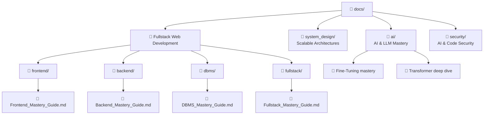
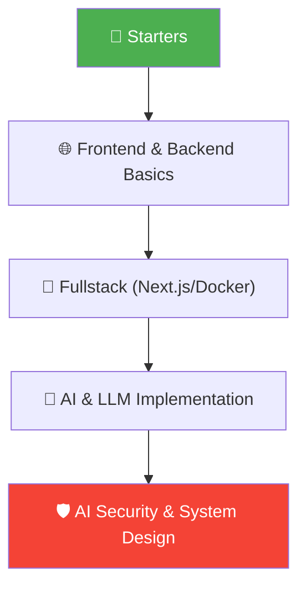

# 📚 Docs Structure Guide
> **MyLLM Project ki learning materials ka organized map (Updated 2026)**

---

## 🗂️ Folder Structure

---

## 📄 File Quick Reference (Web & Backend focus)

| Category | Key Mastery Guide | Final Goal |
|----------|-------------------|------------|
| **Frontend** | [Frontend_Mastery_Guide.md](frontend/Frontend_Mastery_Guide.md) | React, UI Performance & UX. |
| **Backend** | [Backend_Mastery_Guide.md](backend/Backend_Mastery_Guide.md) | Scalable APIs, Node.js & Security. |
| **DBMS** | [DBMS_Mastery_Guide.md](dbms/DBMS_Mastery_Guide.md) | SQL/NoSQL Architecture & Scaling. |
| **Fullstack** | [Fullstack_Mastery_Guide.md](fullstack/Fullstack_Mastery_Guide.md) | CI/CD, Deployment & Infrastructure. |

---

## 🎓 Recommended Professional Path

---

## 🧩 Learning Features
- ✅ **Hinglish Explanations:** Analogies used to make complex logic simple.
- ✅ **Mermaid Diagrams:** Flows for every single architecture.
- ✅ **Expert Deep Dives:** Zero to Hero content.
- ✅ **Interview Preps:** Practice problems in every doc.

---

## 🏃 Quick Start (Fullstack Dev)

**Industry-ready Developer banna hai? In 4 Guides ko pehle khatam karo:**
1. **Frontend_Mastery_Guide.md** → UI & React master karo.
2. **Backend_Mastery_Guide.md** → Logic, APIs & Node.js/Python deep dive.
3. **DBMS_Mastery_Guide.md** → Data organization check karo.
4. **Fullstack_Mastery_Guide.md** → Deployment & CI/CD workflow lo.

**AI + Software (Advanced):**
1. **FineTuning_RLHF_Mastery.md** → AI training.
2. **Inference_Optimization_vLLM_TGI.md** → Performance design.
3. **LLM_Red_Teaming_Mastery.md** → Hacker-proof AI.
