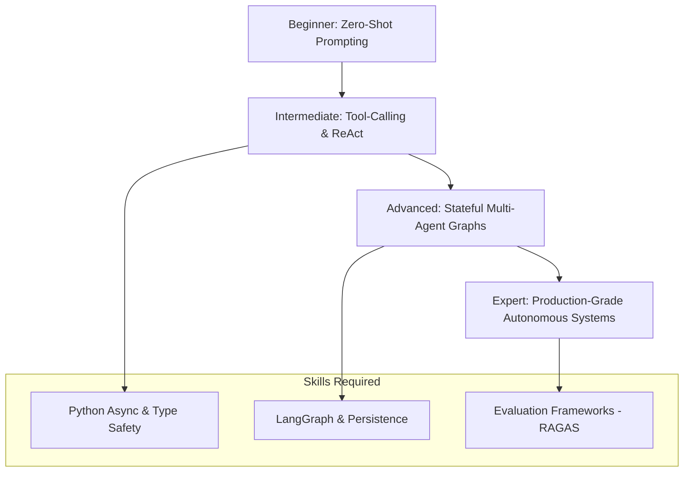

# 🗺️ Agentic AI Roadmap 2026 — Zero to Expert
> **Level:** Foundations | **Language:** Hinglish | **Goal:** Become a Top 1% Agentic AI Engineer in the 2026 market.

---

## 🧭 1. Beginner-Friendly Hinglish Explanation
2026 mein AI ka matlab sirf "Chatbot" nahi reh gaya hai. Aaj hum **Agents** ki baat karte hain—wo AI jo sirf bolta nahi, balki kaam karta hai. Agentic AI Roadmap ka matlab hai wo rasta jo aapko ek "Text Generator" developer se badal kar ek "Autonomous System Architect" bana dega. 

Aapko sirf prompts likhna nahi seekhna, balki systems design karna seekhna hai jo:
- Khud se plan karein.
- Tools (Search, Code, API) use karein.
- Galtiyon se seekhein (Self-reflection).
- Complex goals ko chote tasks mein tod dein.

---

## 🧠 2. Deep Technical Explanation
Agentic AI 2026 revolves around **Cognitive Architectures**. It's moving from fixed loops to dynamic, stateful graphs.
- **Core Loop:** Observation (State) → Reasoning (LLM) → Tool Selection (Action) → Feedback (Environment).
- **Emergent Behavior:** Systems like **Reason-without-Observation (ReWOO)** separate reasoning from tool execution to save costs and latency.
- **Cognitive Load:** Understanding how much context an LLM can handle before "reasoning fatigue" sets in.

---

## 🏗️ 3. Architecture Diagrams



---

## 💻 4. Production-Ready Code Example (Roadmap Tracker)

```python
from typing import TypedDict, List
from langgraph.graph import StateGraph, START, END

# Roadmap State Definition
class RoadmapState(TypedDict):
    completed_milestones: List[str]
    current_focus: str
    is_job_ready: bool

def update_roadmap(state: RoadmapState):
    # Logic to progress the student
    if len(state["completed_milestones"]) >= 10:
        return {"is_job_ready": True, "current_focus": "Interview Prep"}
    return {"is_job_ready": False}

# Simple Graph for Roadmap Tracking
builder = StateGraph(RoadmapState)
builder.add_node("evaluator", update_roadmap)
builder.add_edge(START, "evaluator")
builder.add_edge("evaluator", END)
# graph = builder.compile()
```

---

## 🌍 5. Real-World Use Cases
1. **Autonomous Coding Agents:** Agents that write tests, fix bugs, and commit to GitHub (e.g., OpenDevin).
2. **AI SDRs (Sales):** Agents that research leads, send personalized emails, and handle follow-ups.
3. **Automated Research Teams:** Multiple agents collaborating to write a 50-page technical paper.

---

## ❌ 6. Failure Cases
- **Infinite Loops:** Agent search karta reh jata hai aur kabhi finish nahi karta.
- **Context Overload:** Memory itni bhar jati hai ki agent actual goal bhool jata hai.
- **Tool Hallucination:** Agent aise tools call karta hai jo exist hi nahi karte.

---

## 🛠️ 7. Debugging Guide
- **Trace Viewer:** Always use **LangSmith** or **Arize Phoenix** to see the hidden thoughts of the agent.
- **Log Everything:** Prompt inputs, tool outputs, and LLM reasoning tokens save karne chahiye for audit.

---

## ⚖️ 8. Tradeoffs
- **Speed vs. Accuracy:** Chain-of-thought (CoT) accurate hota hai par slow aur mehnga hota hai.
- **Autonomy vs. Control:** Zyaada autonomy risk badhati hai (hallucinations), kam autonomy development time badhati hai.

---

## ✅ 9. Best Practices
- **Small Tools:** Ek bada "Do everything" tool banane ki jagah 10 chote specific tools banayein.
- **Type Safety:** Python `pydantic` ya `typing` mandatory hai 2026 production mein.
- **Checkpoints:** Har step ke baad state save karein (Persistence).

---

## 🛡️ 10. Security Concerns
- **Prompt Injection:** User agent ko manipulate karke private tools chalwa sakta hai.
- **Data Leakage:** Agent galti se tool output mein sensitive data reveal kar sakta hai.

---

## 📈 11. Scaling Challenges
- **Rate Limits:** Multiple agents fast-fast API calls karke LLM provider se ban ho sakte hain.
- **Shared Memory:** 100 agents ke beech state sync karna difficult hai.

---

## 💰 12. Cost Considerations
- **Token Budgeting:** Har agent loop ki ek max token cost set karni chahiye.
- **Model Routing:** Chote tasks ke liye GPT-4o-mini/Claude-Haiku use karein aur complex tasks ke liye bade models.

---

## 📝 13. Interview Questions
1. **"LangChain vs LangGraph mein kya fark hai?"**
2. **"Agent loops ko infinite hone se kaise rokoge?"**
3. **"State persistence production mein kyu zaruri hai?"**

---

## ⚠️ 14. Common Mistakes
- **No Evaluation:** "Vibes" par check karna ki agent acha kaam kar raha hai (use RAGAS/DeepEval).
- **Too much Context:** LLM ko poori database history bhej dena (use pruning).

---

## 🚀 15. Latest 2026 Industry Patterns
- **MCP (Model Context Protocol):** Connecting agents to any data source instantly.
- **Small Language Models (SLMs):** Fine-tuned 7B models performing better than 70B models for specific tool-calling tasks.

---

> **Final Note:** AI Engineer banna ek sprint nahi, marathon hai. Start building today!
