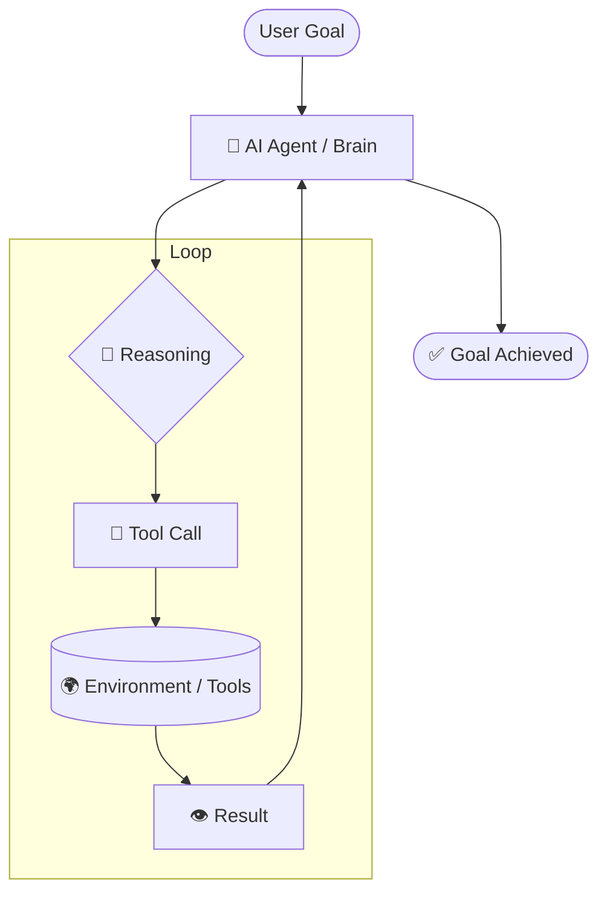

# 🤖 How AI Agents Work — The Cognitive Loop
> **Level:** Foundations | **Language:** Hinglish | **Goal:** Master the core architecture and execution cycle of AI Agents.

---

## 🧭 1. Beginner-Friendly Hinglish Explanation
Normal Chatbot aur AI Agent mein ek bahut bada farq hai: **Chatbot sirf bolta hai, Agent sochta aur karta hai.** 

Imagine karo aap ek travel assistant chatbot se puchte ho: "Dubai ki flights dikhao." Chatbot flight list de dega. Lekin ek **Agent** flight dhoondhega, aapki preferences (veg food, window seat) check karega, aur final booking ke liye link ya approval mangega. 

Ye kaise hota hai? Ek loop ke zariye:
1. **Duniya ko dekho (Observe)**
2. **Brain ka use karo (Reason)**
3. **Kaam karo (Act)**

---

## 🧠 2. Deep Technical Explanation
The core of an agent is the **Reasoning Loop** (often implemented as **ReAct** - Reasoning and Acting). 
- **The State:** A snapshot of the world (conversation history, tool outputs).
- **The Logic:** The LLM processes the current state and generates a "Thought" and an "Action".
- **The Execution:** The system intercepts the "Action" string, calls the actual code/API, and feeds the "Observation" back to the LLM.
- **Cognitive Load:** 2026 systems use **Long-term Memory** (Vector DBs) and **Short-term Memory** (Context Window) to maintain this loop across thousands of steps.

---

## 🏗️ 3. Architecture Diagrams



---

## 💻 4. Production-Ready Code Example (Simple Agent Loop)

```python
import json

def get_weather(city: str):
    # Simulated Tool
    return f"The weather in {city} is 25°C and Sunny."

def run_simple_agent(user_prompt: str):
    # This is a simulation of what happens inside an agent loop
    print(f"Goal: {user_prompt}")
    
    # 1. THOUGHT
    thought = "I need to find the weather for London to answer the user."
    print(f"Thought: {thought}")
    
    # 2. ACT
    action = {"tool": "get_weather", "params": {"city": "London"}}
    print(f"Action: {json.dumps(action)}")
    
    # 3. OBSERVATION
    observation = get_weather("London")
    print(f"Observation: {observation}")
    
    # 4. FINAL ANSWER
    final_answer = f"Based on my search, {observation}"
    print(f"Final Result: {final_answer}")

# run_simple_agent("What's the weather like in London?")
```

---

## 🌍 5. Real-World Use Cases
- **Customer Support:** Resolving issues by checking database orders and processing refunds.
- **Data Analyst:** Running SQL queries on a database and generating charts autonomously.
- **Personal Assistant:** Booking appointments by checking Google Calendar and sending invites.

---

## ❌ 6. Failure Cases
- **Reasoning Drift:** Agent apne goal se bhatak jata hai aur irrelevant cheezein karne lagta hai.
- **Execution Error:** Tool call fail ho jata hai aur agent ko samajh nahi aata ki retry kaise karein.
- **Hallucinated Tools:** LLM aise tool ka naam leta hai jo system mein defined hi nahi hai.

---

## 🛠️ 7. Debugging Guide
- **Trace the Loop:** Har iteration ka "Thought" aur "Observation" print karein.
- **Prompt Inspect:** Check karein ki LLM ko bheja gaya "System Prompt" tools ko sahi se describe kar raha hai ya nahi.

---

## ⚖️ 8. Tradeoffs
- **Reactive vs. Proactive:** ReAct loops reactive hote hain (step-by-step), jabki Plan-and-Execute systems pehle poora plan banate hain (faster but less adaptive).

---

## ✅ 9. Best Practices
- **Explicit Instruction:** System prompt mein likhein: "If you don't know the answer, use the search tool."
- **Structured Output:** Model se humesha JSON ya specific format mein output maangein.

---

## 🛡️ 10. Security Concerns
- **Excessive Agency:** Agent ko wo tools dena jo system delete kar sakein (Dangerous!).
- **Unsanitized Input:** Tool output ko bina check kiye model ko wapas dena (Indirect Prompt Injection).

---

## 📈 11. Scaling Challenges
- **Latency:** Har tool call LLM ko ek naya round-trip bhejti hai, jo slow ho sakta hai.
- **Parallelism:** Ek saath multiple tools kaise chalayein bina "Thought" block kiye.

---

## 💰 12. Cost Considerations
- **Loop Inflation:** Agar agent 10 baar loop chalata hai, toh cost 10x ho jati hai. 
- **Caching:** Common tool results ko cache karna chahiye to save tokens.

---

## 📝 13. Interview Questions
1. **"Observation aur Reasoning ke beech ka difference kya hai?"**
2. **"Agentic loops mein 'Hallucination' ko kaise minimize karenge?"**
3. **"Stateful vs Stateless agents kya hote hain?"**

---

## ⚠️ 14. Common Mistakes
- **Assuming LLM is a robot:** LLM galti kar sakta hai, humesha validation logic (Guardrails) rakhein.
- **No Stop Condition:** Loop ko bina `max_iterations` ke chalana.

---

## 🚀 15. Latest 2026 Industry Patterns
- **Vision-based Observation:** Agents ab sirf text nahi, screen ke screenshots dekh kar "Observe" karte hain (WebVoyager patterns).
- **Self-Healing Loops:** Agar tool error deta hai, toh model khud se apna code/parameter fix karke retry karta hai.

---

> **Expert Tip:** Ek acha agent system wahi hai jahan **Reasoning** aur **Action** ke beech ka rasta saaf aur secure ho.
