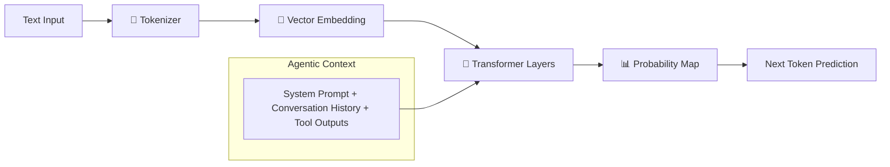

# 🧠 LLM Basics for Agents — The Neural Engine
> **Level:** Foundations | **Language:** Hinglish | **Goal:** Master the fundamental LLM concepts that power intelligent agents.

---

## 🧭 1. Beginner-Friendly Hinglish Explanation
Agent ek gaadi (car) ki tarah hai, aur LLM uska **Engine** hai. Agar engine hi nahi samjhoge, toh gaadi ko race track (production) par kaise chalaoge? 

LLM basics mein hum seekhte hain ki kaise model words ko numbers mein badalta hai (**Tokens/Embeddings**), kaise wo important info par focus karta hai (**Attention**), aur uski memory ki limit kya hai (**Context Window**). 

Agents ke liye LLM ka "smart" hona zaruri hai, lekin uski limitations (Hallucinations) ko handle karna usse bhi zyada zaruri hai.

---

## 🧠 2. Deep Technical Explanation
For an AI Engineer in 2026, understanding the **Transformer Architecture** is non-negotiable.
- **Tokens:** Text is split into sub-word units. Agents are billed by tokens, so efficient prompting is key.
- **Embeddings:** High-dimensional vector representations of text. Essential for **RAG** and semantic search.
- **Attention Mechanism:** Specifically **Multi-Query Attention (MQA)** or **Grouped-Query Attention (GQA)** in modern models like Llama-3, which optimizes KV-cache and speeds up agentic reasoning.
- **Temperature:** Controls randomness. For agents, we usually keep it low (0 to 0.2) to ensure deterministic tool calling.

---

## 🏗️ 3. Architecture Diagrams



---

## 💻 4. Production-Ready Code Example (Token Counting & Management)

```python
import tiktoken

def count_tokens(text: str, model: str = "gpt-4o"):
    # Always count tokens before sending to LLM to avoid context overflow
    encoding = tiktoken.encoding_for_model(model)
    tokens = encoding.encode(text)
    return len(tokens)

# Example Usage
prompt = "Explain the logic of an AI agent in one sentence."
num_tokens = count_tokens(prompt)
print(f"Token Count: {num_tokens}")

# Pruning Logic (Hinglish Logic: Purani baatein delete karo agar limit cross ho)
def prune_context(history: list, limit: int = 4096):
    while sum(count_tokens(m['content']) for m in history) > limit:
        history.pop(0) # Oldest message remove karo
    return history
```

---

## 🌍 5. Real-World Use Cases
- **Context Window Management:** Large agents reading 100-page PDFs using RAG because the context window is limited/expensive.
- **Model Selection:** Using a cheap model (GPT-4o-mini) for summarization and a smart model (Claude 3.5 Sonnet) for coding tasks.

---

## ❌ 6. Failure Cases
- **Hallucination:** Model confident hokar galat fact batata hai ya tool parameter galat deta hai.
- **Lost in the Middle:** Bahut bade context window mein LLM beech ki info bhool jata hai.

---

## 🛠️ 7. Debugging Guide
- **Log Logits:** Advanced users check token probabilities to see if the model was "confused" between two tools.
- **System Prompt Testing:** Change one word and see if the token generation changes drastically.

---

## ⚖️ 8. Tradeoffs
- **Context Size vs. Latency:** Zyaada context = Better reasoning but Slower/Expensive responses.
- **Quantization:** 4-bit models memory kam leti hain par unki reasoning power (IQ) thodi kam ho jati hai.

---

## ✅ 9. Best Practices
- **Stop Sequences:** Use stop sequences (like `Observation:`) to prevent the agent from hallucinating tool outputs.
- **JSON Schema:** Always enforce a schema for structured outputs to make parsing reliable.

---

## 🛡️ 10. Security Concerns
- **Data Leakage in Embeddings:** PII (Private Info) vector DB mein store ho sakta hai jo search result mein leak ho jaye.
- **Adversarial Prompts:** Specially crafted tokens jo model ke safety filters ko bypass kar dein.

---

## 📈 11. Scaling Challenges
- **KV-Cache Memory:** Multiple users ke liye KV-cache store karna GPU memory kha jata hai.
- **Throughput:** Tokens Per Second (TPS) optimize karna for real-time agent feedback.

---

## 💰 12. Cost Considerations
- **Input vs. Output Pricing:** Agent loops mein input tokens (history) repeat hote hain, so **Context Caching** (supported by Anthropic/DeepSeek) saves 90% cost.

---

## 📝 13. Interview Questions
1. **"Temperature 0 aur 1 mein kya difference hai for tool calling?"**
2. **"Tokenization errors agents ko kaise affect karte hain?"**
3. **"Context window saturation kya hai?"**

---

## ⚠️ 14. Common Mistakes
- **Ignoring Token Limits:** Sending massive tool outputs (like a full 2MB JSON) directly to the LLM.
- **Static Temperature:** Sab tasks ke liye same temperature use karna (Creative vs. Logical).

---

## 🚀 15. Latest 2026 Industry Patterns
- **Context Caching:** Persistence of KV-cache across multiple turns to reduce latency and cost.
- **Long-context RAG:** Using 1M+ context windows for "Needle in a Haystack" tasks instead of traditional chunking.

---

> **Expert Tip:** In 2026, tokens are currency. The best engineer is the one who achieves the goal with the fewest tokens.
