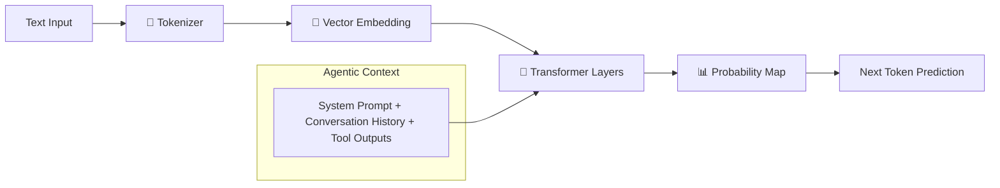

# 🧠 Agents Ke Liye LLM Basics — The Neural Engine
> **Level:** Foundations | **Language:** Hinglish | **Goal:** Intelligent agents ko power dene wale fundamental LLM concepts master karna.

---

## 🧭 1. Beginner-Friendly Hinglish Explanation
Agent ek gaadi (car) ki tarah hai, aur LLM uska **Engine** hai. Agar engine hi nahi samjhoge, toh gaadi ko race track (production) par kaise chalaoge? 

LLM basics mein hum seekhte hain ki kaise model words ko numbers mein badalta hai (**Tokens/Embeddings**), kaise wo important info par focus karta hai (**Attention**), aur uski memory ki limit kya hai (**Context Window**). 

Agents ke liye LLM ka "smart" hona zaruri hai, lekin uski limitations (Hallucinations) ko handle karna usse bhi zyada zaruri hai.

---

## 🧠 2. Deep Technical Explanation
2026 me AI Engineer ke liye **Transformer Architecture** samajhna non-negotiable hai.
- **Tokens:** Text ko sub-word units me split kiya jata hai. Agents ka billing tokens ke basis par hota hai, isliye efficient prompting key hai.
- **Embeddings:** Text ke high-dimensional vector representations. Ye **RAG** aur semantic search ke liye essential hai.
- **Attention Mechanism:** Modern models jaise Llama-3 me specifically **Multi-Query Attention (MQA)** ya **Grouped-Query Attention (GQA)**, jo KV-cache optimize karta hai aur agentic reasoning ko speed up karta hai.
- **Temperature:** Randomness control karta hai. Agents ke liye hum usually ise low (0 to 0.2) rakhte hain taaki deterministic tool calling ensure ho.

---

## 🏗️ 3. Architecture Diagrams


```mermaid
graph LR
    Input[Text Input] --> Tokenizer[🔢 Tokenizer]
    Tokenizer --> Embedding[📍 Vector Embedding]
    Embedding --> Transformer[🧠 Transformer Layers]
    Transformer --> Softmax[📊 Probability Map]
    Softmax --> Output[Next Token Prediction]
    
    subgraph Agentic Context
    Context[System Prompt + Conversation History + Tool Outputs]
    end
    Context --> Transformer
```

---

## 💻 4. Production-Ready Code Example (Token Counting & Management)

```python
import tiktoken

def count_tokens(text: str, model: str = "gpt-4o"):
    # Context overflow avoid karne ke liye LLM ko bhejne se pehle hamesha tokens count karein
    encoding = tiktoken.encoding_for_model(model)
    tokens = encoding.encode(text)
    return len(tokens)

# Example usage
prompt = "Ek sentence me AI agent ki logic explain karo."
num_tokens = count_tokens(prompt)
print(f"Token Count: {num_tokens}")

# Pruning Logic (Hinglish Logic: Purani baatein delete karo agar limit cross ho)
def prune_context(history: list, limit: int = 4096):
    while sum(count_tokens(m['content']) for m in history) > limit:
        history.pop(0) # Oldest message remove karo
    return history
```

---

## 🌍 5. Real-World Use Cases
- **Context Window Management:** Large agents 100-page PDFs read karne ke liye RAG use karte hain kyunki context window limited/expensive hoti hai.
- **Model Selection:** Summarization ke liye cheap model (GPT-4o-mini) aur coding tasks ke liye smart model (Claude 3.5 Sonnet) use karna.

---

## ❌ 6. Failure Cases
- **Hallucination:** Model confident hokar galat fact batata hai ya tool parameter galat deta hai.
- **Lost in the Middle:** Bahut bade context window mein LLM beech ki info bhool jata hai.

---

## 🛠️ 7. Debugging Guide
- **Log Logits:** Advanced users token probabilities check karte hain taaki dekh sakein ki model do tools ke beech "confused" tha ya nahi.
- **System Prompt Testing:** Ek word change karke dekhein ki token generation drastically change hoti hai ya nahi.

---

## ⚖️ 8. Tradeoffs
- **Context Size vs. Latency:** Zyaada context = Better reasoning lekin slower/expensive responses.
- **Quantization:** 4-bit models memory kam leti hain par unki reasoning power (IQ) thodi kam ho jati hai.

---

## ✅ 9. Best Practices
- **Stop Sequences:** Agent ko tool outputs hallucinate karne se prevent karne ke liye stop sequences (jaise `Observation:`) use karein.
- **JSON Schema:** Parsing reliable banane ke liye structured outputs par hamesha schema enforce karein.

---

## 🛡️ 10. Security Concerns
- **Data Leakage in Embeddings:** PII (Private Info) vector DB mein store ho sakta hai jo search result mein leak ho jaye.
- **Adversarial Prompts:** Specially crafted tokens jo model ke safety filters ko bypass kar dein.

---

## 📈 11. Scaling Challenges
- **KV-Cache Memory:** Multiple users ke liye KV-cache store karna GPU memory kha jata hai.
- **Throughput:** Real-time agent feedback ke liye Tokens Per Second (TPS) optimize karna.

---

## 💰 12. Cost Considerations
- **Input vs. Output Pricing:** Agent loops me input tokens (history) repeat hote hain, isliye **Context Caching** (Anthropic/DeepSeek dwara supported) 90% cost save karta hai.

---

## 📝 13. Interview Questions
1. **"Temperature 0 aur 1 mein kya difference hai for tool calling?"**
2. **"Tokenization errors agents ko kaise affect karte hain?"**
3. **"Context window saturation kya hai?"**

---

## ⚠️ 14. Common Mistakes
- **Ignoring Token Limits:** Massive tool outputs (jaise full 2MB JSON) directly LLM ko bhejna.
- **Static Temperature:** Sab tasks ke liye same temperature use karna (Creative vs. Logical).

---

## 🚀 15. Latest 2026 Industry Patterns
- **Context Caching:** Latency aur cost reduce karne ke liye multiple turns across KV-cache ki persistence.
- **Long-context RAG:** Traditional chunking ke bajay "Needle in a Haystack" tasks ke liye 1M+ context windows use karna.

---

> **Expert Tip:** 2026 me tokens currency hain. Best engineer wahi hai jo sabse kam tokens me goal achieve karta hai.
