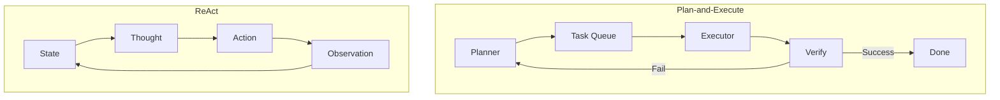

# 🏛️ Agent Architectures — From ReAct to Reflexion
> **Level:** Fundamentals | **Language:** Hinglish | **Goal:** Master the blueprint of how agents are structured and orchestrated.

---

## 🧭 1. Beginner-Friendly Hinglish Explanation
Agent architecture ka matlab hai **"Agent ka dimaag kaise setup hai"**. 

Jaise har kaam ke liye alag tareeke hote hain (e.g., khana banane ka tareeka vs ghar banane ka tareeka), waise hi agents ke bhi patterns hote hain:
- **ReAct:** Socho, Karo, Dekho (Simple loop).
- **Plan-and-Execute:** Pehle poora map banao, phir ek-ek karke tasks poore karo.
- **Reflexion:** Kaam karne ke baad khud ko judge karo: "Kya maine sahi kiya?" aur phir fix karo.

Architecture sahi hogi toh agent fast aur accurate hoga.

---

## 🧠 2. Deep Technical Explanation
Modern agentic architectures are evolving beyond simple linear chains to **Stateful Directed Acyclic Graphs (DAGs)** or even **Cyclic Graphs**.
- **ReAct (Reason + Act):** Interleaves thought traces and actions. High latency due to sequential token generation.
- **Plan-and-Execute:** Separates the **Planner** (LLM that decomposes goal) from the **Executor** (LLM that calls tools). This reduces "Reasoning Drift".
- **Reflexion:** Incorporates a **Linguistic Feedback Loop**. The agent stores its failures in a memory buffer and uses them as "critique" for the next attempt.
- **Autonomous Agents (BabyAGI/AutoGPT style):** Use a dynamic Task Queue that prioritizes and adds tasks on the fly based on current observations.

---

## 🏗️ 3. Architecture Diagrams



---

## 💻 4. Production-Ready Code Example (Plan-and-Execute Pattern)

```python
from typing import List, TypedDict

class Plan(TypedDict):
    steps: List[str]

def planner(goal: str) -> Plan:
    # Logic to decompose goal into steps
    return {"steps": ["Search for AI news", "Summarize top 3", "Format as email"]}

def executor(step: str):
    # Logic to run a single step
    print(f"Executing: {step}")
    return f"Result of {step}"

def run_plan_and_execute(goal: str):
    print(f"Goal: {goal}")
    full_plan = planner(goal)
    
    results = []
    for step in full_plan["steps"]:
        res = executor(step)
        results.append(res)
    
    print("All tasks completed.")
    return results

# run_plan_and_execute("Send a technology news summary to my email.")
```

---

## 🌍 5. Real-World Use Cases
- **Software Engineering Agents (Reflexion):** Agent code likhta hai, tests run karta hai, aur errors dekh kar code fix karta hai.
- **Market Research (Plan-and-Execute):** Agent pehle saare competitors ki list banata hai (Plan), phir har ek ko research karta hai (Execute).

---

## ❌ 6. Failure Cases
- **Plan Rigidity:** Agar environment change ho jaye (e.g., website down), toh "Plan-and-Execute" fail ho sakta hai kyunki wo naya plan nahi banata beech mein.
- **Critique Loop:** Reflexion mein agent kabhi-kabhi "Over-critique" karne lagta hai aur loop mein phas jata hai.

---

## 🛠️ 7. Debugging Guide
- **Visualize the Graph:** LangGraph built-in visuals use karein to see which node is failing.
- **Step-by-Step logs:** Plan-and-Execute mein humesha Task Queue ka status log karein.

---

## ⚖️ 8. Tradeoffs
- **ReAct:** Adaptive but slow and token-heavy.
- **Plan-and-Execute:** Fast and organized but less flexible for dynamic changes.
- **Reflexion:** Highest accuracy but highest cost and latency.

---

## ✅ 9. Best Practices
- **Hybrid Approach:** Use Plan-and-Execute for the big picture and ReAct for individual complex steps.
- **Validation Nodes:** Always have a "Verification" node that checks if the task was actually completed.

---

## 🛡️ 10. Security Concerns
- **State Manipulation:** Agar attacker agent ke intermediate state ya "Plan" ko badal de, toh agent unintended actions le sakta hai.

---

## 📈 11. Scaling Challenges
- **Parallel Execution:** Executing multiple steps of a plan in parallel requires complex state synchronization.
- **Resource Locking:** Multiple agents same tool (e.g., Database) use karein toh conflicts ho sakte hain.

---

## 💰 12. Cost Considerations
- **Planner Re-runs:** Agar plan fail hota hai, toh poora replanning mehnga ho sakta hai. 
- **Efficiency:** Small models use karein for simple execution steps to save cost.

---

## 📝 13. Interview Questions
1. **"ReAct aur Plan-and-Execute mein kab kya choose karoge?"**
2. **"Self-reflection loops mein 'Hallucination' kaise trigger hoti hai?"**
3. **"Stateful architecture kyu zaruri hai complex agents ke liye?"**

---

## ⚠️ 14. Common Mistakes
- **Complex Plans:** LLM se 50 steps ka plan banwana (Model 5-10 steps ke baad logic bhoolne lagta hai).
- **No Feedback:** Executor ko planner ko wapas feedback na dene dena.

---

## 🚀 15. Latest 2026 Industry Patterns
- **Hierarchical Planning:** A Master Planner delegating sub-plans to specialized Sub-Planners.
- **Dynamic Replanning:** Agents that monitor their own execution and rewrite the plan mid-way if a bottleneck is found.

---

> **Final Insight:** Mastery of architecture is about knowing **when to plan** and **when to act**. 
