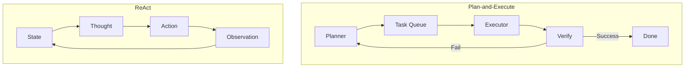

# 🏛️ Agent Architectures — ReAct se Reflexion tak
> **Level:** Fundamentals | **Language:** Hinglish | **Goal:** Agents kaise structure aur orchestrate hote hain, us blueprint ko master karna.

---

## 🧭 1. Beginner-Friendly Hinglish Explanation
Agent architecture ka matlab hai **"Agent ka dimaag kaise setup hai"**. 

Jaise har kaam ke liye alag tareeke hote hain (e.g., khana banane ka tareeka vs ghar banane ka tareeka), waise hi agents ke bhi patterns hote hain:
- **ReAct:** Socho, Karo, Dekho (Simple loop).
- **Plan-and-Execute:** Pehle poora map banao, phir ek-ek karke tasks poore karo.
- **Reflexion:** Kaam karne ke baad khud ko judge karo: "Kya maine sahi kiya?" aur phir fix karo.

Architecture sahi hogi toh agent fast aur accurate hoga.

---

## 🧠 2. Deep Technical Explanation
Modern agentic architectures simple linear chains se aage badh kar **Stateful Directed Acyclic Graphs (DAGs)** ya even **Cyclic Graphs** tak evolve ho rahi hain.
- **ReAct (Reason + Act):** Thought traces aur actions ko interleave karta hai. Sequential token generation ki wajah se latency high hoti hai.
- **Plan-and-Execute:** **Planner** (LLM jo goal decompose karta hai) ko **Executor** (LLM jo tools call karta hai) se separate karta hai. Ye "Reasoning Drift" reduce karta hai.
- **Reflexion:** Ek **Linguistic Feedback Loop** include karta hai. Agent apni failures ko memory buffer me store karta hai aur next attempt ke liye unhe "critique" ke roop me use karta hai.
- **Autonomous Agents (BabyAGI/AutoGPT style):** Dynamic Task Queue use karte hain jo current observations ke basis par tasks ko prioritize aur on the fly add karta hai.

---

## 🏗️ 3. Architecture Diagrams


```mermaid
graph TD
    subgraph "Plan-and-Execute"
    P[Planner] --> TQ[Task Queue]
    TQ --> E[Executor]
    E --> V[Verify]
    V -- Fail --> P
    V -- Success --> Done
    end
    
    subgraph "ReAct"
    R1[State] --> R2[Thought]
    R2 --> R3[Action]
    R3 --> R4[Observation]
    R4 --> R1
    end
```

---

## 💻 4. Production-Ready Code Example (Plan-and-Execute Pattern)

```python
from typing import List, TypedDict

class Plan(TypedDict):
    steps: List[str]

def planner(goal: str) -> Plan:
    # Goal ko steps me decompose karne ki logic
    return {"steps": ["AI news search karo", "Top 3 summarize karo", "Email format me likho"]}

def executor(step: str):
    # Single step run karne ki logic
    print(f"Execute ho raha hai: {step}")
    return f"{step} ka result"

def run_plan_and_execute(goal: str):
    print(f"Goal: {goal}")
    full_plan = planner(goal)
    
    results = []
    for step in full_plan["steps"]:
        res = executor(step)
        results.append(res)
    
    print("Saare tasks complete ho gaye.")
    return results

# run_plan_and_execute("Mere email par technology news summary bhejo.")
```

---

## 🌍 5. Real-World Use Cases
- **Software Engineering Agents (Reflexion):** Agent code likhta hai, tests run karta hai, aur errors dekh kar code fix karta hai.
- **Market Research (Plan-and-Execute):** Agent pehle saare competitors ki list banata hai (Plan), phir har ek ko research karta hai (Execute).

---

## ❌ 6. Failure Cases
- **Plan Rigidity:** Agar environment change ho jaye (e.g., website down), toh "Plan-and-Execute" fail ho sakta hai kyunki wo naya plan nahi banata beech mein.
- **Critique Loop:** Reflexion mein agent kabhi-kabhi "Over-critique" karne lagta hai aur loop mein phas jata hai.

---

## 🛠️ 7. Debugging Guide
- **Visualize the Graph:** Kaunsa node fail ho raha hai dekhne ke liye LangGraph built-in visuals use karein.
- **Step-by-Step logs:** Plan-and-Execute mein humesha Task Queue ka status log karein.

---

## ⚖️ 8. Tradeoffs
- **ReAct:** Adaptive hota hai, lekin slow aur token-heavy hota hai.
- **Plan-and-Execute:** Fast aur organized hota hai, lekin dynamic changes ke liye less flexible hota hai.
- **Reflexion:** Highest accuracy deta hai, lekin cost aur latency bhi highest hoti hai.

---

## ✅ 9. Best Practices
- **Hybrid Approach:** Big picture ke liye Plan-and-Execute use karein aur individual complex steps ke liye ReAct use karein.
- **Validation Nodes:** Hamesha ek "Verification" node rakhein jo check kare ki task actually complete hua ya nahi.

---

## 🛡️ 10. Security Concerns
- **State Manipulation:** Agar attacker agent ke intermediate state ya "Plan" ko badal de, toh agent unintended actions le sakta hai.

---

## 📈 11. Scaling Challenges
- **Parallel Execution:** Plan ke multiple steps ko parallel execute karne ke liye complex state synchronization chahiye hoti hai.
- **Resource Locking:** Multiple agents same tool (e.g., Database) use karein toh conflicts ho sakte hain.

---

## 💰 12. Cost Considerations
- **Planner Re-runs:** Agar plan fail hota hai, toh poora replanning mehnga ho sakta hai. 
- **Efficiency:** Cost save karne ke liye simple execution steps ke liye small models use karein.

---

## 📝 13. Interview Questions
1. **"ReAct aur Plan-and-Execute mein kab kya choose karoge?"**
2. **"Self-reflection loops mein 'Hallucination' kaise trigger hoti hai?"**
3. **"Stateful architecture kyu zaruri hai complex agents ke liye?"**

---

## ⚠️ 14. Common Mistakes
- **Complex Plans:** LLM se 50 steps ka plan banwana (Model 5-10 steps ke baad logic bhoolne lagta hai).
- **No Feedback:** Executor ko planner ko wapas feedback na dene dena.

---

## 🚀 15. Latest 2026 Industry Patterns
- **Hierarchical Planning:** Master Planner specialized Sub-Planners ko sub-plans delegate karta hai.
- **Dynamic Replanning:** Agents apni execution monitor karte hain aur bottleneck milne par plan ko mid-way rewrite karte hain.

---

> **Final Insight:** Architecture ki mastery ka matlab ye samajhna hai ki **kab plan karna hai** aur **kab act karna hai**. 
