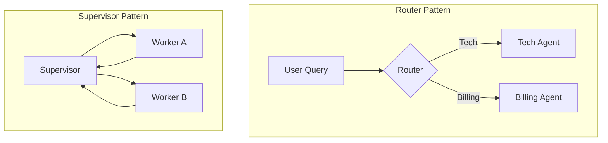

# 🎨 Agent Design Patterns — The Blueprint for Success
> **Level:** Fundamentals | **Language:** Hinglish | **Goal:** Master the proven structural patterns for organizing agents and workflows.

---

## 🧭 1. Beginner-Friendly Hinglish Explanation
Design Patterns ka matlab hai **"Kaam karne ka standard tareeka"**. 

Jaise har ghar mein kitchen aur bathroom ki ek jagah fix hoti hai, waise hi complex AI systems banane ke kuch fixed design patterns hain jo 2026 mein industry standard ban chuke hain:
- **Router Pattern:** Ek receptionist jo decide kare ki aapka sawal kis department ko jayega.
- **Supervisor Pattern:** Ek boss jo team ko handle kare.
- **Worker Pattern:** Specialized agents jo sirf apna ek kaam karein.
- **Planner-Executor Pattern:** Pehle dimag lagao (Plan), phir haath chalao (Execute).

---

## 🧠 2. Deep Technical Explanation
Design patterns decouple the **Logical Flow** from the **Inference Logic**.
- **Router Pattern:** Uses an LLM or Semantic Search to classify the input and route it to a specific node. This saves tokens by only activating the relevant agent.
- **Supervisor Pattern (Orchestrator):** A master agent manages a state graph. It delegates tasks to specialized workers and collects their outputs. The Supervisor is the only one who can decide when the goal is met.
- **Worker Pattern (Service Agents):** Agents with a highly restricted prompt and specific tools. They are "stateless" relative to the master goal.
- **Planner-Executor:** The Planner creates a DAG of tasks. The Executor (or multiple Executors) processes these tasks. This is essential for long-horizon reasoning.

---

## 🏗️ 3. Architecture Diagrams



---

## 💻 4. Production-Ready Code Example (Router Pattern)

```python
from typing import Literal
from pydantic import BaseModel

class Route(BaseModel):
    destination: Literal["coding", "general"]

def router_logic(query: str) -> str:
    # Logic to classify the query (Simulated LLM call)
    if "code" in query.lower() or "python" in query.lower():
        return "coding"
    return "general"

def run_system(query: str):
    target = router_logic(query)
    print(f"Routing to: {target}")
    
    if target == "coding":
        return "Executing coding logic..."
    return "Executing general logic..."

# run_system("Write a python script for a calculator.")
```

---

## 🌍 5. Real-World Use Cases
- **Enterprise Helpdesks:** Router pattern automatically assigns tickets to HR, IT, or Finance agents.
- **Multi-modal Systems:** A Supervisor agent receives a video, sends frames to a Vision agent, audio to a Transcription agent, and then combines the result.

---

## ❌ 6. Failure Cases
- **Router Misclassification:** Router sawal galat department mein bhej deta hai, jisse wrong answer milta hai.
- **Supervisor Bottleneck:** Agar supervisor agent "Dumb" hai, toh wo ache workers hone ke bawajood kaam kharab kar dega.
- **Tightly Coupled Patterns:** Ek agent mein change karne se poora pattern toot jana.

---

## 🛠️ 7. Debugging Guide
- **Pattern Isolation:** Har node ko individually test karein. Agar Router fail ho raha hai, toh pehle use fix karein before checking workers.
- **Decision Logging:** Supervisor ne task kyu delegate kiya, uska "Reasoning" humesha log karein.

---

## ⚖️ 8. Tradeoffs
- **Modular (Multi-agent):** Scalable and robust but higher latency.
- **Monolithic (Single agent):** Fast and simple but gets confused by complex tasks.

---

## ✅ 9. Best Practices
- **Least Privilege:** Worker agents ko sirf wahi tools dein jo unke task ke liye zaruri hain.
- **Deterministic Routing:** Simple classification ke liye model ki jagah Keywords ya Semantic Search (faster) use karein.

---

## 🛡️ 10. Security Concerns
- **Orchestration Hijacking:** Attacker supervisor agent ko convince kar leta hai ki wo "Worker" hai, aur system ka control le leta.

---

## 📈 11. Scaling Challenges
- **State Synchronization:** In the Supervisor pattern, syncing state between multiple parallel workers is complex.
- **Node Sprawl:** Too many small nodes make the system hard to maintain.

---

## 💰 12. Cost Considerations
- **Routing Cost:** Har incoming request par routing LLM call karna mehnga ho sakta hai (use small models for routing).

---

## 📝 13. Interview Questions
1. **"Supervisor vs Router pattern mein kya difference hai?"**
2. **"Complex workflows ke liye Planner-Executor kyu prefer kiya jata hai?"**
3. **"Design patterns system reliability kaise improve karte hain?"**

---

## ⚠️ 14. Common Mistakes
- **Over-engineering:** 2-step task ke liye Supervisor pattern use karna.
- **Implicit Routing:** Model ko hi bolna ki "Check if this is tech or billing" (Use an explicit router node instead).

---

## 🚀 15. Latest 2026 Industry Patterns
- **Dynamic Routing:** Systems that learn from past routing mistakes and update their logic autonomously.
- **Federated Agents:** Patterns where agents from different organizations collaborate securely using standardized protocols.

---

> **Final Insight:** A good design pattern **hides complexity** and **exposes control**. 
