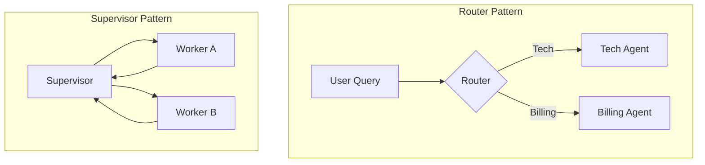

# 🎨 Agent Design Patterns — Success ka Blueprint
> **Level:** Fundamentals | **Language:** Hinglish | **Goal:** Agents aur workflows organize karne ke proven structural patterns master karna.

---

## 🧭 1. Beginner-Friendly Hinglish Explanation
Design Patterns ka matlab hai **"Kaam karne ka standard tareeka"**. 

Jaise har ghar mein kitchen aur bathroom ki ek jagah fix hoti hai, waise hi complex AI systems banane ke kuch fixed design patterns hain jo 2026 mein industry standard ban chuke hain:
- **Router Pattern:** Ek receptionist jo decide kare ki aapka sawal kis department ko jayega.
- **Supervisor Pattern:** Ek boss jo team ko handle kare.
- **Worker Pattern:** Specialized agents jo sirf apna ek kaam karein.
- **Planner-Executor Pattern:** Pehle dimag lagao (Plan), phir haath chalao (Execute).

---

## 🧠 2. Deep Technical Explanation
Design patterns **Logical Flow** ko **Inference Logic** se decouple karte hain.
- **Router Pattern:** Input classify karne aur specific node tak route karne ke liye LLM ya Semantic Search use karta hai. Sirf relevant agent activate karke ye tokens save karta hai.
- **Supervisor Pattern (Orchestrator):** Master agent state graph manage karta hai. Ye specialized workers ko tasks delegate karta hai aur unke outputs collect karta hai. Supervisor hi decide karta hai ki goal meet hua ya nahi.
- **Worker Pattern (Service Agents):** Highly restricted prompt aur specific tools wale agents. Master goal ke relative ye "stateless" hote hain.
- **Planner-Executor:** Planner tasks ka DAG create karta hai. Executor (ya multiple Executors) in tasks ko process karte hain. Ye long-horizon reasoning ke liye essential hai.

---

## 🏗️ 3. Architecture Diagrams


```mermaid
graph TD
    subgraph "Router Pattern"
    U[User Query] --> R{Router}
    R -->|Tech| T[Tech Agent]
    R -->|Billing| B[Billing Agent]
    end
    
    subgraph "Supervisor Pattern"
    S[Supervisor] --> W1[Worker A]
    S --> W2[Worker B]
    W1 --> S
    W2 --> S
    end
```

---

## 💻 4. Production-Ready Code Example (Router Pattern)

```python
from typing import Literal
from pydantic import BaseModel

class Route(BaseModel):
    destination: Literal["coding", "general"]

def router_logic(query: str) -> str:
    # Query classify karne ki logic (simulated LLM call)
    if "code" in query.lower() or "python" in query.lower():
        return "coding"
    return "general"

def run_system(query: str):
    target = router_logic(query)
    print(f"Routing ho raha hai: {target}")
    
    if target == "coding":
        return "Coding logic execute ho rahi hai..."
    return "General logic execute ho rahi hai..."

# run_system("Calculator ke liye python script likho.")
```

---

## 🌍 5. Real-World Use Cases
- **Enterprise Helpdesks:** Router pattern tickets ko automatically HR, IT, ya Finance agents ko assign karta hai.
- **Multi-modal Systems:** Supervisor agent video receive karta hai, frames Vision agent ko bhejta hai, audio Transcription agent ko bhejta hai, aur phir result combine karta hai.

---

## ❌ 6. Failure Cases
- **Router Misclassification:** Router sawal galat department mein bhej deta hai, jisse wrong answer milta hai.
- **Supervisor Bottleneck:** Agar supervisor agent "Dumb" hai, toh wo ache workers hone ke bawajood kaam kharab kar dega.
- **Tightly Coupled Patterns:** Ek agent mein change karne se poora pattern toot jana.

---

## 🛠️ 7. Debugging Guide
- **Pattern Isolation:** Har node ko individually test karein. Agar Router fail ho raha hai, toh workers check karne se pehle use fix karein.
- **Decision Logging:** Supervisor ne task kyu delegate kiya, uska "Reasoning" humesha log karein.

---

## ⚖️ 8. Tradeoffs
- **Modular (Multi-agent):** Scalable aur robust hota hai, lekin latency higher hoti hai.
- **Monolithic (Single agent):** Fast aur simple hota hai, lekin complex tasks me confuse ho jata hai.

---

## ✅ 9. Best Practices
- **Least Privilege:** Worker agents ko sirf wahi tools dein jo unke task ke liye zaruri hain.
- **Deterministic Routing:** Simple classification ke liye model ki jagah Keywords ya Semantic Search (faster) use karein.

---

## 🛡️ 10. Security Concerns
- **Orchestration Hijacking:** Attacker supervisor agent ko convince kar leta hai ki wo "Worker" hai, aur system ka control le leta.

---

## 📈 11. Scaling Challenges
- **State Synchronization:** Supervisor pattern me multiple parallel workers ke beech state sync karna complex hota hai.
- **Node Sprawl:** Bahut zyada small nodes system ko maintain karna hard bana dete hain.

---

## 💰 12. Cost Considerations
- **Routing Cost:** Har incoming request par routing LLM call karna mehnga ho sakta hai (routing ke liye small models use karein).

---

## 📝 13. Interview Questions
1. **"Supervisor vs Router pattern mein kya difference hai?"**
2. **"Complex workflows ke liye Planner-Executor kyu prefer kiya jata hai?"**
3. **"Design patterns system reliability kaise improve karte hain?"**

---

## ⚠️ 14. Common Mistakes
- **Over-engineering:** 2-step task ke liye Supervisor pattern use karna.
- **Implicit Routing:** Model ko hi bolna ki "Check karo ye tech hai ya billing" (iske bajay explicit router node use karein).

---

## 🚀 15. Latest 2026 Industry Patterns
- **Dynamic Routing:** Systems jo past routing mistakes se learn karte hain aur apni logic autonomously update karte hain.
- **Federated Agents:** Patterns jahan different organizations ke agents standardized protocols use karke securely collaborate karte hain.

---

> **Final Insight:** Ek good design pattern **complexity hide karta hai** aur **control expose karta hai**. 
