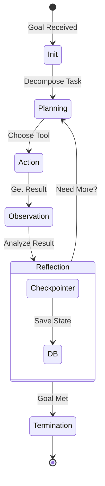

# 🔄 Agent Lifecycle & State — Keeping the Brain Alive
> **Level:** Fundamentals | **Language:** Hinglish | **Goal:** Master the lifecycle stages of an agent and how to manage its persistent state.

---

## 🧭 1. Beginner-Friendly Hinglish Explanation
Agent ka **Lifecycle** matlab uski "zindagi ka safar"—jab wo shuru hota hai (Birth), kaam karta hai (Execution), aur finish karta hai (Completion). 

Lekin sabse important cheez hai **State**. State ka matlab hai Agent ki "Yaaddasht" (Memory). Agar agent bhool jaye ki usne pichle step mein kya kiya tha, toh wo kabhi apna goal pura nahi kar payega. 

Imagine karo aap ek recipe bana rahe ho. State wo "bartan" hai jisme saare ingredients (info) jama ho rahe hain. Agar bartan leak ho gaya (State lost), toh recipe kharab!

---

## 🧠 2. Deep Technical Explanation
In 2026, **State Management** is the differentiator between a toy and a production system.
- **Agent Lifecycle:** Initialization → Planning → Action → Observation → Reflection → Termination.
- **State Persistence:** We use **Checkpointers** to save the state at every node transition in a graph (e.g., LangGraph).
- **Snapshotting:** Saving the entire environment state so we can "Time Travel" back to a previous point if the agent makes a mistake.
- **Thread Management:** Handling multiple users means each needs a separate `thread_id` to keep their state isolated.

---

## 🏗️ 3. Architecture Diagrams



---

## 💻 4. Production-Ready Code Example (State with Checkpointing)

```python
from typing import Annotated, TypedDict
from langgraph.graph import StateGraph, START, END

# Define the State Schema
class AgentState(TypedDict):
    # Annotated helps LangGraph understand how to 'update' the state
    messages: Annotated[list[str], "List of chat messages"]
    task_completed: bool

def node_executor(state: AgentState):
    # Logic happens here
    print(f"Processing state: {state['messages']}")
    return {"messages": ["Added a new message"], "task_completed": True}

# Build Graph
workflow = StateGraph(AgentState)
workflow.add_node("worker", node_executor)
workflow.add_edge(START, "worker")
workflow.add_edge("worker", END)

# In production, we add a checkpointer (e.g., SQLite/Redis)
# config = {"configurable": {"thread_id": "user_123"}}
# app = workflow.compile(checkpointer=MemorySaver())
# app.invoke({"messages": ["Hello"], "task_completed": False}, config)
```

---

## 🌍 5. Real-World Use Cases
- **Customer Onboarding:** Agent 1 mahine tak user ka state track karta hai (Step 1 complete, Step 2 pending).
- **Long-running Research:** Agent 2 din tak data fetch karta hai, so jata hai (Sleep), aur state se wapas resume karta hai.

---

## ❌ 6. Failure Cases
- **State Corruption:** Agent galat format mein state update kar deta hai, jisse next node crash ho jata hai.
- **Lost Thread:** Database error ki wajah se user ka session load nahi hota, aur agent "Zero" se shuru karta hai.
- **Stale State:** Agent purani, outdated information ko sach maan kar decision leta hai.

---

## 🛠️ 7. Debugging Guide
- **Inspect the Snapshot:** Humesha `app.get_state(config)` use karke dekho ki state mein abhi kya hai.
- **Log State Diff:** Har node ke baad sirf wo dekho jo change hua (The Delta), poora state nahi.

---

## ⚖️ 8. Tradeoffs
- **In-Memory State:** Fast but data lost on restart.
- **Persistent State (DB):** Secure and reliable but adds latency and cost.

---

## ✅ 9. Best Practices
- **Immutable Updates:** State ko direct modify mat karein, hamesha naya object return karein (`return {"key": "new_val"}`).
- **Checkpoint Frequency:** Har action ke baad checkpoint karein, har thought ke baad nahi (Performance balance).

---

## 🛡️ 10. Security Concerns
- **State Injection:** Agar user intermediate state manipulate kar sake, toh wo agent ka behavior change kar sakta hai.
- **Session Hijacking:** Ek user ka `thread_id` doosre user ko mil jana (Data leakage).

---

## 📈 11. Scaling Challenges
- **State Serialization:** Bahut bade state objects (like images/PDFs) ko database mein save karna slow hota hai.
- **Distributed State:** Multiple server instances ke beech state consistency maintain karna.

---

## 💰 12. Cost Considerations
- **DB Write Costs:** Har step par database likhna (write) mehnga ho sakta hai in high-traffic apps.
- **TTL (Time to Live):** Purane, useless states ko automatically delete karna chahiye to save storage cost.

---

## 📝 13. Interview Questions
1. **"Stateless vs Stateful agents mein production mein kya fark hota hai?"**
2. **"LangGraph mein 'Thread ID' ka role kya hai?"**
3. **"State recovery mechanism kaise implement karenge?"**

---

## ⚠️ 14. Common Mistakes
- **Giant States:** Sab kuch state mein bhar dena (Images, raw logs, redundant data).
- **No Error State:** Failures ko state mein track na karna, jisse agent ko pata nahi chalta ki wo pichli baar kyu fail hua tha.

---

## 🚀 15. Latest 2026 Industry Patterns
- **Time-Travel Debugging:** Developers can "pause" a live agent, go back 10 steps in the state, fix a prompt, and resume.
- **Cross-session Memory:** Persistent state that links multiple user sessions into one continuous "User Persona".

---

> **Expert Tip:** State management is the **glue** of agentic AI. If the glue is weak, the system falls apart.
