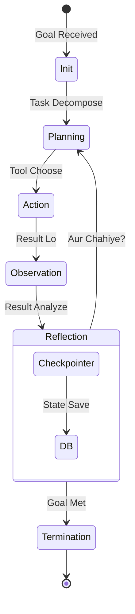

# 🔄 Agent Lifecycle & State — Brain Ko Alive Rakhna
> **Level:** Fundamentals | **Language:** Hinglish | **Goal:** Agent ke lifecycle stages aur uski persistent state manage karna master karna.

---

## 🧭 1. Beginner-Friendly Hinglish Explanation
Agent ka **Lifecycle** matlab uski "zindagi ka safar"—jab wo shuru hota hai (Birth), kaam karta hai (Execution), aur finish karta hai (Completion). 

Lekin sabse important cheez hai **State**. State ka matlab hai Agent ki "Yaaddasht" (Memory). Agar agent bhool jaye ki usne pichle step mein kya kiya tha, toh wo kabhi apna goal pura nahi kar payega. 

Imagine karo aap ek recipe bana rahe ho. State wo "bartan" hai jisme saare ingredients (info) jama ho rahe hain. Agar bartan leak ho gaya (State lost), toh recipe kharab!

---

## 🧠 2. Deep Technical Explanation
2026 me **State Management** toy system aur production system ke beech ka differentiator hai.
- **Agent Lifecycle:** Initialization → Planning → Action → Observation → Reflection → Termination.
- **State Persistence:** Graph me har node transition par state save karne ke liye hum **Checkpointers** use karte hain (e.g., LangGraph).
- **Snapshotting:** Entire environment state save karna taaki agar agent mistake kare to hum previous point par "Time Travel" kar sakein.
- **Thread Management:** Multiple users handle karne ka matlab hai har user ko separate `thread_id` chahiye, taaki unki state isolated rahe.

---

## 🏗️ 3. Architecture Diagrams


```mermaid
stateDiagram-v2
    [*] --> Init: Goal Received
    Init --> Planning: Task Decompose
    Planning --> Action: Tool Choose
    Action --> Observation: Result Lo
    Observation --> Reflection: Result Analyze
    Reflection --> Planning: Aur Chahiye?
    Reflection --> Termination: Goal Met
    Termination --> [*]
    
    state Reflection {
        Checkpointer --> DB: State Save
    }
```

---

## 💻 4. Production-Ready Code Example (State with Checkpointing)

```python
from typing import Annotated, TypedDict
from langgraph.graph import StateGraph, START, END

# State schema define karein
class AgentState(TypedDict):
    # Annotated LangGraph ko state 'update' karna samajhne me help karta hai
    messages: Annotated[list[str], "Chat messages ki list"]
    task_completed: bool

def node_executor(state: AgentState):
    # Logic yahan hoti hai
    print(f"State process ho rahi hai: {state['messages']}")
    return {"messages": ["Naya message add hua"], "task_completed": True}

# Graph build karein
workflow = StateGraph(AgentState)
workflow.add_node("worker", node_executor)
workflow.add_edge(START, "worker")
workflow.add_edge("worker", END)

# Production me hum checkpointer add karte hain (e.g., SQLite/Redis)
# config = {"configurable": {"thread_id": "user_123"}}
# app = workflow.compile(checkpointer=MemorySaver())
# app.invoke({"messages": ["Hello"], "task_completed": False}, config)
```

---

## 🌍 5. Real-World Use Cases
- **Customer Onboarding:** Agent 1 mahine tak user ka state track karta hai (Step 1 complete, Step 2 pending).
- **Long-running Research:** Agent 2 din tak data fetch karta hai, so jata hai (Sleep), aur state se wapas resume karta hai.

---

## ❌ 6. Failure Cases
- **State Corruption:** Agent galat format mein state update kar deta hai, jisse next node crash ho jata hai.
- **Lost Thread:** Database error ki wajah se user ka session load nahi hota, aur agent "Zero" se shuru karta hai.
- **Stale State:** Agent purani, outdated information ko sach maan kar decision leta hai.

---

## 🛠️ 7. Debugging Guide
- **Inspect the Snapshot:** Humesha `app.get_state(config)` use karke dekho ki state mein abhi kya hai.
- **Log State Diff:** Har node ke baad sirf wo dekho jo change hua (The Delta), poora state nahi.

---

## ⚖️ 8. Tradeoffs
- **In-Memory State:** Fast hoti hai, lekin restart par data lost ho jata hai.
- **Persistent State (DB):** Secure aur reliable hoti hai, lekin latency aur cost add karti hai.

---

## ✅ 9. Best Practices
- **Immutable Updates:** State ko direct modify mat karein, hamesha naya object return karein (`return {"key": "new_val"}`).
- **Checkpoint Frequency:** Har action ke baad checkpoint karein, har thought ke baad nahi (Performance balance).

---

## 🛡️ 10. Security Concerns
- **State Injection:** Agar user intermediate state manipulate kar sake, toh wo agent ka behavior change kar sakta hai.
- **Session Hijacking:** Ek user ka `thread_id` doosre user ko mil jana (Data leakage).

---

## 📈 11. Scaling Challenges
- **State Serialization:** Bahut bade state objects (like images/PDFs) ko database mein save karna slow hota hai.
- **Distributed State:** Multiple server instances ke beech state consistency maintain karna.

---

## 💰 12. Cost Considerations
- **DB Write Costs:** Har step par database likhna (write) mehnga ho sakta hai in high-traffic apps.
- **TTL (Time to Live):** Purane, useless states ko automatically delete karna chahiye to save storage cost.

---

## 📝 13. Interview Questions
1. **"Stateless vs Stateful agents mein production mein kya fark hota hai?"**
2. **"LangGraph mein 'Thread ID' ka role kya hai?"**
3. **"State recovery mechanism kaise implement karenge?"**

---

## ⚠️ 14. Common Mistakes
- **Giant States:** Sab kuch state mein bhar dena (Images, raw logs, redundant data).
- **No Error State:** Failures ko state mein track na karna, jisse agent ko pata nahi chalta ki wo pichli baar kyu fail hua tha.

---

## 🚀 15. Latest 2026 Industry Patterns
- **Time-Travel Debugging:** Developers live agent ko "pause" kar sakte hain, state me 10 steps wapas ja sakte hain, prompt fix kar sakte hain, aur resume kar sakte hain.
- **Cross-session Memory:** Persistent state jo multiple user sessions ko ek continuous "User Persona" me link karti hai.

---

> **Expert Tip:** State management agentic AI ka **glue** hai. Agar glue weak hai, system toot jata hai.
