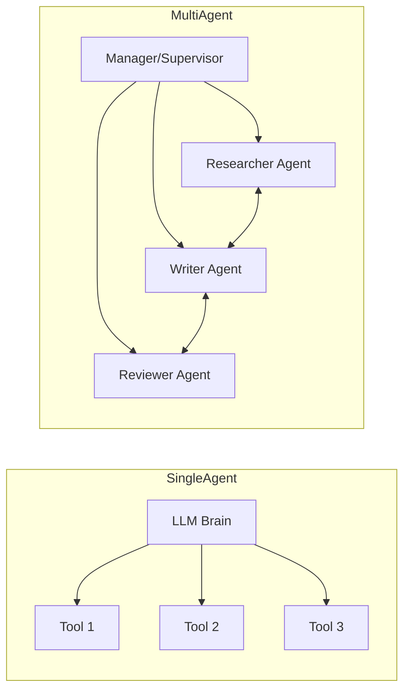

# 👥 Single vs Multi-Agent Systems — Lone Hero vs Expert Team
> **Level:** Fundamentals | **Language:** Hinglish | **Goal:** Understand when to use a single complex agent versus a team of specialized agents.

---

## 🧭 1. Beginner-Friendly Hinglish Explanation
Socho aapko ek movie banani hai. 
- **Single Agent:** Ek hi banda script likh raha hai, camera chala raha hai, acting kar raha hai, aur editing bhi. Ye simple video ke liye theek hai, par Hollywood movie ke liye impossible hai. 
- **Multi-Agent:** Ek Director hai, ek Writer hai, ek Actor hai, aur ek Editor hai. Sab apne kaam mein expert hain. 

AI mein bhi yahi hota hai. Single agent tab use karte hain jab kaam simple ho (like summarization). Multi-agent tab chahiye jab kaam complex aur diverse ho (like building a full software app).

---

## 🧠 2. Deep Technical Explanation
The shift from Single-Agent to Multi-Agent is driven by **LLM Specialization** and **Reasoning Separation**.
- **Single Agent:** A single LLM handles the entire "Reasoning Loop". It suffers from **Context Contamination**—the model gets confused by too many instructions.
- **Multi-Agent Systems (MAS):** Divide the labor using **Persona-based Prompting**. Each agent has a restricted scope, reducing the tokens processed by each individual call and increasing precision.
- **Orchestration:** MAS requires a **Communication Protocol** (like AutoGen's chat-based or CrewAI's task-based models). 
- **Emergent Complexity:** Multi-agent systems can exhibit "group-think" or "deadlocks" which single agents don't face.

---

## 🏗️ 3. Architecture Diagrams



---

## 💻 4. Production-Ready Code Example (Simple Multi-Agent Handoff)

```python
from typing import TypedDict, Literal

# Shared State
class AgentState(TypedDict):
    content: str
    next_step: Literal["research", "write", "finish"]

def research_agent(state: AgentState):
    print("Researcher: Finding info...")
    return {"content": "Data about AI 2026", "next_step": "write"}

def writer_agent(state: AgentState):
    print("Writer: Drafting content...")
    new_content = f"Draft based on: {state['content']}"
    return {"content": new_content, "next_step": "finish"}

# Orchestration Logic (Manager)
def run_team(goal: str):
    state = {"content": "", "next_step": "research"}
    
    # Simple Sequential Handoff
    while state["next_step"] != "finish":
        if state["next_step"] == "research":
            state.update(research_agent(state))
        elif state["next_step"] == "write":
            state.update(writer_agent(state))
            
    print(f"Goal Achieved: {state['content']}")

# run_team("Write a report on AI 2026")
```

---

## 🌍 5. Real-World Use Cases
- **Software Dev Teams:** `Coder Agent` writes code, `Reviewer Agent` checks for bugs, `DevOps Agent` deploys.
- **Customer Support:** `Triage Agent` identifies the problem, `Billing Agent` handles money issues, `Technical Agent` fixes tech bugs.

---

## ❌ 6. Failure Cases
- **Infinite Handoffs:** Agent A Agent B ko kaam bhejta hai, aur B wapas A ko (Loop).
- **Communication Breakdown:** Agent 1 ki output ka format Agent 2 samajh nahi pata.
- **Persona Drift:** Multi-agent system mein model apna "Role" bhool kar generic chatbot ban jata hai.

---

## 🛠️ 7. Debugging Guide
- **Per-Agent Logs:** Humesha dekho ki kis agent ne kya output diya. Pure system ka output dekhna kafi nahi hai.
- **Agent Interrogation:** Agar error aaye, toh Supervisor agent se pucho: "Why did you send this task to Agent X?"

---

## ⚖️ 8. Tradeoffs
- **Single Agent:** Low latency, cheaper, easier to debug.
- **Multi-Agent:** High accuracy, handles complexity better, modular but Expensive and Slow (due to multiple LLM calls).

---

## ✅ 9. Best Practices
- **Strict Schemas:** Agents ke beech communication hamesha structured data (JSON) mein karein.
- **Supervisor Pattern:** Ek "Boss" agent rakhein jo final decision le aur flow ko control kare.

---

## 🛡️ 10. Security Concerns
- **Agent-to-Agent Prompt Injection:** Agent A (compromised) Agent B ko malicious instructions bhej sakta hai.
- **Permission Escalation:** Manager agent galti se worker agent ko admin tools ka access de sakta hai.

---

## 📈 11. Scaling Challenges
- **Inter-Agent Latency:** 5 agents matlab 5 consecutive LLM calls (Min 10-15 seconds wait).
- **State Bloat:** Sab agents ki history store karne se tokens bahut jaldi khatam ho jate hain.

---

## 💰 12. Cost Considerations
- **Orchestration Overhead:** Manager agent khud se 500-1000 tokens leta hai har decision ke liye.
- **Model Mixing:** Use GPT-4 for Manager and GPT-4o-mini for Workers to balance cost.

---

## 📝 13. Interview Questions
1. **"Single agent kab use karna chahiye vs Multi-agent?"**
2. **"Multi-agent systems mein 'Communication Protocol' kya hota hai?"**
3. **"State sync kaise maintain karte hain multiple agents ke beech?"**

---

## ⚠️ 14. Common Mistakes
- **Too many agents:** 10 agents ka team bana dena simple task ke liye (Slow + Expensive).
- **Vague Backstories:** Agents ko "You are a helpful assistant" bolna (Instead, give specific goals and constraints).

---

## 🚀 15. Latest 2026 Industry Patterns
- **Peer-to-Peer (P2P) Agents:** Agents that dynamically find and hire other agents from a decentralized registry to complete tasks.
- **Agent Swarms:** Thousands of tiny, specialized agents working in parallel for high-throughput data processing.

---

> **Final Insight:** Use the **Rule of Three**: If an agent has more than 3 distinct roles, split it into multiple agents.
