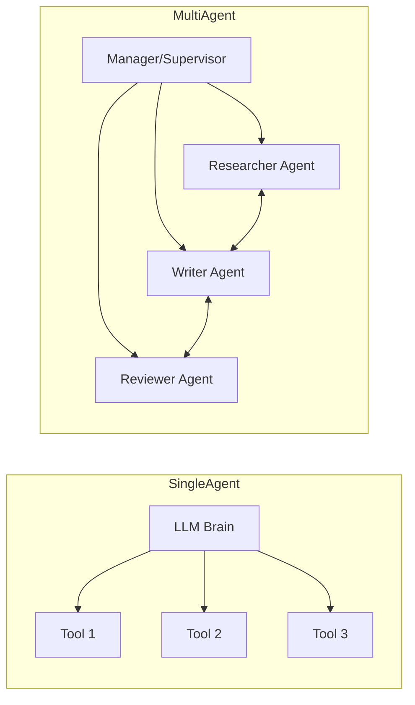

# 👥 Single vs Multi-Agent Systems — Lone Hero vs Expert Team
> **Level:** Fundamentals | **Language:** Hinglish | **Goal:** Kab single complex agent use karna hai aur kab specialized agents ki team use karni hai, ye samajhna.

---

## 🧭 1. Beginner-Friendly Hinglish Explanation
Socho aapko ek movie banani hai. 
- **Single Agent:** Ek hi banda script likh raha hai, camera chala raha hai, acting kar raha hai, aur editing bhi. Ye simple video ke liye theek hai, par Hollywood movie ke liye impossible hai. 
- **Multi-Agent:** Ek Director hai, ek Writer hai, ek Actor hai, aur ek Editor hai. Sab apne kaam mein expert hain. 

AI mein bhi yahi hota hai. Single agent tab use karte hain jab kaam simple ho (like summarization). Multi-agent tab chahiye jab kaam complex aur diverse ho (like building a full software app).

---

## 🧠 2. Deep Technical Explanation
Single-Agent se Multi-Agent shift **LLM Specialization** aur **Reasoning Separation** se driven hai.
- **Single Agent:** Ek single LLM poora "Reasoning Loop" handle karta hai. Ye **Context Contamination** se suffer karta hai, jahan model bahut zyada instructions ki wajah se confuse ho jata hai.
- **Multi-Agent Systems (MAS):** **Persona-based Prompting** use karke labor divide karte hain. Har agent ka restricted scope hota hai, jisse har individual call me process hone wale tokens reduce hote hain aur precision badhti hai.
- **Orchestration:** MAS ko **Communication Protocol** chahiye hota hai (jaise AutoGen ke chat-based ya CrewAI ke task-based models). 
- **Emergent Complexity:** Multi-agent systems "group-think" ya "deadlocks" dikha sakte hain, jo single agents face nahi karte.

---

## 🏗️ 3. Architecture Diagrams


```mermaid
graph LR
    subgraph SingleAgent
    S[LLM Brain] --> T1[Tool 1]
    S --> T2[Tool 2]
    S --> T3[Tool 3]
    end
    
    subgraph MultiAgent
    M[Manager/Supervisor] --> A1[Researcher Agent]
    M --> A2[Writer Agent]
    M --> A3[Reviewer Agent]
    A1 <--> A2
    A2 <--> A3
    end
```

---

## 💻 4. Production-Ready Code Example (Simple Multi-Agent Handoff)

```python
from typing import TypedDict, Literal

# Shared state
class AgentState(TypedDict):
    content: str
    next_step: Literal["research", "write", "finish"]

def research_agent(state: AgentState):
    print("Researcher: Info find kar raha hai...")
    return {"content": "AI 2026 ke baare me data", "next_step": "write"}

def writer_agent(state: AgentState):
    print("Writer: Content draft kar raha hai...")
    new_content = f"Draft ka base: {state['content']}"
    return {"content": new_content, "next_step": "finish"}

# Orchestration logic (Manager)
def run_team(goal: str):
    state = {"content": "", "next_step": "research"}
    
    # Simple sequential handoff
    while state["next_step"] != "finish":
        if state["next_step"] == "research":
            state.update(research_agent(state))
        elif state["next_step"] == "write":
            state.update(writer_agent(state))
            
    print(f"Goal achieve hua: {state['content']}")

# run_team("AI 2026 par report likho")
```

---

## 🌍 5. Real-World Use Cases
- **Software Dev Teams:** `Coder Agent` writes code, `Reviewer Agent` checks for bugs, `DevOps Agent` deploys.
- **Customer Support:** `Triage Agent` identifies the problem, `Billing Agent` handles money issues, `Technical Agent` fixes tech bugs.

---

## ❌ 6. Failure Cases
- **Infinite Handoffs:** Agent A Agent B ko kaam bhejta hai, aur B wapas A ko (Loop).
- **Communication Breakdown:** Agent 1 ki output ka format Agent 2 samajh nahi pata.
- **Persona Drift:** Multi-agent system mein model apna "Role" bhool kar generic chatbot ban jata hai.

---

## 🛠️ 7. Debugging Guide
- **Per-Agent Logs:** Humesha dekho ki kis agent ne kya output diya. Pure system ka output dekhna kafi nahi hai.
- **Agent Interrogation:** Agar error aaye, toh Supervisor agent se pucho: "Tumne ye task Agent X ko kyu bheja?"

---

## ⚖️ 8. Tradeoffs
- **Single Agent:** Low latency, cheaper, aur debug karna easier.
- **Multi-Agent:** High accuracy, complexity better handle karta hai, modular hota hai, lekin multiple LLM calls ki wajah se expensive aur slow hota hai.

---

## ✅ 9. Best Practices
- **Strict Schemas:** Agents ke beech communication hamesha structured data (JSON) mein karein.
- **Supervisor Pattern:** Ek "Boss" agent rakhein jo final decision le aur flow ko control kare.

---

## 🛡️ 10. Security Concerns
- **Agent-to-Agent Prompt Injection:** Agent A (compromised) Agent B ko malicious instructions bhej sakta hai.
- **Permission Escalation:** Manager agent galti se worker agent ko admin tools ka access de sakta hai.

---

## 📈 11. Scaling Challenges
- **Inter-Agent Latency:** 5 agents matlab 5 consecutive LLM calls (Min 10-15 seconds wait).
- **State Bloat:** Sab agents ki history store karne se tokens bahut jaldi khatam ho jate hain.

---

## 💰 12. Cost Considerations
- **Orchestration Overhead:** Manager agent khud se 500-1000 tokens leta hai har decision ke liye.
- **Model Mixing:** Cost balance karne ke liye Manager ke liye GPT-4 aur Workers ke liye GPT-4o-mini use karein.

---

## 📝 13. Interview Questions
1. **"Single agent kab use karna chahiye vs Multi-agent?"**
2. **"Multi-agent systems mein 'Communication Protocol' kya hota hai?"**
3. **"State sync kaise maintain karte hain multiple agents ke beech?"**

---

## ⚠️ 14. Common Mistakes
- **Too many agents:** 10 agents ka team bana dena simple task ke liye (Slow + Expensive).
- **Vague Backstories:** Agents ko "You are a helpful assistant" bolna (iske bajay specific goals aur constraints dein).

---

## 🚀 15. Latest 2026 Industry Patterns
- **Peer-to-Peer (P2P) Agents:** Agents jo tasks complete karne ke liye decentralized registry se dynamically doosre agents find aur hire karte hain.
- **Agent Swarms:** Thousands of tiny, specialized agents jo high-throughput data processing ke liye parallel me kaam karte hain.

---

> **Final Insight:** **Rule of Three** use karein: Agar ek agent ke paas 3 se zyada distinct roles hain, to use multiple agents me split kar dein.
