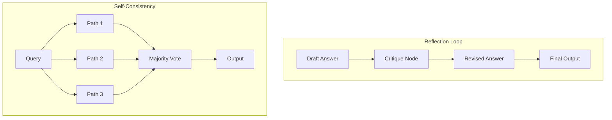

# 🚀 Advanced Prompting — Beyond the Basics
> **Level:** Core Engineering | **Language:** Hinglish | **Goal:** Master advanced reasoning techniques like Reflection, Self-Consistency, and Constitutional AI.

---

## 🧭 1. Beginner-Friendly Hinglish Explanation
Advanced Prompting ka matlab hai model ko sirf kaam batana nahi, balki use **"Apne dimaag ka best use"** karne ke liye guide karna. 

Jaise ek student ko sirf math ka problem dena kafi nahi hota, use sikhana padta hai ki "Sawal ko re-check karo" ya "Agar answer galat lage toh doosra tareeka apnao." 
- **Reflection:** Agent apna hi kaam check karta hai.
- **Self-Consistency:** Model se 3 baar answer mangna aur jo sabse common ho wo choose karna.
- **Constitutional AI:** Agent ko kuch "Rules" dena (Like a Constitution) jise wo kabhi break nahi kar sakta.

---

## 🧠 2. Deep Technical Explanation
Advanced techniques focus on **Verification** and **Path Diversity**.
- **Reflection (Self-Correction):** The prompt includes a second phase where the model is asked: "Critique your previous output for hallucinations and logical fallacies."
- **Self-Consistency (CoT-SC):** Instead of one reasoning path, the agent generates multiple paths and uses "Majority Voting" to pick the final answer. This is highly effective for math and logic.
- **Constitutional AI (CAI):** Pioneered by Anthropic, it uses a set of principles to align the model. The prompt forces the model to evaluate its draft against these principles before finalizing.
- **Dynamic Few-Shot:** Selecting the most relevant examples from a vector database to inject into the prompt at runtime (RAG for prompts).

---

## 🏗️ 3. Architecture Diagrams



---

## 💻 4. Production-Ready Code Example (Reflection Pattern)

```python
def generate_initial_draft(query: str):
    return f"Draft answer for: {query}"

def reflect_and_critique(draft: str):
    # Instruction to model: Find errors in this draft
    return f"Critique of: {draft} - Found 1 potential error."

def final_revision(draft: str, critique: str):
    # Instruction to model: Fix the draft using the critique
    return f"Final Answer based on {critique}"

def run_advanced_agent(query: str):
    draft = generate_initial_draft(query)
    print(f"Draft: {draft}")
    
    critique = reflect_and_critique(draft)
    print(f"Critique: {critique}")
    
    final = final_revision(draft, critique)
    print(f"Final: {final}")
    return final

# run_advanced_agent("How do transformers handle positional information?")
```

---

## 🌍 5. Real-World Use Cases
- **Legal Document Review:** Reflection ensures that the agent doesn't miss any clause or hallucinate legal terms.
- **Complex Math/Coding:** Self-consistency helps in finding the most stable solution among multiple attempts.
- **Content Moderation:** Constitutional AI ensures the agent follows "Human Rights" or "Safety" guidelines strictly.

---

## ❌ 6. Failure Cases
- **Endless Critique:** Agent "Critique -> Revise -> Critique" loop mein phas jata hai aur output kabhi nahi deta.
- **Confirmation Bias:** Reflection node humesha bolta hai "Draft is perfect" (Failure of critique).
- **Inconsistent Voting:** Self-consistency mein agar 3 alag answers mil jayein (Tie), toh selection fail ho jata hai.

---

## 🛠️ 7. Debugging Guide
- **Critique Analysis:** Check karein ki critique node actually useful feedback de raha hai ya sirf generic baatein kar raha hai.
- **Vote Monitoring:** Trace karein ki kitne reasoning paths diverge ho rahe hain.

---

## ⚖️ 8. Tradeoffs
- **Accuracy:** Bahut high ho jati hai reflection ke saath.
- **Cost/Latency:** 2x-3x badh jati hai kyunki har query ke liye multiple LLM calls ho rahi hain.

---

## ✅ 9. Best Practices
- **Step-wise Reflection:** Poore kaam ke baad nahi, har chhote step ke baad reflect karein.
- **Independent Nodes:** Draft karne wala model aur Critique karne wala model different (ya different prompt) rakhein.

---

## 🛡️ 10. Security Concerns
- **Critique Manipulation:** Attacker critique node ko manipulate karke system ko "Force" kar sakta hai ki wo galat answer accept kare.

---

## 📈 11. Scaling Challenges
- **Parallel Sampling:** Running 5 paths for self-consistency requires high throughput from the LLM provider.

---

## 💰 12. Cost Considerations
- **Small Model Critics:** Critique ke liye chote, saste models (Haiku/Flash) use karein to save costs.

---

## 📝 13. Interview Questions
1. **"Reflection vs ReAct mein kya fark hai?"**
2. **"Self-consistency kab use nahi karni chahiye?"**
3. **"Constitutional AI model safety mein kaise help karta hai?"**

---

## ⚠️ 14. Common Mistakes
- **Vague Rubrics:** Critique node ko "Check for errors" bolna (Instead, give a specific checklist: "Check for facts, tone, and grammar").

---

## 🚀 15. Latest 2026 Industry Patterns
- **Multi-modal Reflection:** Agents checking their text outputs against generated images/charts to ensure consistency.
- **Automated Jailbreak Testing:** Using advanced prompts to try and break your own agent's constitution during the dev cycle.

---

> **Expert Tip:** Reflection is the **Quality Control** department of your AI agent. Don't ship without it.
