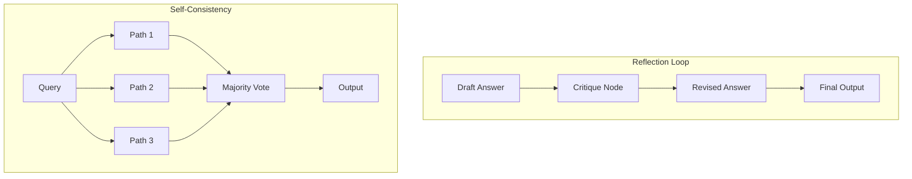

# 🚀 Advanced Prompting — Basics Se Aage
> **Level:** Core Engineering | **Language:** Hinglish | **Goal:** Reflection, Self-Consistency, aur Constitutional AI jaise advanced reasoning techniques master karna.

---

## 🧭 1. Beginner-Friendly Hinglish Explanation
Advanced Prompting ka matlab hai model ko sirf kaam batana nahi, balki use **"Apne dimaag ka best use"** karne ke liye guide karna. 

Jaise ek student ko sirf math ka problem dena kafi nahi hota, use sikhana padta hai ki "Sawal ko re-check karo" ya "Agar answer galat lage toh doosra tareeka apnao." 
- **Reflection:** Agent apna hi kaam check karta hai.
- **Self-Consistency:** Model se 3 baar answer mangna aur jo sabse common ho wo choose karna.
- **Constitutional AI:** Agent ko kuch "Rules" dena (Like a Constitution) jise wo kabhi break nahi kar sakta.

---

## 🧠 2. Deep Technical Explanation
Advanced techniques **Verification** aur **Path Diversity** par focus karti hain.
- **Reflection (Self-Correction):** Prompt me ek second phase hota hai jahan model se pucha jata hai: "Apne previous output ko hallucinations aur logical fallacies ke liye critique karo."
- **Self-Consistency (CoT-SC):** Ek reasoning path ke bajay agent multiple paths generate karta hai aur final answer pick karne ke liye "Majority Voting" use karta hai. Ye math aur logic ke liye highly effective hai.
- **Constitutional AI (CAI):** Anthropic dwara pioneer kiya gaya, ye model ko align karne ke liye principles ka set use karta hai. Prompt model ko force karta hai ki finalizing se pehle apne draft ko in principles ke against evaluate kare.
- **Dynamic Few-Shot:** Runtime par prompt me inject karne ke liye vector database se most relevant examples select karna (prompts ke liye RAG).

---

## 🏗️ 3. Architecture Diagrams


```mermaid
graph TD
    subgraph "Reflection Loop"
    D[Draft Answer] --> C[Critique Node]
    C --> R[Revised Answer]
    R --> Final[Final Output]
    end
    
    subgraph "Self-Consistency"
    Q[Query] --> P1[Path 1]
    Q --> P2[Path 2]
    Q --> P3[Path 3]
    P1 & P2 & P3 --> V[Majority Vote]
    V --> Output
    end
```

---

## 💻 4. Production-Ready Code Example (Reflection Pattern)

```python
def generate_initial_draft(query: str):
    return f"Draft answer for: {query}"

def reflect_and_critique(draft: str):
    # Model ko instruction: Is draft me errors find karo
    return f"Critique of: {draft} - 1 potential error mila."

def final_revision(draft: str, critique: str):
    # Model ko instruction: Critique use karke draft fix karo
    return f"{critique} ke basis par final answer"

def run_advanced_agent(query: str):
    draft = generate_initial_draft(query)
    print(f"Draft: {draft}")
    
    critique = reflect_and_critique(draft)
    print(f"Critique: {critique}")
    
    final = final_revision(draft, critique)
    print(f"Final: {final}")
    return final

# run_advanced_agent("Transformers positional information ko kaise handle karte hain?")
```

---

## 🌍 5. Real-World Use Cases
- **Legal Document Review:** Reflection ensure karta hai ki agent koi clause miss na kare ya legal terms hallucinate na kare.
- **Complex Math/Coding:** Self-consistency multiple attempts me se most stable solution find karne me help karta hai.
- **Content Moderation:** Constitutional AI ensure karta hai ki agent "Human Rights" ya "Safety" guidelines strictly follow kare.

---

## ❌ 6. Failure Cases
- **Endless Critique:** Agent "Critique -> Revise -> Critique" loop mein phas jata hai aur output kabhi nahi deta.
- **Confirmation Bias:** Reflection node humesha bolta hai "Draft is perfect" (Failure of critique).
- **Inconsistent Voting:** Self-consistency mein agar 3 alag answers mil jayein (Tie), toh selection fail ho jata hai.

---

## 🛠️ 7. Debugging Guide
- **Critique Analysis:** Check karein ki critique node actually useful feedback de raha hai ya sirf generic baatein kar raha hai.
- **Vote Monitoring:** Trace karein ki kitne reasoning paths diverge ho rahe hain.

---

## ⚖️ 8. Tradeoffs
- **Accuracy:** Bahut high ho jati hai reflection ke saath.
- **Cost/Latency:** 2x-3x badh jati hai kyunki har query ke liye multiple LLM calls ho rahi hain.

---

## ✅ 9. Best Practices
- **Step-wise Reflection:** Poore kaam ke baad nahi, har chhote step ke baad reflect karein.
- **Independent Nodes:** Draft karne wala model aur Critique karne wala model different (ya different prompt) rakhein.

---

## 🛡️ 10. Security Concerns
- **Critique Manipulation:** Attacker critique node ko manipulate karke system ko "Force" kar sakta hai ki wo galat answer accept kare.

---

## 📈 11. Scaling Challenges
- **Parallel Sampling:** Self-consistency ke liye 5 paths run karne par LLM provider se high throughput chahiye hota hai.

---

## 💰 12. Cost Considerations
- **Small Model Critics:** Critique ke liye chote, saste models (Haiku/Flash) use karein to save costs.

---

## 📝 13. Interview Questions
1. **"Reflection vs ReAct mein kya fark hai?"**
2. **"Self-consistency kab use nahi karni chahiye?"**
3. **"Constitutional AI model safety mein kaise help karta hai?"**

---

## ⚠️ 14. Common Mistakes
- **Vague Rubrics:** Critique node ko "Errors check karo" bolna (iske bajay specific checklist dein: "Facts, tone, aur grammar check karo").

---

## 🚀 15. Latest 2026 Industry Patterns
- **Multi-modal Reflection:** Agents consistency ensure karne ke liye apne text outputs ko generated images/charts ke against check karte hain.
- **Automated Jailbreak Testing:** Dev cycle ke dauran advanced prompts use karke apne agent ki constitution break karne ki koshish karna.

---

> **Expert Tip:** Reflection aapke AI agent ka **Quality Control** department hai. Iske bina ship mat karein.
