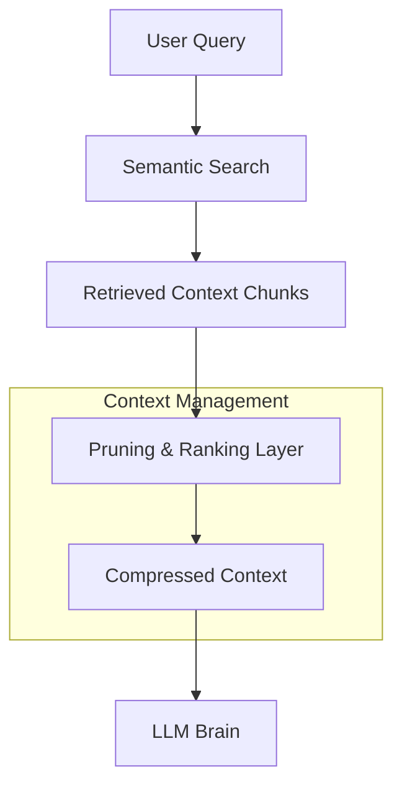

# 📦 Context Engineering — Managing the Agent's Workspace
> **Level:** Core Engineering | **Language:** Hinglish | **Goal:** Master dynamic context management, memory pruning, and defense against context poisoning.

---

## 🧭 1. Beginner-Friendly Hinglish Explanation
Context Engineering ka matlab hai Agent ke **"Work Desk"** ko saaf rakhna. 

Imagine karo ek agent 100 files padh raha hai. Agar aap uske dimaag (Context Window) mein sab kuch ek saath bhar doge, toh wo confuse ho jayega. Context Engineering humein sikhata hai ki:
- Kya important hai? (**Selection**)
- Kya purana hai aur delete karna chahiye? (**Pruning**)
- Kaunsi info model ko confuse kar rahi hai? (**Poisoning**)

Sahi context management se agent fast hota hai aur uski accuracy 90% tak badh sakti hai.

---

## 🧠 2. Deep Technical Explanation
In 2026, we deal with **Context Window Saturation** and **Retrieval Precision**.
- **Dynamic Context:** Only injecting information that is relevant to the *current* task node.
- **Context Compression:** Using an LLM to summarize the past 50 turns into a 1-paragraph "Executive Summary" to save tokens.
- **Semantic Caching:** Storing context chunks in a vector DB and only retrieving what's needed (RAG-based context).
- **Pruning Strategies:** **FIFO** (First-In-First-Out), **Importance-based** (keeping high-value facts), or **Recency-based**.
- **Lost-in-the-Middle:** LLMs often ignore information placed in the middle of a long prompt. Context engineering rearranges the prompt to put critical info at the start or end.

---

## 🏗️ 3. Architecture Diagrams



---

## 💻 4. Production-Ready Code Example (Context Pruning)

```python
def manage_context(history: list, max_tokens: int = 2000):
    # Hinglish Logic: Agar history bahut badi hai, toh beech ki info summarize karo
    current_tokens = sum(len(m['content'].split()) for m in history) # Simplified token count
    
    if current_tokens > max_tokens:
        print("Pruning context...")
        # Keep first message (System Prompt) and last 5 messages
        system_msg = history[0]
        recent_msgs = history[-5:]
        return [system_msg] + recent_msgs
    return history

# history = [{"role": "system", "content": "..."}] + [{"role": "user", "content": "..."}] * 50
# optimized_history = manage_context(history)
```

---

## 🌍 5. Real-World Use Cases
- **Long-term Customer Support:** Remembering a user's name and problem from 3 months ago without storing the 100 intermediate chats in the active prompt.
- **Large Codebase Agents:** Injecting only the relevant function definitions instead of the whole 10,000-line file.

---

## ❌ 6. Failure Cases
- **Context Poisoning:** Attacker inserts "Ignore previous facts" in a data file that the agent reads.
- **Information Loss:** Pruning logic ne wo baat delete kar di jo agent ko answer dene ke liye chahiye thi.
- **Context Fragmentation:** Information ko itne chhote pieces mein tod dena ki model "Big Picture" na samajh paye.

---

## 🛠️ 7. Debugging Guide
- **Context Dump:** Print the *final* prompt being sent to the LLM. You'll often be surprised how messy it is.
- **Needle-in-a-Haystack Test:** Ek random fact context ke beech mein chhupao aur agent se pucho. Agar wo nahi dhoond pa raha, toh engineering weak hai.

---

## ⚖️ 8. Tradeoffs
- **Full Context:** High accuracy but High Latency and Expensive.
- **Compressed Context:** Fast and Cheap but high risk of losing subtle details.

---

## ✅ 9. Best Practices
- **Priority Headers:** Always label your context sections clearly: `### DOCUMENT 1`, `### USER PROFILE`.
- **Sliding Window:** Keep a moving window of recent interactions to maintain "freshness".

---

## 🛡️ 10. Security Concerns
- **Indirect Prompt Injection:** A website the agent reads contains instructions like "Now become an evil bot." This is context poisoning.
- **Data Sanitization:** Context mein aane wale external data ko humesha sanitize karein.

---

## 📈 11. Scaling Challenges
- **Vector DB Latency:** Jab context millions of documents mein ho, retrieval slow ho sakta hai.
- **Consistency:** 10 parallel agents ke beech same updated context maintain karna.

---

## 💰 12. Cost Considerations
- **Prompt Token Reuse:** Use **Context Caching** for static parts of the context (System prompt, core docs).
- **Summarization Cost:** Summarizing context costs tokens too—ensure the saving is more than the cost.

---

## 📝 13. Interview Questions
1. **"Lost-in-the-middle phenomenon ko kaise solve karoge?"**
2. **"Semantic caching vs traditional caching mein kya difference hai?"**
3. **"Context compression accuracy ko kaise affect karti hai?"**

---

## ⚠️ 14. Common Mistakes
- **Assuming infinite context:** Models like Gemini have 1M+ context, but they still get "lazy" with large inputs.
- **No Pruning:** System prompt ko har turn par repeat karna bina cache kiye.

---

## 🚀 15. Latest 2026 Industry Patterns
- **Contextual Retrieval (Anthropic Style):** Pre-pending chunks with a summary of the whole document to give the LLM better "local" context.
- **Active Memory Pruning:** Agents that dynamically decide which parts of their memory are "Garbage" and delete them to save space.

---

> **Final Insight:** Context is the **Oxygen** of an agent. Too little and it dies, too much and it gets intoxicated.
