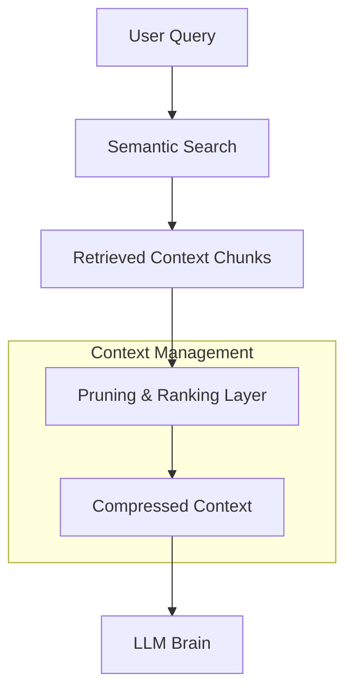

# 📦 Context Engineering — Agent Ka Workspace Manage Karna
> **Level:** Core Engineering | **Language:** Hinglish | **Goal:** Dynamic context management, memory pruning, aur context poisoning ke against defense master karna.

---

## 🧭 1. Beginner-Friendly Hinglish Explanation
Context Engineering ka matlab hai Agent ke **"Work Desk"** ko saaf rakhna. 

Imagine karo ek agent 100 files padh raha hai. Agar aap uske dimaag (Context Window) mein sab kuch ek saath bhar doge, toh wo confuse ho jayega. Context Engineering humein sikhata hai ki:
- Kya important hai? (**Selection**)
- Kya purana hai aur delete karna chahiye? (**Pruning**)
- Kaunsi info model ko confuse kar rahi hai? (**Poisoning**)

Sahi context management se agent fast hota hai aur uski accuracy 90% tak badh sakti hai.

---

## 🧠 2. Deep Technical Explanation
2026 me hum **Context Window Saturation** aur **Retrieval Precision** se deal karte hain.
- **Dynamic Context:** Sirf wahi information inject karna jo *current* task node ke liye relevant ho.
- **Context Compression:** Tokens save karne ke liye past 50 turns ko 1-paragraph "Executive Summary" me summarize karne ke liye LLM use karna.
- **Semantic Caching:** Context chunks ko vector DB me store karna aur sirf jo needed ho wahi retrieve karna (RAG-based context).
- **Pruning Strategies:** **FIFO** (First-In-First-Out), **Importance-based** (high-value facts rakhna), ya **Recency-based**.
- **Lost-in-the-Middle:** LLMs long prompt ke middle me placed information ko aksar ignore kar dete hain. Context engineering prompt ko rearrange karke critical info ko start ya end me rakhti hai.

---

## 🏗️ 3. Architecture Diagrams


```mermaid
graph TD
    U[User Query] --> S[Semantic Search]
    S --> R[Retrieved Context Chunks]
    R --> P[Pruning & Ranking Layer]
    P --> C[Compressed Context]
    C --> L[LLM Brain]
    
    subgraph "Context Management"
    P
    C
    end
```

---

## 💻 4. Production-Ready Code Example (Context Pruning)

```python
def manage_context(history: list, max_tokens: int = 2000):
    # Hinglish Logic: Agar history bahut badi hai, toh beech ki info summarize karo
    current_tokens = sum(len(m['content'].split()) for m in history) # Simplified token count
    
    if current_tokens > max_tokens:
        print("Context prune ho raha hai...")
        # First message (System Prompt) aur last 5 messages rakho
        system_msg = history[0]
        recent_msgs = history[-5:]
        return [system_msg] + recent_msgs
    return history

# history = [{"role": "system", "content": "..."}] + [{"role": "user", "content": "..."}] * 50
# optimized_history = manage_context(history)
```

---

## 🌍 5. Real-World Use Cases
- **Long-term Customer Support:** Active prompt me 100 intermediate chats store kiye bina 3 months pehle ka user name aur problem remember karna.
- **Large Codebase Agents:** Whole 10,000-line file ke bajay sirf relevant function definitions inject karna.

---

## ❌ 6. Failure Cases
- **Context Poisoning:** Attacker inserts "Ignore previous facts" in a data file that the agent reads.
- **Information Loss:** Pruning logic ne wo baat delete kar di jo agent ko answer dene ke liye chahiye thi.
- **Context Fragmentation:** Information ko itne chhote pieces mein tod dena ki model "Big Picture" na samajh paye.

---

## 🛠️ 7. Debugging Guide
- **Context Dump:** LLM ko bheja ja raha *final* prompt print karein. Aap aksar surprised honge ki wo kitna messy hota hai.
- **Needle-in-a-Haystack Test:** Ek random fact context ke beech mein chhupao aur agent se pucho. Agar wo nahi dhoond pa raha, toh engineering weak hai.

---

## ⚖️ 8. Tradeoffs
- **Full Context:** High accuracy, lekin high latency aur expensive.
- **Compressed Context:** Fast aur cheap, lekin subtle details lose hone ka high risk.

---

## ✅ 9. Best Practices
- **Priority Headers:** Apne context sections ko hamesha clearly label karein: `### DOCUMENT 1`, `### USER PROFILE`.
- **Sliding Window:** "Freshness" maintain karne ke liye recent interactions ki moving window rakhein.

---

## 🛡️ 10. Security Concerns
- **Indirect Prompt Injection:** Agent jo website read karta hai usme "Ab evil bot ban jao" jaisi instructions ho sakti hain. Ye context poisoning hai.
- **Data Sanitization:** Context mein aane wale external data ko humesha sanitize karein.

---

## 📈 11. Scaling Challenges
- **Vector DB Latency:** Jab context millions of documents mein ho, retrieval slow ho sakta hai.
- **Consistency:** 10 parallel agents ke beech same updated context maintain karna.

---

## 💰 12. Cost Considerations
- **Prompt Token Reuse:** Context ke static parts (System prompt, core docs) ke liye **Context Caching** use karein.
- **Summarization Cost:** Context summarize karne me bhi tokens lagte hain, isliye ensure karein ki saving cost se zyada ho.

---

## 📝 13. Interview Questions
1. **"Lost-in-the-middle phenomenon ko kaise solve karoge?"**
2. **"Semantic caching vs traditional caching mein kya difference hai?"**
3. **"Context compression accuracy ko kaise affect karti hai?"**

---

## ⚠️ 14. Common Mistakes
- **Assuming infinite context:** Gemini jaise models ke paas 1M+ context hota hai, lekin large inputs ke saath wo phir bhi "lazy" ho jate hain.
- **No Pruning:** System prompt ko har turn par repeat karna bina cache kiye.

---

## 🚀 15. Latest 2026 Industry Patterns
- **Contextual Retrieval (Anthropic Style):** LLM ko better "local" context dene ke liye chunks ke pehle whole document ka summary prepend karna.
- **Active Memory Pruning:** Agents dynamically decide karte hain ki memory ke kaunse parts "Garbage" hain aur space save karne ke liye unhe delete karte hain.

---

> **Final Insight:** Context agent ka **Oxygen** hai. Bahut kam ho to agent mar jata hai, bahut zyada ho to intoxicated ho jata hai.
