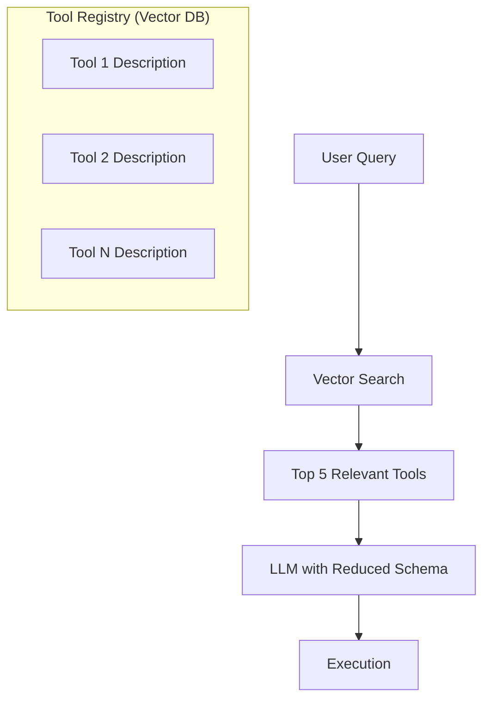

# 🎯 Dynamic Tool Selection — Managing Tool Sprawl
> **Level:** Core Engineering | **Language:** Hinglish | **Goal:** Master the techniques to handle hundreds of tools using semantic routing and selective injection.

---

## 🧭 1. Beginner-Friendly Hinglish Explanation
Dynamic Tool Selection ka matlab hai **"Sahi waqt par sahi tool chunna"**. 

Imagine aapke paas 500 tools hain. Agar aap saare tools ek saath AI ko doge, toh wo pagal ho jayega (Context confusion) aur bahut tokens kharch honge. 

Dynamic Selection mein hum:
- User ka sawal sunte hain.
- Pata karte hain ki kaunse 5-10 tools actually kaam aa sakte hain.
- Sirf wahi tools AI ko dikhate hain.

Ye bilkul waisa hi hai jaise ek mechanic poora workshop utha kar nahi lata, sirf wo tools lata hai jo gaadi theek karne ke liye chahiye.

---

## 🧠 2. Deep Technical Explanation
Handling **Tool Sprawl** requires a two-step retrieval process:
1. **Tool Indexing:** Descriptions of every tool are stored as embeddings in a **Vector Database**.
2. **Semantic Retrieval:** When a query arrives, we perform a vector search to find the top $N$ most relevant tool descriptions.
3. **Dynamic Injection:** Only these top $N$ tool schemas are injected into the LLM's system prompt or function calling configuration.
4. **Tool Metadata:** Using tags or categories to filter tools before semantic search (e.g., "Finance Tools", "Admin Tools").

This approach solves the **Context Window Limit** and reduces **Hallucinations** caused by overlapping tool descriptions.

---

## 🏗️ 3. Architecture Diagrams



---

## 💻 4. Production-Ready Code Example (Semantic Tool Picker)

```python
# Simulated Tool Metadata
tool_registry = [
    {"name": "get_weather", "description": "Fetches weather data for a city"},
    {"name": "send_email", "description": "Sends an email to a recipient"},
    {"name": "query_db", "description": "Runs SQL queries on the production database"}
]

def find_relevant_tools(user_query: str):
    # Hinglish Logic: Simple keyword matching (In production, use Vector Search)
    relevant = []
    for tool in tool_registry:
        if any(word in user_query.lower() for word in tool['description'].split()):
            relevant.append(tool)
    return relevant

# query = "What's the weather in Delhi?"
# selected_tools = find_relevant_tools(query)
# print(f"Tools injected into prompt: {[t['name'] for t in selected_tools]}")
```

---

## 🌍 5. Real-World Use Cases
- **Enterprise ERPs:** Systems with thousands of APIs where no single model can process all schemas at once.
- **Personal Assistants:** Switching between "Work tools" (Email, Slack) and "Home tools" (Lights, Music) based on intent.
- **Dynamic Plugin Systems:** Allowing users to upload their own tools which the agent automatically learns to use.

---

## ❌ 6. Failure Cases
- **Retriever Miss:** Semantic search fail ho jata hai aur zaruri tool miss ho jata hai, jisse agent bolta hai "I can't do that."
- **Description Overlap:** Do tools ki descriptions itni similar hain ki retriever hamesha galat tool pick karta hai.
- **Cold Start:** Naye tools ka embedding index update nahi hua, isliye wo search mein nahi aate.

---

## 🛠️ 7. Debugging Guide
- **Check Retrieval Score:** Dekhein ki retriever ne tools ko kitna rank diya hai.
- **Diversity Sampling:** Sirf top 5 nahi, thode random tools bhi bhej kar dekhein accuracy badhti hai ya nahi.

---

## ⚖️ 8. Tradeoffs
- **Dynamic Selection:** Saves context tokens and improves focus but adds a small latency for the retrieval step.
- **Static Selection:** Faster (no retrieval) but limited to a small number of tools.

---

## ✅ 9. Best Practices
- **Rich Descriptions:** Tool descriptions mein use cases aur keywords zarur likhein for better vector search.
- **Hierarchical Routing:** Pehle "Category" select karein, phir us category ke "Tools".

---

## 🛡️ 10. Security Concerns
- **Tool Shadowing:** Ek malicious tool ki description aisi likhna ki wo legit tools ko replace kar de search results mein.
- **Access Control:** Dynamic selection mein wahi tools dikhane chahiye jinka user ke paas permission hai.

---

## 📈 11. Scaling Challenges
- **Vector DB Sync:** Thousands of developers adding tools means the index needs to be updated in real-time.

---

## 💰 12. Cost Considerations
- **Token Savings:** 100 tools (10k tokens) ki jagah 5 tools (500 tokens) inject karne se cost 95% kam ho jati hai.

---

## 📝 13. Interview Questions
1. **"Tool Sprawl problem kya hai aur use kaise solve karenge?"**
2. **"Semantic retrieval tool calling accuracy ko kaise improve karta hai?"**
3. **"Router pattern vs Semantic tool picking mein kya fark hai?"**

---

## ⚠️ 14. Common Mistakes
- **Vague Descriptions:** "Tool for data" likhna (Retriever ise kabhi pick nahi kar payega).
- **Ignoring Metadata:** Sirf text search par depend karna bina category filters ke.

---

## 🚀 15. Latest 2026 Industry Patterns
- **Agent-to-Tool Discovery:** Agents querying an "Agentic App Store" (using MCP protocol) to find and install tools they need for a task.
- **On-the-fly Tool Generation:** Model creating a custom tool (writing code) when a matching one isn't found in the registry.

---

> **Expert Tip:** Don't drown your agent in tools. Give it a **Menu**, not the whole kitchen inventory.
