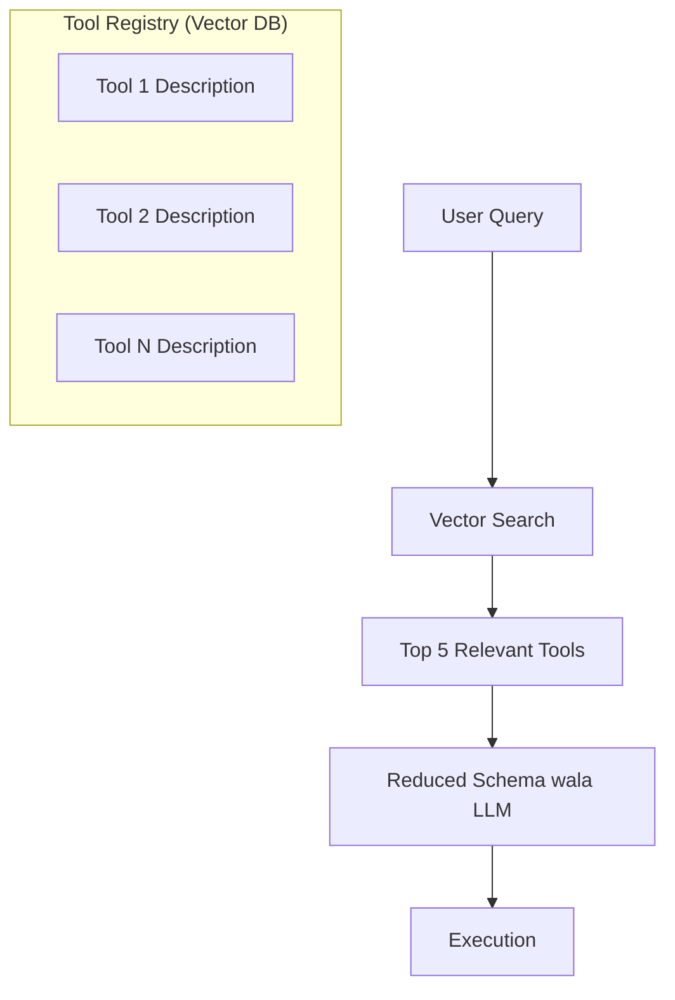

# 🎯 Dynamic Tool Selection — Tool Sprawl Manage Karna
> **Level:** Core Engineering | **Language:** Hinglish | **Goal:** Semantic routing aur selective injection use karke hundreds of tools handle karne ki techniques master karna.

---

## 🧭 1. Beginner-Friendly Hinglish Explanation
Dynamic Tool Selection ka matlab hai **"Sahi waqt par sahi tool chunna"**. 

Imagine aapke paas 500 tools hain. Agar aap saare tools ek saath AI ko doge, toh wo pagal ho jayega (Context confusion) aur bahut tokens kharch honge. 

Dynamic Selection mein hum:
- User ka sawal sunte hain.
- Pata karte hain ki kaunse 5-10 tools actually kaam aa sakte hain.
- Sirf wahi tools AI ko dikhate hain.

Ye bilkul waisa hi hai jaise ek mechanic poora workshop utha kar nahi lata, sirf wo tools lata hai jo gaadi theek karne ke liye chahiye.

---

## 🧠 2. Deep Technical Explanation
**Tool Sprawl** handle karne ke liye two-step retrieval process chahiye hota hai:
1. **Tool Indexing:** Har tool ki descriptions ko embeddings ke roop me **Vector Database** me store kiya jata hai.
2. **Semantic Retrieval:** Jab query aati hai, hum top $N$ most relevant tool descriptions find karne ke liye vector search perform karte hain.
3. **Dynamic Injection:** Sirf ye top $N$ tool schemas LLM ke system prompt ya function calling configuration me inject kiye jate hain.
4. **Tool Metadata:** Semantic search se pehle tools filter karne ke liye tags ya categories use karna (e.g., "Finance Tools", "Admin Tools").

Ye approach **Context Window Limit** solve karta hai aur overlapping tool descriptions ki wajah se hone wali **Hallucinations** reduce karta hai.

---

## 🏗️ 3. Architecture Diagrams


```mermaid
graph TD
    U[User Query] --> V[Vector Search]
    subgraph "Tool Registry (Vector DB)"
    T1[Tool 1 Description]
    T2[Tool 2 Description]
    TN[Tool N Description]
    end
    V --> R[Top 5 Relevant Tools]
    R --> L[Reduced Schema wala LLM]
    L --> Call[Execution]
```

---

## 💻 4. Production-Ready Code Example (Semantic Tool Picker)

```python
# Simulated tool metadata
tool_registry = [
    {"name": "get_weather", "description": "City ke liye weather data fetch karta hai"},
    {"name": "send_email", "description": "Recipient ko email bhejta hai"},
    {"name": "query_db", "description": "Production database par SQL queries run karta hai"}
]

def find_relevant_tools(user_query: str):
    # Hinglish logic: Simple keyword matching (production me Vector Search use karein)
    relevant = []
    for tool in tool_registry:
        if any(word in user_query.lower() for word in tool['description'].split()):
            relevant.append(tool)
    return relevant

# query = "Delhi me weather kaisa hai?"
# selected_tools = find_relevant_tools(query)
# print(f"Prompt me inject kiye gaye tools: {[t['name'] for t in selected_tools]}")
```

---

## 🌍 5. Real-World Use Cases
- **Enterprise ERPs:** Aise systems jinke paas thousands of APIs hote hain jahan koi single model saare schemas ek saath process nahi kar sakta.
- **Personal Assistants:** Intent ke basis par "Work tools" (Email, Slack) aur "Home tools" (Lights, Music) ke beech switch karna.
- **Dynamic Plugin Systems:** Users ko apne tools upload karne dena, jinhe agent automatically use karna seekh leta hai.

---

## ❌ 6. Failure Cases
- **Retriever Miss:** Semantic search fail ho jata hai aur zaruri tool miss ho jata hai, jisse agent bolta hai "I can't do that."
- **Description Overlap:** Do tools ki descriptions itni similar hain ki retriever hamesha galat tool pick karta hai.
- **Cold Start:** Naye tools ka embedding index update nahi hua, isliye wo search mein nahi aate.

---

## 🛠️ 7. Debugging Guide
- **Check Retrieval Score:** Dekhein ki retriever ne tools ko kitna rank diya hai.
- **Diversity Sampling:** Sirf top 5 nahi, thode random tools bhi bhej kar dekhein accuracy badhti hai ya nahi.

---

## ⚖️ 8. Tradeoffs
- **Dynamic Selection:** Context tokens save karta hai aur focus improve karta hai, lekin retrieval step ke liye thodi latency add karta hai.
- **Static Selection:** Faster hota hai (retrieval nahi), lekin small number of tools tak limited hota hai.

---

## ✅ 9. Best Practices
- **Rich Descriptions:** Tool descriptions mein use cases aur keywords zarur likhein for better vector search.
- **Hierarchical Routing:** Pehle "Category" select karein, phir us category ke "Tools".

---

## 🛡️ 10. Security Concerns
- **Tool Shadowing:** Ek malicious tool ki description aisi likhna ki wo legit tools ko replace kar de search results mein.
- **Access Control:** Dynamic selection mein wahi tools dikhane chahiye jinka user ke paas permission hai.

---

## 📈 11. Scaling Challenges
- **Vector DB Sync:** Thousands of developers tools add kar rahe hon to index ko real-time me update karna padta hai.

---

## 💰 12. Cost Considerations
- **Token Savings:** 100 tools (10k tokens) ki jagah 5 tools (500 tokens) inject karne se cost 95% kam ho jati hai.

---

## 📝 13. Interview Questions
1. **"Tool Sprawl problem kya hai aur use kaise solve karenge?"**
2. **"Semantic retrieval tool calling accuracy ko kaise improve karta hai?"**
3. **"Router pattern vs Semantic tool picking mein kya fark hai?"**

---

## ⚠️ 14. Common Mistakes
- **Vague Descriptions:** "Tool for data" likhna (Retriever ise kabhi pick nahi kar payega).
- **Ignoring Metadata:** Sirf text search par depend karna bina category filters ke.

---

## 🚀 15. Latest 2026 Industry Patterns
- **Agent-to-Tool Discovery:** Agents task ke liye needed tools find aur install karne ke liye "Agentic App Store" query karte hain (MCP protocol use karke).
- **On-the-fly Tool Generation:** Jab registry me matching tool nahi milta, model custom tool create karta hai (code likh kar).

---

> **Expert Tip:** Apne agent ko tools me drown mat karo. Use **Menu** do, poora kitchen inventory nahi.
