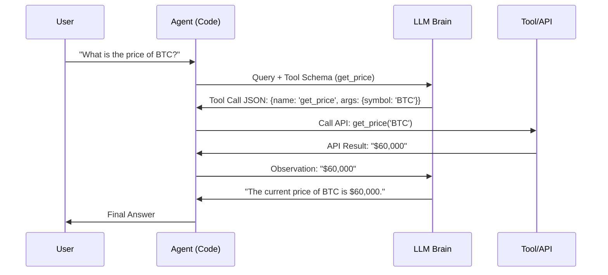

# 🔧 Function Calling Complete Guide — The Agent's Hands
> **Level:** Core Engineering | **Language:** Hinglish | **Goal:** Master structured outputs and tool integration across OpenAI, Gemini, and Anthropic.

---

## 🧭 1. Beginner-Friendly Hinglish Explanation
Function Calling ka matlab hai AI ko **"Power to do things"** dena. 

Normal AI sirf baatein karta hai, lekin Function Calling wala AI **Python code chala sakta hai, email bhej sakta hai, ya database se data nikaal sakta hai.** 

Imagine aapne ek car banayi. Function Calling uske **Hand-break, Accelerator, aur Steering** hain. Aap model ko batate ho: "Ye steering hai, isse gaadi left-right hogi." Model khud decide karega kab steering ghumana hai (Action) aur kitna ghumana hai (Parameters).

---

## 🧠 2. Deep Technical Explanation
Function calling is **not** the LLM executing code. It is the LLM generating a **Structured JSON Object** that represents a function call.
1. **Schema Definition:** You provide a JSON schema of your functions (name, description, parameters).
2. **Model Reasoning:** The LLM analyzes the user query and the schemas. It decides if a function call is needed.
3. **Structured Generation:** The LLM outputs a specific string (usually JSON) like `{"name": "get_weather", "arguments": "{\"location\": \"Delhi\"}"}`.
4. **Execution:** Your backend parses this JSON, runs the actual function, and sends the result back to the LLM.
5. **Final Response:** The LLM uses the tool output to answer the user.

---

## 🏗️ 3. Architecture Diagrams



---

## 💻 4. Production-Ready Code Example (Pydantic Tool Definition)

```python
from pydantic import BaseModel, Field
from typing import Optional

# 1. Define the tool schema using Pydantic (Cleanest way in 2026)
class GetWeather(BaseModel):
    """Get the current weather in a given location"""
    location: str = Field(description="The city and state, e.g. San Francisco, CA")
    unit: Optional[str] = Field(default="celsius", enum=["celsius", "fahrenheit"])

# 2. Convert to OpenAI/Gemini format
# tool_definition = {"type": "function", "function": GetWeather.model_json_schema()}

# 3. Execution logic
def execute_tool(name, args):
    if name == "GetWeather":
        # logic to fetch weather
        return f"Weather in {args['location']} is 30 degrees {args['unit']}."
```

---

## 🌍 5. Real-World Use Cases
- **E-commerce:** "Mera order status kya hai?" -> Agent calls `get_order_status(order_id)`.
- **IT Automation:** "Server restart kardo." -> Agent calls `restart_server(server_name)`.
- **Data Science:** "Is CSV ka mean nikaalo." -> Agent calls `run_python_analysis(script)`.

---

## ❌ 6. Failure Cases
- **Parameter Hallucination:** Agent aise parameters bhejta hai jo galat hain (e.g. `order_id` ki jagah apna naam bhej diya).
- **Schema Mismatch:** Model JSON galat format mein bhej deta hai (e.g. missing braces), jisse parser crash ho jata hai.
- **Wrong Tool Selection:** Weather pucha hai, par agent Calculator call kar raha hai.

---

## 🛠️ 7. Debugging Guide
- **Dry Run:** Tool call JSON ko manual execute karke dekhein.
- **System Prompt Fix:** Agar model parameters miss kar raha hai, toh prompt mein likhein: "Always include the 'unit' parameter in the weather tool."

---

## ⚖️ 8. Tradeoffs
- **Tool Count:** Zyaada tools (10+) reasoning confusion aur latency badhate hain.
- **Specificity:** Ek generic `run_api` tool vs 10 specific tools (`get_user`, `update_user`, etc.). Specific tools are safer.

---

## ✅ 9. Best Practices
- **Clear Descriptions:** Function aur parameters ke descriptions "Beginner-friendly" aur detailed hone chahiye. Model descriptions ko hi "Manual" manta hai.
- **Validation:** Tool call result ko LLM ko bhejne se pehle humesha validate karein.

---

## 🛡️ 10. Security Concerns
- **Remote Code Execution (RCE):** Agar aapka tool `eval()` ya `os.system()` chalata hai, toh attacker model ko manipulate karke server hack kar sakta hai.
- **Data Access:** Agent ko sirf wahi data tools dein jo uske task ke liye relevant hain.

---

## 📈 11. Scaling Challenges
- **Latency:** Har tool call LLM trip badhati hai. Use **Parallel Tool Calling** to speed up.
- **Reliability:** API down hai toh agent ko handle karna aana chahiye (Retry logic).

---

## 💰 12. Cost Considerations
- **Output Tokens:** Complex JSON objects generate karne mein tokens kharch hote hain. Keep schemas concise.

---

## 📝 13. Interview Questions
1. **"Function calling mein model actually code chala raha hai ya kuch aur?"**
2. **"JSON Mode kyu zaruri hai response parsing ke liye?"**
3. **"Tool descriptions reasoning quality ko kaise improve karte hain?"**

---

## ⚠️ 14. Common Mistakes
- **Complex Schemas:** Nested JSON schemas dena jise model handle na kar paye.
- **No Examples:** Tool use ke few-shot examples na dena.

---

## 🚀 15. Latest 2026 Industry Patterns
- **Native Tool Use:** Models like Claude 3.5 aur GPT-4o ab tool calling ke liye optimized weights use karte hain (less hallucination).
- **Tool Registry:** Managing thousands of tools in a central registry and using a "Router" to fetch the relevant ones for a specific task.

---

> **Expert Tip:** In 2026, **Descriptions are Code**. The better you describe your function, the better the model will use it.
