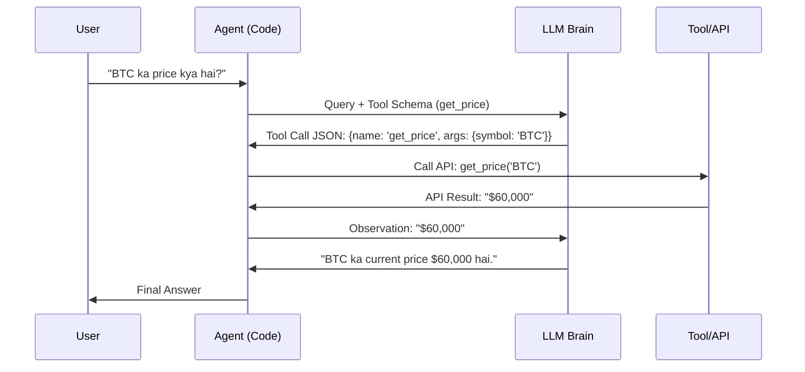

# 🔧 Function Calling Complete Guide — Agent Ke Hands
> **Level:** Core Engineering | **Language:** Hinglish | **Goal:** OpenAI, Gemini, aur Anthropic across structured outputs aur tool integration master karna.

---

## 🧭 1. Beginner-Friendly Hinglish Explanation
Function Calling ka matlab hai AI ko **"Power to do things"** dena. 

Normal AI sirf baatein karta hai, lekin Function Calling wala AI **Python code chala sakta hai, email bhej sakta hai, ya database se data nikaal sakta hai.** 

Imagine aapne ek car banayi. Function Calling uske **Hand-break, Accelerator, aur Steering** hain. Aap model ko batate ho: "Ye steering hai, isse gaadi left-right hogi." Model khud decide karega kab steering ghumana hai (Action) aur kitna ghumana hai (Parameters).

---

## 🧠 2. Deep Technical Explanation
Function calling ka matlab LLM ka code execute karna **nahi** hai. Ye LLM ka ek **Structured JSON Object** generate karna hai jo function call represent karta hai.
1. **Schema Definition:** Aap apne functions ka JSON schema provide karte hain (name, description, parameters).
2. **Model Reasoning:** LLM user query aur schemas analyze karta hai. Ye decide karta hai ki function call needed hai ya nahi.
3. **Structured Generation:** LLM ek specific string (usually JSON) output karta hai jaise `{"name": "get_weather", "arguments": "{\"location\": \"Delhi\"}"}`.
4. **Execution:** Aapka backend is JSON ko parse karta hai, actual function run karta hai, aur result wapas LLM ko bhejta hai.
5. **Final Response:** LLM tool output use karke user ko answer deta hai.

---

## 🏗️ 3. Architecture Diagrams


```mermaid
sequenceDiagram
    participant U as User
    participant A as Agent (Code)
    participant L as LLM Brain
    participant T as Tool/API

    U->>A: "BTC ka price kya hai?"
    A->>L: Query + Tool Schema (get_price)
    L->>A: Tool Call JSON: {name: 'get_price', args: {symbol: 'BTC'}}
    A->>T: Call API: get_price('BTC')
    T->>A: API Result: "$60,000"
    A->>L: Observation: "$60,000"
    L->>A: "BTC ka current price $60,000 hai."
    A->>U: Final Answer
```

---

## 💻 4. Production-Ready Code Example (Pydantic Tool Definition)

```python
from pydantic import BaseModel, Field
from typing import Optional

# 1. Pydantic use karke tool schema define karein (2026 ka cleanest way)
class GetWeather(BaseModel):
    """Given location ka current weather lo"""
    location: str = Field(description="City aur state, e.g. San Francisco, CA")
    unit: Optional[str] = Field(default="celsius", enum=["celsius", "fahrenheit"])

# 2. OpenAI/Gemini format me convert karein
# tool_definition = {"type": "function", "function": GetWeather.model_json_schema()}

# 3. Execution logic
def execute_tool(name, args):
    if name == "GetWeather":
        # Weather fetch karne ki logic
        return f"{args['location']} me weather 30 degrees {args['unit']} hai."
```

---

## 🌍 5. Real-World Use Cases
- **E-commerce:** "Mera order status kya hai?" -> Agent calls `get_order_status(order_id)`.
- **IT Automation:** "Server restart kardo." -> Agent calls `restart_server(server_name)`.
- **Data Science:** "Is CSV ka mean nikaalo." -> Agent calls `run_python_analysis(script)`.

---

## ❌ 6. Failure Cases
- **Parameter Hallucination:** Agent aise parameters bhejta hai jo galat hain (e.g. `order_id` ki jagah apna naam bhej diya).
- **Schema Mismatch:** Model JSON galat format mein bhej deta hai (e.g. missing braces), jisse parser crash ho jata hai.
- **Wrong Tool Selection:** Weather pucha hai, par agent Calculator call kar raha hai.

---

## 🛠️ 7. Debugging Guide
- **Dry Run:** Tool call JSON ko manual execute karke dekhein.
- **System Prompt Fix:** Agar model parameters miss kar raha hai, toh prompt mein likhein: "Weather tool me hamesha 'unit' parameter include karo."

---

## ⚖️ 8. Tradeoffs
- **Tool Count:** Zyaada tools (10+) reasoning confusion aur latency badhate hain.
- **Specificity:** Ek generic `run_api` tool vs 10 specific tools (`get_user`, `update_user`, etc.). Specific tools safer hote hain.

---

## ✅ 9. Best Practices
- **Clear Descriptions:** Function aur parameters ke descriptions "Beginner-friendly" aur detailed hone chahiye. Model descriptions ko hi "Manual" manta hai.
- **Validation:** Tool call result ko LLM ko bhejne se pehle humesha validate karein.

---

## 🛡️ 10. Security Concerns
- **Remote Code Execution (RCE):** Agar aapka tool `eval()` ya `os.system()` chalata hai, toh attacker model ko manipulate karke server hack kar sakta hai.
- **Data Access:** Agent ko sirf wahi data tools dein jo uske task ke liye relevant hain.

---

## 📈 11. Scaling Challenges
- **Latency:** Har tool call LLM trip badhati hai. Speed up ke liye **Parallel Tool Calling** use karein.
- **Reliability:** API down hai toh agent ko handle karna aana chahiye (Retry logic).

---

## 💰 12. Cost Considerations
- **Output Tokens:** Complex JSON objects generate karne me tokens kharch hote hain. Schemas concise rakhein.

---

## 📝 13. Interview Questions
1. **"Function calling mein model actually code chala raha hai ya kuch aur?"**
2. **"JSON Mode kyu zaruri hai response parsing ke liye?"**
3. **"Tool descriptions reasoning quality ko kaise improve karte hain?"**

---

## ⚠️ 14. Common Mistakes
- **Complex Schemas:** Nested JSON schemas dena jise model handle na kar paye.
- **No Examples:** Tool use ke few-shot examples na dena.

---

## 🚀 15. Latest 2026 Industry Patterns
- **Native Tool Use:** Models like Claude 3.5 aur GPT-4o ab tool calling ke liye optimized weights use karte hain (less hallucination).
- **Tool Registry:** Thousands of tools ko central registry me manage karna aur specific task ke liye relevant tools fetch karne ke liye "Router" use karna.

---

> **Expert Tip:** 2026 me **Descriptions are Code**. Aap function ko jitna better describe karenge, model use utna better use karega.
