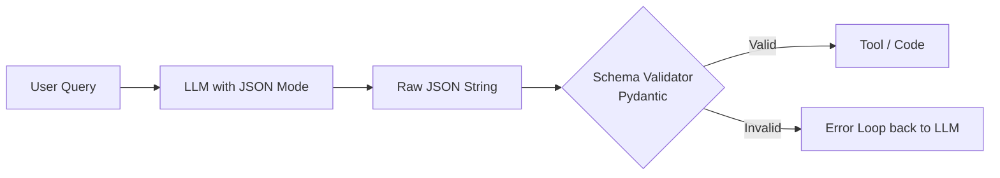

# 📄 JSON Mode & Schema Validation — Ensuring Structured Outputs
> **Level:** Core Engineering | **Language:** Hinglish | **Goal:** Master the techniques to force LLMs to output valid, verifiable, and structured JSON for production tools.

---

## 🧭 1. Beginner-Friendly Hinglish Explanation
JSON Mode ka matlab hai AI ko **"Line mein lagana"**. 

Normal AI "free-style" baatein karta hai. Lekin agar aapko wo data kisi programming code mein use karna hai, toh aapko ek fixed format chahiye—jise hum **JSON** kehte hain. 
Agar AI ne JSON mein ek comma (`,`) ya bracket (`{`) miss kar diya, toh aapka program crash ho jayega. 

Schema Validation wo **"Check-post"** hai jo ensure karta hai ki AI ne jo JSON diya hai, wo exact wahi hai jo humne manga tha. 

---

## 🧠 2. Deep Technical Explanation
JSON Mode is a constraint applied during the decoding process of an LLM.
- **Native JSON Mode:** Supported by OpenAI (since `gpt-3.5-turbo-1106`) and Gemini. It forces the model to generate a valid JSON string.
- **Structured Outputs (2026 Standard):** Beyond just JSON mode, models now support **Constrained Decoding** where the logits are masked to only allow tokens that follow a specific **JSON Schema (Pydantic)**.
- **Schema Validation:** Using libraries like `pydantic` or `jsonschema` to parse and validate the LLM's output before passing it to tools.
- **Repair Logic:** If the JSON is slightly broken (e.g. missing trailing brace), using regex or "JSON Repair" models to fix it.

---

## 🏗️ 3. Architecture Diagrams



---

## 💻 4. Production-Ready Code Example (Pydantic Validation)

```python
from pydantic import BaseModel, ValidationError
import json

# Define the expected schema
class SearchParameters(BaseModel):
    query: str
    limit: int = 5

def process_llm_output(raw_json: str):
    try:
        # 1. Parse JSON
        data = json.loads(raw_json)
        # 2. Validate against schema
        params = SearchParameters(**data)
        return params.model_dump()
    except (json.JSONDecodeError, ValidationError) as e:
        # Hinglish Logic: Agar validation fail ho, toh error dikhao
        return {"error": f"Invalid JSON or Schema: {str(e)}"}

# llm_output = '{"query": "AI news", "limit": "high"}' # This will fail validation because limit must be int
# print(process_llm_output(llm_output))
```

---

## 🌍 5. Real-World Use Cases
- **Data Extraction:** Extracting structured info from invoices or medical records.
- **API Payloads:** Generating the exact JSON body needed for a REST API call.
- **Frontend State:** Directly updating a React state based on LLM's structured instructions.

---

## ❌ 6. Failure Cases
- **Schema Rigidness:** Model ko ek aisi field chahiye jo available hi nahi hai, isliye wo "None" ya fake data bhej deta hai.
- **Type Mismatch:** Model `int` ki jagah `string` bhej deta hai (e.g., `"5"` instead of `5`).
- **Markdown Wrapping:** JSON mode hone ke bawajood model kabhi-kabhi JSON ko ```json blocks mein wrap kar deta hai, jise `json.loads` direct handle nahi karta.

---

## 🛠️ 7. Debugging Guide
- **Print Raw Output:** Parse karne se pehle humesha raw string dekhein.
- **Pydantic Error Details:** `e.errors()` use karein to see exactly kaunsi field fail hui.

---

## ⚖️ 8. Tradeoffs
- **JSON Mode:** High reliability for format but doesn't guarantee the *content* is correct.
- **Few-shot Examples:** Content sahi rehta hai par format kabhi-kabhi toot jata hai.

---

## ✅ 9. Best Practices
- **JSON Mode + System Prompt:** Sirf JSON mode on mat karein, prompt mein bhi likhein: "Respond ONLY in JSON format following the schema."
- **Optional Fields:** Pydantic mein `Optional[]` use karein taaki model crash na ho agar data missing ho.

---

## 🛡️ 10. Security Concerns
- **JSON Injection:** Attacker JSON values mein malicious data bhej sakta hai jo aapka database ya frontend break kar de.
- **Resource Exhaustion:** Model ko bahut bada nested JSON generate karne par majboor karna (Token drain).

---

## 📈 11. Scaling Challenges
- **Parsing Latency:** Complex nested validation hundreds of requests par CPU consume karti hai.

---

## 💰 12. Cost Considerations
- **Tokens for Braces:** JSON is token-heavy (lots of quotes, braces, spaces). Use **minified JSON** instructions if cost is a concern.

---

## 📝 13. Interview Questions
1. **"JSON Mode aur Structured Outputs mein kya difference hai?"**
2. **"Pydantic validation agents ke liye kyu best hai?"**
3. **"Agar model valid JSON na de, toh retry logic kaise implement karoge?"**

---

## ⚠️ 14. Common Mistakes
- **No Schema:** Bina schema ke JSON mangna (Model fields ke naam badal deta hai).
- **Ignoring Parser Errors:** Error handle na karna aur program ko crash hone dena.

---

## 🚀 15. Latest 2026 Industry Patterns
- **Grammar-based Decoding:** Using libraries like **Guidance** or **Outlines** to force the LLM to follow a Regex or BNF grammar at the token level (100% reliability).
- **Multi-step Validation:** One agent generates JSON, another agent validates it, a third one fixes it.

---

> **Expert Tip:** In 2026, **Schema is Contract**. Don't let your agent talk to your code without a signed contract (Pydantic).
