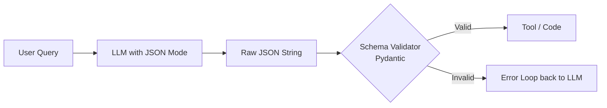

# 📄 JSON Mode & Schema Validation — Structured Outputs Ensure Karna
> **Level:** Core Engineering | **Language:** Hinglish | **Goal:** Production tools ke liye LLMs se valid, verifiable, aur structured JSON output karwane ki techniques master karna.

---

## 🧭 1. Beginner-Friendly Hinglish Explanation
JSON Mode ka matlab hai AI ko **"Line mein lagana"**. 

Normal AI "free-style" baatein karta hai. Lekin agar aapko wo data kisi programming code mein use karna hai, toh aapko ek fixed format chahiye—jise hum **JSON** kehte hain. 
Agar AI ne JSON mein ek comma (`,`) ya bracket (`{`) miss kar diya, toh aapka program crash ho jayega. 

Schema Validation wo **"Check-post"** hai jo ensure karta hai ki AI ne jo JSON diya hai, wo exact wahi hai jo humne manga tha. 

---

## 🧠 2. Deep Technical Explanation
JSON Mode ek constraint hai jo LLM ke decoding process ke dauran apply hota hai.
- **Native JSON Mode:** OpenAI (`gpt-3.5-turbo-1106` se) aur Gemini dwara supported. Ye model ko valid JSON string generate karne ke liye force karta hai.
- **Structured Outputs (2026 Standard):** Sirf JSON mode se aage, models ab **Constrained Decoding** support karte hain jahan logits mask kiye jate hain taaki sirf specific **JSON Schema (Pydantic)** follow karne wale tokens allow hon.
- **Schema Validation:** Tools ko pass karne se pehle LLM output parse aur validate karne ke liye `pydantic` ya `jsonschema` jaise libraries use karna.
- **Repair Logic:** Agar JSON thoda broken ho (e.g. trailing brace missing), to regex ya "JSON Repair" models use karke ise fix karna.

---

## 🏗️ 3. Architecture Diagrams


```mermaid
graph LR
    U[User Query] --> L[LLM with JSON Mode]
    L --> J[Raw JSON String]
    J --> V{Schema Validator\nPydantic}
    V -->|Valid| T[Tool / Code]
    V -->|Invalid| E[Error Loop back to LLM]
```

---

## 💻 4. Production-Ready Code Example (Pydantic Validation)

```python
from pydantic import BaseModel, ValidationError
import json

# Expected schema define karein
class SearchParameters(BaseModel):
    query: str
    limit: int = 5

def process_llm_output(raw_json: str):
    try:
        # 1. JSON parse karein
        data = json.loads(raw_json)
        # 2. Schema ke against validate karein
        params = SearchParameters(**data)
        return params.model_dump()
    except (json.JSONDecodeError, ValidationError) as e:
        # Hinglish Logic: Agar validation fail ho, toh error dikhao
        return {"error": f"Invalid JSON ya Schema: {str(e)}"}

# llm_output = '{"query": "AI news", "limit": "high"}' # Ye validation fail karega kyunki limit int honi chahiye
# print(process_llm_output(llm_output))
```

---

## 🌍 5. Real-World Use Cases
- **Data Extraction:** Invoices ya medical records se structured info extract karna.
- **API Payloads:** REST API call ke liye needed exact JSON body generate karna.
- **Frontend State:** LLM ki structured instructions ke basis par directly React state update karna.

---

## ❌ 6. Failure Cases
- **Schema Rigidness:** Model ko ek aisi field chahiye jo available hi nahi hai, isliye wo "None" ya fake data bhej deta hai.
- **Type Mismatch:** Model `int` ki jagah `string` bhej deta hai (e.g., `"5"` instead of `5`).
- **Markdown Wrapping:** JSON mode hone ke bawajood model kabhi-kabhi JSON ko ```json blocks mein wrap kar deta hai, jise `json.loads` direct handle nahi karta.

---

## 🛠️ 7. Debugging Guide
- **Print Raw Output:** Parse karne se pehle humesha raw string dekhein.
- **Pydantic Error Details:** Exactly kaunsi field fail hui dekhne ke liye `e.errors()` use karein.

---

## ⚖️ 8. Tradeoffs
- **JSON Mode:** Format ke liye high reliability deta hai, lekin *content* correct hai ye guarantee nahi karta.
- **Few-shot Examples:** Content sahi rehta hai, par format kabhi-kabhi toot jata hai.

---

## ✅ 9. Best Practices
- **JSON Mode + System Prompt:** Sirf JSON mode on mat karein, prompt mein bhi likhein: "Schema follow karte hue ONLY JSON format me respond karo."
- **Optional Fields:** Pydantic mein `Optional[]` use karein taaki model crash na ho agar data missing ho.

---

## 🛡️ 10. Security Concerns
- **JSON Injection:** Attacker JSON values mein malicious data bhej sakta hai jo aapka database ya frontend break kar de.
- **Resource Exhaustion:** Model ko bahut bada nested JSON generate karne par majboor karna (Token drain).

---

## 📈 11. Scaling Challenges
- **Parsing Latency:** Complex nested validation hundreds of requests par CPU consume karti hai.

---

## 💰 12. Cost Considerations
- **Tokens for Braces:** JSON token-heavy hota hai (bahut quotes, braces, spaces). Cost concern ho to **minified JSON** instructions use karein.

---

## 📝 13. Interview Questions
1. **"JSON Mode aur Structured Outputs mein kya difference hai?"**
2. **"Pydantic validation agents ke liye kyu best hai?"**
3. **"Agar model valid JSON na de, toh retry logic kaise implement karoge?"**

---

## ⚠️ 14. Common Mistakes
- **No Schema:** Bina schema ke JSON mangna (Model fields ke naam badal deta hai).
- **Ignoring Parser Errors:** Error handle na karna aur program ko crash hone dena.

---

## 🚀 15. Latest 2026 Industry Patterns
- **Grammar-based Decoding:** **Guidance** ya **Outlines** jaise libraries use karke LLM ko token level par Regex ya BNF grammar follow karne ke liye force karna (100% reliability).
- **Multi-step Validation:** Ek agent JSON generate karta hai, doosra agent validate karta hai, teesra use fix karta hai.

---

> **Expert Tip:** 2026 me **Schema is Contract**. Signed contract (Pydantic) ke bina apne agent ko code se baat na karne dein.
