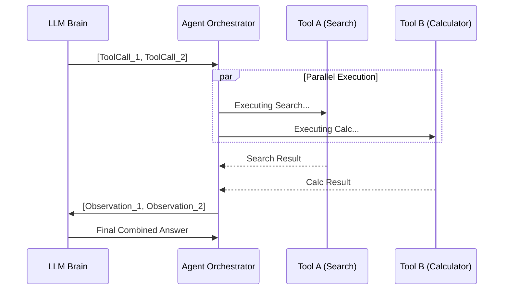

# ⚡ Parallel Tool Calling — Speeding Up the Agent
> **Level:** Core Engineering | **Language:** Hinglish | **Goal:** Master the art of executing multiple tools simultaneously to reduce latency and improve agentic efficiency.

---

## 🧭 1. Beginner-Friendly Hinglish Explanation
Parallel Tool Calling ka matlab hai **"Ek saath multiple kaam karna"**. 

Socho aapne agent ko bola: "Delhi aur Mumbai dono ka weather batao." 
- **Sequential:** Pehle Delhi ka dhoondho (2 sec) -> Result mila -> Phir Mumbai ka dhoondho (2 sec). Total 4 seconds.
- **Parallel:** Dono cities ka weather ek saath dhoondho. Total sirf 2 seconds!

Production mein latency (wait time) sabse badi dushman hai. Parallel calling se hum agent ko "Superfast" bana dete hain.

---

## 🧠 2. Deep Technical Explanation
Most modern models (GPT-4o, Claude 3.5, Gemini 1.5) support parallel tool calling out-of-the-box.
- **The Protocol:** Instead of sending one `tool_call` object, the LLM sends a **list** of `tool_call` objects in its response.
- **Execution:** Your backend should use **Asynchronous execution** (Python `asyncio.gather` or `ThreadedPool`) to run these functions at the same time.
- **The Response:** You must send back the results in the *exact same order* or with the *exact same tool_call_id* so the LLM can map which result belongs to which call.

---

## 🏗️ 3. Architecture Diagrams



---

## 💻 4. Production-Ready Code Example (Async Parallel Execution)

```python
import asyncio

async def fetch_stock_price(symbol: str):
    await asyncio.sleep(1) # Simulate API call
    return f"Price of {symbol}: $100"

async def run_parallel_tools(tool_calls: list):
    tasks = []
    for call in tool_calls:
        # Hinglish Logic: Har call ke liye ek async task banao
        if call['name'] == 'fetch_stock_price':
            tasks.append(fetch_stock_price(call['args']['symbol']))
    
    # Sabko ek saath chalao
    results = await asyncio.gather(*tasks)
    return results

# tool_calls = [{'name': 'fetch_stock_price', 'args': {'symbol': 'BTC'}}, 
#               {'name': 'fetch_stock_price', 'args': {'symbol': 'ETH'}}]
# results = asyncio.run(run_parallel_tools(tool_calls))
```

---

## 🌍 5. Real-World Use Cases
- **Travel Portals:** Checking multiple airlines for the same route simultaneously.
- **Dashboards:** Fetching user profile, order history, and current balance in one go.
- **Comparison Agents:** Comparing products across 5 different websites.

---

## ❌ 6. Failure Cases
- **Dependency Issues:** Agent ne Tool A aur Tool B dono call kiye, lekin Tool B ko Tool A ka result chahiye tha (Parallel calling fails here).
- **Resource Exhaustion:** Ek saath 100 tool calls karne se API rate limits hit ho sakti hain.
- **Partial Failure:** 2 tools chal gaye, 1 fail ho gaya. Agent ko handle karna aana chahiye ki "2 results mile hain, 1 error hai".

---

## 🛠️ 7. Debugging Guide
- **Trace IDs:** Har parallel call ke liye ek unique `tool_call_id` track karein.
- **Timing Logs:** Check karein ki actual "Time Saved" kitna hai vs Sequential.

---

## ⚖️ 8. Tradeoffs
- **Speed:** Latency drastically kam ho jati hai.
- **Complexity:** Async code manage karna mushkil hota hai aur debugging tough ho jati hai.

---

## ✅ 9. Best Practices
- **Idempotency:** Parallel tools "Idempotent" hone chahiye (unhe baar baar chalane se state kharab na ho).
- **Timeouts:** Har tool call ke liye ek max timeout set karein taaki ek slow API poore agent ko block na kare.

---

## 🛡️ 10. Security Concerns
- **DDoS Risk:** Agent galti se ek hi server par thousands of parallel calls bhej sakta hai (Self-DDoS).
- **Rate Limiting:** Protect your internal APIs from being overwhelmed by parallel agentic requests.

---

## 📈 11. Scaling Challenges
- **Thread/Process Management:** High traffic mein thousands of parallel connections manage karna backend ke liye challenge hai.

---

## 💰 12. Cost Considerations
- **Multiple Tool Outputs:** Har result wapas LLM ko bhejne mein tokens kharch hote hain. Ensure results are concise.

---

## 📝 13. Interview Questions
1. **"Sequential vs Parallel tool calling mein system design kaise change hota hai?"**
2. **"Agar Tool B, Tool A par depend karta hai, toh kya parallel calling possible hai?"**
3. **"Python mein parallel tools ke liye `asyncio` kyu preferred hai?"**

---

## ⚠️ 14. Common Mistakes
- **No Error Handling:** Sochna ki saare tools humesha success honge.
- **Blocking Code:** Async loop ke beech mein synchronous `time.sleep()` ya heavy DB call karna.

---

## 🚀 15. Latest 2026 Industry Patterns
- **Speculative Tool Execution:** Agents predicting the next tool call and pre-fetching results before the LLM even confirms it.
- **Batched Tooling:** Combining multiple small tool calls into one large "Batch Request" to save API round-trips.

---

> **Expert Tip:** Parallelism is a **Performance Hack**. Use it for data fetching, avoid it for sequential logic steps.
