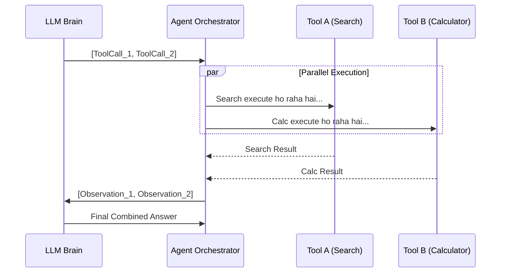

# ⚡ Parallel Tool Calling — Agent Ko Speed Up Karna
> **Level:** Core Engineering | **Language:** Hinglish | **Goal:** Latency reduce karne aur agentic efficiency improve karne ke liye multiple tools ko simultaneously execute karna master karna.

---

## 🧭 1. Beginner-Friendly Hinglish Explanation
Parallel Tool Calling ka matlab hai **"Ek saath multiple kaam karna"**. 

Socho aapne agent ko bola: "Delhi aur Mumbai dono ka weather batao." 
- **Sequential:** Pehle Delhi ka dhoondho (2 sec) -> Result mila -> Phir Mumbai ka dhoondho (2 sec). Total 4 seconds.
- **Parallel:** Dono cities ka weather ek saath dhoondho. Total sirf 2 seconds!

Production mein latency (wait time) sabse badi dushman hai. Parallel calling se hum agent ko "Superfast" bana dete hain.

---

## 🧠 2. Deep Technical Explanation
Zyadatar modern models (GPT-4o, Claude 3.5, Gemini 1.5) parallel tool calling out-of-the-box support karte hain.
- **Protocol:** Ek `tool_call` object bhejne ke bajay LLM apne response me `tool_call` objects ki **list** bhejta hai.
- **Execution:** In functions ko same time par run karne ke liye aapke backend ko **Asynchronous execution** (Python `asyncio.gather` ya `ThreadedPool`) use karna chahiye.
- **Response:** Results ko *exact same order* me ya *exact same tool_call_id* ke saath wapas bhejna chahiye taaki LLM map kar sake ki kaunsa result kis call ka hai.

---

## 🏗️ 3. Architecture Diagrams


```mermaid
sequenceDiagram
    participant L as LLM Brain
    participant A as Agent Orchestrator
    participant T1 as Tool A (Search)
    participant T2 as Tool B (Calculator)

    L->>A: [ToolCall_1, ToolCall_2]
    par Parallel Execution
        A->>T1: Search execute ho raha hai...
        A->>T2: Calc execute ho raha hai...
    end
    T1-->>A: Search Result
    T2-->>A: Calc Result
    A->>L: [Observation_1, Observation_2]
    L->>A: Final Combined Answer
```

---

## 💻 4. Production-Ready Code Example (Async Parallel Execution)

```python
import asyncio

async def fetch_stock_price(symbol: str):
    await asyncio.sleep(1) # API call simulate karo
    return f"{symbol} ka price: $100"

async def run_parallel_tools(tool_calls: list):
    tasks = []
    for call in tool_calls:
        # Hinglish Logic: Har call ke liye ek async task banao
        if call['name'] == 'fetch_stock_price':
            tasks.append(fetch_stock_price(call['args']['symbol']))
    
    # Sabko ek saath chalao
    results = await asyncio.gather(*tasks)
    return results

# tool_calls = [{'name': 'fetch_stock_price', 'args': {'symbol': 'BTC'}}, 
#               {'name': 'fetch_stock_price', 'args': {'symbol': 'ETH'}}]
# results = asyncio.run(run_parallel_tools(tool_calls))
```

---

## 🌍 5. Real-World Use Cases
- **Travel Portals:** Same route ke liye multiple airlines simultaneously check karna.
- **Dashboards:** User profile, order history, aur current balance ek hi go me fetch karna.
- **Comparison Agents:** 5 different websites across products compare karna.

---

## ❌ 6. Failure Cases
- **Dependency Issues:** Agent ne Tool A aur Tool B dono call kiye, lekin Tool B ko Tool A ka result chahiye tha (Parallel calling fails here).
- **Resource Exhaustion:** Ek saath 100 tool calls karne se API rate limits hit ho sakti hain.
- **Partial Failure:** 2 tools chal gaye, 1 fail ho gaya. Agent ko handle karna aana chahiye ki "2 results mile hain, 1 error hai".

---

## 🛠️ 7. Debugging Guide
- **Trace IDs:** Har parallel call ke liye ek unique `tool_call_id` track karein.
- **Timing Logs:** Check karein ki sequential ke comparison me actual "Time Saved" kitna hai.

---

## ⚖️ 8. Tradeoffs
- **Speed:** Latency drastically kam ho jati hai.
- **Complexity:** Async code manage karna mushkil hota hai aur debugging tough ho jati hai.

---

## ✅ 9. Best Practices
- **Idempotency:** Parallel tools "Idempotent" hone chahiye (unhe baar baar chalane se state kharab na ho).
- **Timeouts:** Har tool call ke liye ek max timeout set karein taaki ek slow API poore agent ko block na kare.

---

## 🛡️ 10. Security Concerns
- **DDoS Risk:** Agent galti se ek hi server par thousands of parallel calls bhej sakta hai (Self-DDoS).
- **Rate Limiting:** Apni internal APIs ko parallel agentic requests se overwhelm hone se protect karein.

---

## 📈 11. Scaling Challenges
- **Thread/Process Management:** High traffic mein thousands of parallel connections manage karna backend ke liye challenge hai.

---

## 💰 12. Cost Considerations
- **Multiple Tool Outputs:** Har result wapas LLM ko bhejne me tokens kharch hote hain. Ensure karein ki results concise hon.

---

## 📝 13. Interview Questions
1. **"Sequential vs Parallel tool calling mein system design kaise change hota hai?"**
2. **"Agar Tool B, Tool A par depend karta hai, toh kya parallel calling possible hai?"**
3. **"Python mein parallel tools ke liye `asyncio` kyu preferred hai?"**

---

## ⚠️ 14. Common Mistakes
- **No Error Handling:** Sochna ki saare tools humesha success honge.
- **Blocking Code:** Async loop ke beech mein synchronous `time.sleep()` ya heavy DB call karna.

---

## 🚀 15. Latest 2026 Industry Patterns
- **Speculative Tool Execution:** Agents next tool call predict karte hain aur LLM ke confirm karne se pehle hi results pre-fetch karte hain.
- **Batched Tooling:** API round-trips save karne ke liye multiple small tool calls ko ek large "Batch Request" me combine karna.

---

> **Expert Tip:** Parallelism ek **Performance Hack** hai. Ise data fetching ke liye use karein, sequential logic steps ke liye avoid karein.
