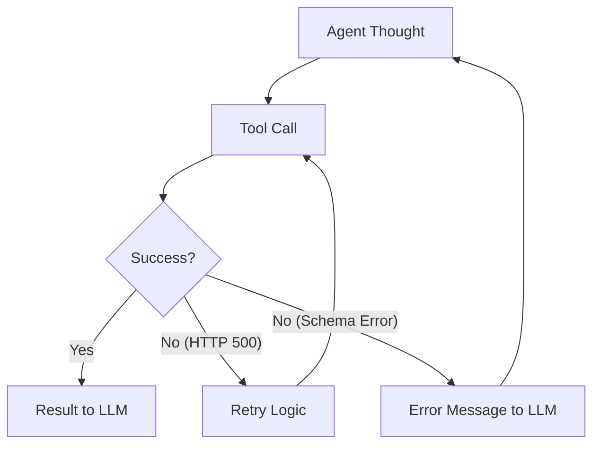

# 🛠️ Tool Error Handling — Building Resilient Agents
> **Level:** Core Engineering | **Language:** Hinglish | **Goal:** Master the techniques to handle tool failures, timeouts, and hallucinations gracefully.

---

## 🧭 1. Beginner-Friendly Hinglish Explanation
Tool Error Handling ka matlab hai **"Galtiyon ko sambhalna"**. 

Socho aapka agent ek web search tool use kar raha hai, par internet chala gaya ya API down hai. Ek "Dumb" agent wahi par crash ho jayega. Lekin ek "Production-Ready" agent:
- Retry karega.
- User ko batayega ki "Abhi technical issue hai."
- Ya phir koi doosra raasta (Alternate tool) dhoondhega.

Agentic AI mein "Error" sirf code ka fail hona nahi hai, balki model ka galat parameters bhej dena bhi ek error hai.

---

## 🧠 2. Deep Technical Explanation
Error handling in agents happens at three levels:
1. **Validation Errors (Client-side):** The LLM generates JSON that doesn't match the schema.
2. **Execution Errors (Runtime):** The tool function throws an exception (HTTP 404, Database timeout).
3. **Reasoning Errors (Logic):** The tool succeeds, but the result is useless for the goal.

**The "Self-Correction" Loop:** When a tool fails, instead of stopping, we feed the error message *back* to the LLM as an "Observation". The LLM then realizes its mistake and tries a different approach.

---

## 🏗️ 3. Architecture Diagrams



---

## 💻 4. Production-Ready Code Example (Self-Correction Loop)

```python
def run_tool_with_retry(tool_name, args):
    try:
        # Simulate a tool that might fail
        if tool_name == "db_search" and not args.get("id"):
            raise ValueError("ID is missing in parameters!")
        return "Success: Record found."
    except Exception as e:
        # Hinglish Logic: Error ko model ko wapas bhej do taaki wo fix kare
        return f"ERROR: Tool execution failed. Message: {str(e)}. Please fix the parameters and retry."

# Observation example:
# Observation: "ERROR: Tool execution failed. Message: ID is missing..."
# Next Thought: "My apologies, I missed the ID. Let me retrieve it first and then call the tool again."
```

---

## 🌍 5. Real-World Use Cases
- **Database Agents:** If a query is slow, the agent tries an optimized version or limits the results.
- **API Orchestrators:** If a paid API fails, the agent switches to a free/alternative version.
- **File System Agents:** If a file is "Read Only", the agent asks for permission or looks for another file.

---

## ❌ 6. Failure Cases
- **Infinite Retry Loop:** Agent baar-baar wahi galat tool call karta rehta hai (Loop death).
- **Silent Failures:** Tool fail hota hai par "Success: None" bhej deta hai, jisse model confuse ho jata hai.
- **Misleading Errors:** Error message itna complex hai ki LLM ko samajh hi nahi aata ki fix kya karna hai.

---

## 🛠️ 7. Debugging Guide
- **Error Injection:** Jan-बूझकर (Intentionally) galat data bhej kar dekhein ki agent kaise behave karta hai.
- **Log Exceptions:** Humesha full stack trace log karein, sirf error message nahi.

---

## ⚖️ 8. Tradeoffs
- **Aggressive Retry:** Higher reliability but higher token cost and latency.
- **Fail Fast:** Cheaper but poor user experience for unstable tools.

---

## ✅ 9. Best Practices
- **User-friendly Errors:** Model ko "HTTP 502" bolne ki jagah "The server is currently busy, please try another tool" boleinh.
- **Max Retries:** Humesha ek counter rakhein (`max_retries=3`) taaki infinite loops na hon.

---

## 🛡️ 10. Security Concerns
- **Error Leakage:** Error messages mein sensitive info (API keys, DB paths) leak ho sakti hai jo LLM user ko bata dega.
- **Injection via Error:** Attacker tool output ko manipulate karke error message mein malicious instructions bhej sakta hai.

---

## 📈 11. Scaling Challenges
- **Backoff Strategies:** Multiple agents ek saath retry karein toh target server crash ho sakta hai (Use Exponential Backoff).

---

## 💰 12. Cost Considerations
- **Token Drain:** Har retry cycle LLM calls add karti hai. Optimize your error messages to be short and clear.

---

## 📝 13. Interview Questions
1. **"Tool error handling mein 'Self-correction' loop kaise kaam karta hai?"**
2. **"Agent loops ko 'Infinite Retry' se kaise bachayenge?"**
3. **"Hallucinated parameters ko detect karne ka best tareeka kya hai?"**

---

## ⚠️ 14. Common Mistakes
- **Hiding Errors:** Exception catch karke kuch na batana.
- **Unstructured Errors:** Model ko raw Python stack trace bhej dena.

---

## 🚀 15. Latest 2026 Industry Patterns
- **Simulated Tool Runs:** Agents running a "Dry Run" of a tool in a sandbox to check for errors before committing to the real execution.
- **Collaborative Debugging:** One agent identifying the error in another agent's tool call and suggesting a fix.

---

> **Expert Tip:** In Agentic AI, **Errors are Context**. The more information you give the model about *why* it failed, the better it will succeed next time.
