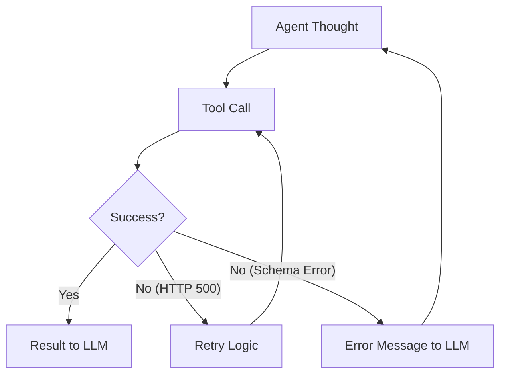

# 🛠️ Tool Error Handling — Resilient Agents Banana
> **Level:** Core Engineering | **Language:** Hinglish | **Goal:** Tool failures, timeouts, aur hallucinations ko gracefully handle karne ki techniques master karna.

---

## 🧭 1. Beginner-Friendly Hinglish Explanation
Tool Error Handling ka matlab hai **"Galtiyon ko sambhalna"**. 

Socho aapka agent ek web search tool use kar raha hai, par internet chala gaya ya API down hai. Ek "Dumb" agent wahi par crash ho jayega. Lekin ek "Production-Ready" agent:
- Retry karega.
- User ko batayega ki "Abhi technical issue hai."
- Ya phir koi doosra raasta (Alternate tool) dhoondhega.

Agentic AI mein "Error" sirf code ka fail hona nahi hai, balki model ka galat parameters bhej dena bhi ek error hai.

---

## 🧠 2. Deep Technical Explanation
Agents me error handling three levels par hoti hai:
1. **Validation Errors (Client-side):** LLM aisa JSON generate karta hai jo schema se match nahi karta.
2. **Execution Errors (Runtime):** Tool function exception throw karta hai (HTTP 404, Database timeout).
3. **Reasoning Errors (Logic):** Tool succeed ho jata hai, lekin result goal ke liye useless hota hai.

**"Self-Correction" Loop:** Jab tool fail hota hai, stop karne ke bajay hum error message ko "Observation" ke roop me LLM ko *back* feed karte hain. Phir LLM apni mistake realize karta hai aur different approach try karta hai.

---

## 🏗️ 3. Architecture Diagrams


```mermaid
graph TD
    A[Agent Thought] --> B[Tool Call]
    B --> C{Success?}
    C -- Yes --> D[Result to LLM]
    C -- No (HTTP 500) --> E[Retry Logic]
    C -- No (Schema Error) --> F[Error Message to LLM]
    F --> A
    E --> B
```

---

## 💻 4. Production-Ready Code Example (Self-Correction Loop)

```python
def run_tool_with_retry(tool_name, args):
    try:
        # Aisa tool simulate karo jo fail ho sakta hai
        if tool_name == "db_search" and not args.get("id"):
            raise ValueError("Parameters me ID missing hai!")
        return "Success: Record mil gaya."
    except Exception as e:
        # Hinglish Logic: Error ko model ko wapas bhej do taaki wo fix kare
        return f"ERROR: Tool execution fail ho gaya. Message: {str(e)}. Parameters fix karke retry karein."

# Observation example:
# Observation: "ERROR: Tool execution fail ho gaya. Message: ID missing hai..."
# Next Thought: "Mujhse ID miss ho gayi. Pehle use retrieve karta hoon, phir tool dobara call karta hoon."
```

---

## 🌍 5. Real-World Use Cases
- **Database Agents:** Agar query slow ho, agent optimized version try karta hai ya results limit karta hai.
- **API Orchestrators:** Agar paid API fail ho, agent free/alternative version par switch karta hai.
- **File System Agents:** Agar file "Read Only" ho, agent permission maangta hai ya doosri file dhoondhta hai.

---

## ❌ 6. Failure Cases
- **Infinite Retry Loop:** Agent baar-baar wahi galat tool call karta rehta hai (Loop death).
- **Silent Failures:** Tool fail hota hai par "Success: None" bhej deta hai, jisse model confuse ho jata hai.
- **Misleading Errors:** Error message itna complex hai ki LLM ko samajh hi nahi aata ki fix kya karna hai.

---

## 🛠️ 7. Debugging Guide
- **Error Injection:** Jaan-boojhkar (intentionally) galat data bhej kar dekhein ki agent kaise behave karta hai.
- **Log Exceptions:** Humesha full stack trace log karein, sirf error message nahi.

---

## ⚖️ 8. Tradeoffs
- **Aggressive Retry:** Higher reliability deta hai, lekin token cost aur latency bhi higher hoti hai.
- **Fail Fast:** Cheaper hota hai, lekin unstable tools ke liye user experience poor hota hai.

---

## ✅ 9. Best Practices
- **User-friendly Errors:** Model ko "HTTP 502" bolne ki jagah "Server abhi busy hai, please doosra tool try karein" bolein.
- **Max Retries:** Humesha ek counter rakhein (`max_retries=3`) taaki infinite loops na hon.

---

## 🛡️ 10. Security Concerns
- **Error Leakage:** Error messages mein sensitive info (API keys, DB paths) leak ho sakti hai jo LLM user ko bata dega.
- **Injection via Error:** Attacker tool output ko manipulate karke error message mein malicious instructions bhej sakta hai.

---

## 📈 11. Scaling Challenges
- **Backoff Strategies:** Multiple agents ek saath retry karein toh target server crash ho sakta hai (Exponential Backoff use karein).

---

## 💰 12. Cost Considerations
- **Token Drain:** Har retry cycle LLM calls add karti hai. Apne error messages ko short aur clear optimize karein.

---

## 📝 13. Interview Questions
1. **"Tool error handling mein 'Self-correction' loop kaise kaam karta hai?"**
2. **"Agent loops ko 'Infinite Retry' se kaise bachayenge?"**
3. **"Hallucinated parameters ko detect karne ka best tareeka kya hai?"**

---

## ⚠️ 14. Common Mistakes
- **Hiding Errors:** Exception catch karke kuch na batana.
- **Unstructured Errors:** Model ko raw Python stack trace bhej dena.

---

## 🚀 15. Latest 2026 Industry Patterns
- **Simulated Tool Runs:** Real execution commit karne se pehle errors check karne ke liye agents sandbox me tool ka "Dry Run" run karte hain.
- **Collaborative Debugging:** Ek agent doosre agent ke tool call me error identify karta hai aur fix suggest karta hai.

---

> **Expert Tip:** Agentic AI me **Errors are Context**. Aap model ko *kyu* fail hua iske baare me jitni better information denge, next time wo utna better succeed karega.
