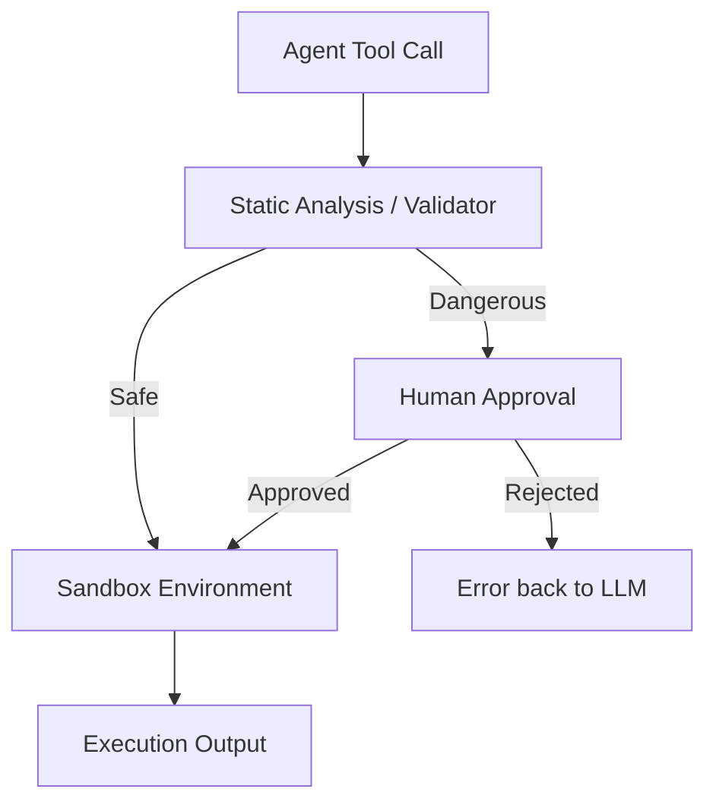

# 🛡️ Tool Execution Safety — Protecting the Environment
> **Level:** Core Engineering | **Language:** Hinglish | **Goal:** Master the techniques to safely execute agent-generated actions and code in production.

---

## 🧭 1. Beginner-Friendly Hinglish Explanation
Tool Execution Safety ka matlab hai **"AI ko khula saand mat chhodo"**. 

Imagine aapne agent ko computer ka access de diya. Agent galti se (ya prompt injection ki wajah se) `delete C:\Windows` command chala sakta hai. 
Safety ka matlab hai agent ko ek **"Pinjare" (Sandbox)** mein rakhna:
- Wo wahi dekh sake jo hum chahte hain.
- Wo bahar ki duniya ko nuksaan na pahucha sake.
- Har dangerous kaam se pehle humse permission le (**Human-in-the-loop**).

---

## 🧠 2. Deep Technical Explanation
Safety in tool execution is built on **Isolation** and **Policy Enforcement**.
- **Sandboxing:** Running code (Python/Bash) generated by an agent in a secure, ephemeral container (e.g., Docker, E2B, or WASM).
- **Human-in-the-loop (HITL):** Implementing an approval node in the state graph for "Critical Tools" (e.g., Payments, Deletion).
- **Static Analysis:** Scanning agent-generated code for malicious patterns (e.g., `os.system`, `subprocess`) before execution.
- **Resource Limits:** Constraining CPU, RAM, and Network access for the tool executor to prevent resource exhaustion or exfiltration.

---

## 🏗️ 3. Architecture Diagrams



---

## 💻 4. Production-Ready Code Example (Human-in-the-Loop Pattern)

```python
def delete_user_record(user_id: int):
    # This is a dangerous tool
    print(f"User {user_id} deleted successfully.")

def execute_with_safety(tool_name, args):
    dangerous_tools = ["delete_user_record", "transfer_funds"]
    
    if tool_name in dangerous_tools:
        # Hinglish Logic: Critical kaam se pehle insaan se pucho
        print(f"⚠️ SECURITY CHECK: Agent wants to call {tool_name} with {args}")
        approval = input("Type 'yes' to approve: ")
        if approval.lower() != 'yes':
            return "ERROR: Action rejected by human supervisor."
    
    # Execute if safe or approved
    if tool_name == "delete_user_record":
        return delete_user_record(args['user_id'])

# execute_with_safety("delete_user_record", {"user_id": 123})
```

---

## 🌍 5. Real-World Use Cases
- **Cloud Management:** Agents can restart servers but need approval to delete them.
- **Financial Agents:** Trading bots can research stocks but need a human to sign off on a $10,000+ trade.
- **Coding Assistants:** Code is executed in a WASM sandbox so it can't access the host machine's files.

---

## ❌ 6. Failure Cases
- **Approval Fatigue:** Insaan itni baar "Yes" dabata hai ki wo galti se "Yes" dabadeta hai bina soche (Safety fail).
- **Sandbox Escape:** Hacker aisi command bhejta hai jo sandbox ki memory se bahar nikal kar host machine ko hack kar le.
- **Oversights in Static Analysis:** `import os` block hai par hacker `__import__('o'+'s')` use karke bypass kar deta hai.

---

## 🛠️ 7. Debugging Guide
- **Audit Logs:** Har tool call, uske parameters, aur approval status ko immutable database mein store karein.
- **Sandbox Monitoring:** Sandbox ki network activity monitor karein for any suspicious outgoing connections.

---

## ⚖️ 8. Tradeoffs
- **High Safety:** Slow development and bad user experience (due to approvals).
- **Low Safety:** Fast but high risk of data loss or system hack.

---

## ✅ 9. Best Practices
- **Ephemeral Environments:** Har code execution ke liye ek naya, fresh sandbox banayein jo kaam ke baad delete ho jaye.
- **Whitelist over Blacklist:** Sirf wo commands allow karein jo safe hain, bajaye iske ki wo block karein jo unsafe hain.

---

## 🛡️ 10. Security Concerns
- **SSRF (Server Side Request Forgery):** Agent tools ko use karke internal networks ko scan kar sakta hai.
- **Data Exfiltration:** Agent galti se sensitive data kisi external URL par bhej sakta hai via `curl` or `requests`.

---

## 📈 11. Scaling Challenges
- **Sandbox Startup Time:** Har request ke liye Docker start karna slow hai (Use Fly.io or WASM for faster start).

---

## 💰 12. Cost Considerations
- **Sandbox Hosting:** Managed sandboxes (like E2B) cost money per execution minute.

---

## 📝 13. Interview Questions
1. **"Human-in-the-loop (HITL) architecture kyu zaruri hai?"**
2. **"Agent-generated code ko safely kaise execute karenge?"**
3. **"Sandbox escape kya hota hai aur use kaise rokenge?"**

---

## ⚠️ 14. Common Mistakes
- **Running as Root:** Tool executor ko admin permissions de dena.
- **No Network Isolation:** Sandbox ko poore internet ka access dena.

---

## 🚀 15. Latest 2026 Industry Patterns
- **Proof-of-Authority (PoA):** Only executing tool calls that have a valid cryptographic signature from a verified agent or human.
- **Autonomous Red Teaming:** Using a separate "Hacker Agent" to constantly try and break the primary agent's safety guardrails.

---

> **Expert Tip:** Safety is not a feature, it's a **Foundation**. If your agent can't fail safely, it shouldn't be in production.
