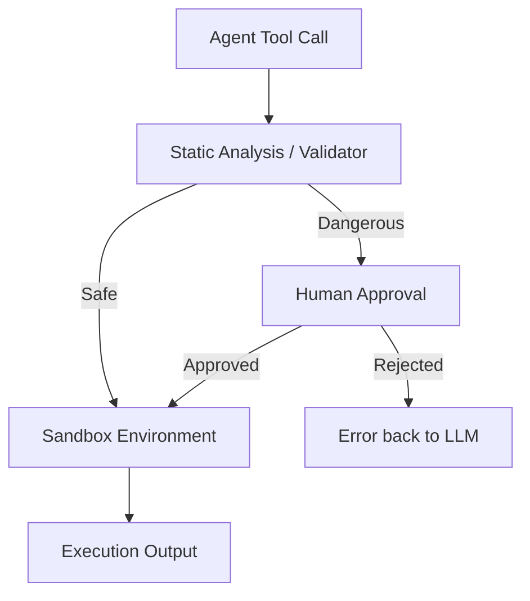

# 🛡️ Tool Execution Safety — Environment Ko Protect Karna
> **Level:** Core Engineering | **Language:** Hinglish | **Goal:** Production me agent-generated actions aur code safely execute karne ki techniques master karna.

---

## 🧭 1. Beginner-Friendly Hinglish Explanation
Tool Execution Safety ka matlab hai **"AI ko khula saand mat chhodo"**. 

Imagine aapne agent ko computer ka access de diya. Agent galti se (ya prompt injection ki wajah se) `delete C:\Windows` command chala sakta hai. 
Safety ka matlab hai agent ko ek **"Pinjare" (Sandbox)** mein rakhna:
- Wo wahi dekh sake jo hum chahte hain.
- Wo bahar ki duniya ko nuksaan na pahucha sake.
- Har dangerous kaam se pehle humse permission le (**Human-in-the-loop**).

---

## 🧠 2. Deep Technical Explanation
Tool execution me safety **Isolation** aur **Policy Enforcement** par built hoti hai.
- **Sandboxing:** Agent dwara generated code (Python/Bash) ko secure, ephemeral container me run karna (e.g., Docker, E2B, ya WASM).
- **Human-in-the-loop (HITL):** "Critical Tools" (e.g., Payments, Deletion) ke liye state graph me approval node implement karna.
- **Static Analysis:** Execution se pehle malicious patterns (e.g., `os.system`, `subprocess`) ke liye agent-generated code scan karna.
- **Resource Limits:** Resource exhaustion ya exfiltration prevent karne ke liye tool executor ke CPU, RAM, aur Network access ko constrain karna.

---

## 🏗️ 3. Architecture Diagrams


```mermaid
graph TD
    A[Agent Tool Call] --> V[Static Analysis / Validator]
    V -->|Dangerous| H[Human Approval]
    V -->|Safe| S[Sandbox Environment]
    H -->|Approved| S
    H -->|Rejected| R[Error back to LLM]
    S --> Result[Execution Output]
```

---

## 💻 4. Production-Ready Code Example (Human-in-the-Loop Pattern)

```python
def delete_user_record(user_id: int):
    # Ye dangerous tool hai
    print(f"User {user_id} successfully delete ho gaya.")

def execute_with_safety(tool_name, args):
    dangerous_tools = ["delete_user_record", "transfer_funds"]
    
    if tool_name in dangerous_tools:
        # Hinglish Logic: Critical kaam se pehle insaan se pucho
        print(f"⚠️ SECURITY CHECK: Agent {tool_name} ko {args} ke saath call karna chahta hai")
        approval = input("Approve karne ke liye 'yes' type karein: ")
        if approval.lower() != 'yes':
            return "ERROR: Human supervisor ne action reject kar diya."
    
    # Safe ya approved ho to execute karein
    if tool_name == "delete_user_record":
        return delete_user_record(args['user_id'])

# execute_with_safety("delete_user_record", {"user_id": 123})
```

---

## 🌍 5. Real-World Use Cases
- **Cloud Management:** Agents servers restart kar sakte hain, lekin delete karne ke liye approval chahiye hota hai.
- **Financial Agents:** Trading bots stocks research kar sakte hain, lekin $10,000+ trade par human sign-off chahiye hota hai.
- **Coding Assistants:** Code WASM sandbox me execute hota hai taaki wo host machine ki files access na kar sake.

---

## ❌ 6. Failure Cases
- **Approval Fatigue:** Insaan itni baar "Yes" dabata hai ki wo galti se "Yes" dabadeta hai bina soche (Safety fail).
- **Sandbox Escape:** Hacker aisi command bhejta hai jo sandbox ki memory se bahar nikal kar host machine ko hack kar le.
- **Oversights in Static Analysis:** `import os` block hai par hacker `__import__('o'+'s')` use karke bypass kar deta hai.

---

## 🛠️ 7. Debugging Guide
- **Audit Logs:** Har tool call, uske parameters, aur approval status ko immutable database mein store karein.
- **Sandbox Monitoring:** Suspicious outgoing connections ke liye sandbox ki network activity monitor karein.

---

## ⚖️ 8. Tradeoffs
- **High Safety:** Development slow hota hai aur approvals ki wajah se user experience bad ho sakta hai.
- **Low Safety:** Fast hota hai, lekin data loss ya system hack ka risk high hota hai.

---

## ✅ 9. Best Practices
- **Ephemeral Environments:** Har code execution ke liye ek naya, fresh sandbox banayein jo kaam ke baad delete ho jaye.
- **Whitelist over Blacklist:** Sirf wo commands allow karein jo safe hain, bajaye iske ki wo block karein jo unsafe hain.

---

## 🛡️ 10. Security Concerns
- **SSRF (Server Side Request Forgery):** Agent tools ko use karke internal networks ko scan kar sakta hai.
- **Data Exfiltration:** Agent galti se sensitive data kisi external URL par bhej sakta hai via `curl` or `requests`.

---

## 📈 11. Scaling Challenges
- **Sandbox Startup Time:** Har request ke liye Docker start karna slow hai (faster start ke liye Fly.io ya WASM use karein).

---

## 💰 12. Cost Considerations
- **Sandbox Hosting:** Managed sandboxes (jaise E2B) per execution minute cost karte hain.

---

## 📝 13. Interview Questions
1. **"Human-in-the-loop (HITL) architecture kyu zaruri hai?"**
2. **"Agent-generated code ko safely kaise execute karenge?"**
3. **"Sandbox escape kya hota hai aur use kaise rokenge?"**

---

## ⚠️ 14. Common Mistakes
- **Root Ke Roop Me Run Karna:** Tool executor ko admin permissions de dena.
- **No Network Isolation:** Sandbox ko poore internet ka access dena.

---

## 🚀 15. Latest 2026 Industry Patterns
- **Proof-of-Authority (PoA):** Sirf un tool calls ko execute karna jinke paas verified agent ya human se valid cryptographic signature ho.
- **Autonomous Red Teaming:** Primary agent ke safety guardrails ko constantly break try karne ke liye separate "Hacker Agent" use karna.

---

> **Expert Tip:** Safety feature nahi, **Foundation** hai. Agar aapka agent safely fail nahi kar sakta, to use production me nahi hona chahiye.
