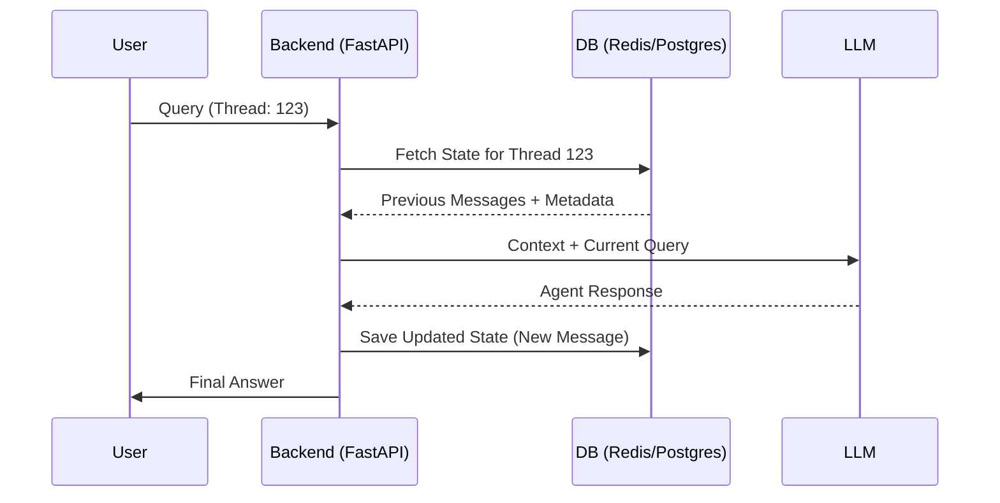

# 💬 Conversation State Management — Tracking the Dialogue
> **Level:** Core Engineering | **Language:** Hinglish | **Goal:** Master the techniques to manage multi-turn dialogues and maintain consistency in complex agent interactions.

---

## 🧭 1. Beginner-Friendly Hinglish Explanation
Conversation State Management ka matlab hai **"Baat-cheet ka hisaab rakhna"**. 

Socho aap ek agent se ticket book karwa rahe ho. 
Step 1: Aapne kaha "Delhi jaana hai." 
Step 2: Agent ne pucha "Kab?" 
Step 3: Aapne kaha "Kal." 
Agar agent bhool jaye ki aapne Step 1 mein "Delhi" bola tha, toh wo "Kal" ka matlab nahi samajh payega. 

State management ensure karta hai ki agent ko hamesha pata ho:
- Hum kahan hain?
- Pichle steps kya the?
- Agla target kya hai?

---

## 🧠 2. Deep Technical Explanation
Dialogue state management in 2026 is handled via **Stateful Agents** using **Thread Isolation**.
- **Thread ID:** Every conversation has a unique identifier. The backend uses this ID to fetch the specific `history` from a database (Redis/Postgres).
- **Turn-taking Logic:** Explicitly managing when the agent should "Stop" and wait for user input vs when it should continue tool execution.
- **Message Truncation:** Managing the growing list of messages by summarizing old ones or removing system-heavy metadata after a turn is finished.
- **Branching States:** For complex flows, the state can branch (e.g., the agent starts two sub-tasks). Managing the "Parent" and "Child" states is critical.

---

## 🏗️ 3. Architecture Diagrams



---

## 💻 4. Production-Ready Code Example (Threaded Message Management)

```python
from typing import List, Dict

# Simulated Database
db: Dict[str, List[dict]] = {}

def get_session_history(thread_id: str) -> List[dict]:
    # Hinglish Logic: Database se puraani baatein nikaalo
    return db.get(thread_id, [])

def save_message(thread_id: str, role: str, content: str):
    if thread_id not in db:
        db[thread_id] = []
    db[thread_id].append({"role": role, "content": content})

def chat_interface(thread_id: str, user_query: str):
    # 1. Load context
    history = get_session_history(thread_id)
    
    # 2. Add new user query
    save_message(thread_id, "user", user_query)
    
    # 3. Simulate LLM response
    response = f"I remember you said: '{history[-1]['content']}'" if history else "Nice to meet you!"
    
    # 4. Save response
    save_message(thread_id, "assistant", response)
    return response

# print(chat_interface("T1", "My name is Sameer."))
# print(chat_interface("T1", "What is my name?"))
```

---

## 🌍 5. Real-World Use Cases
- **Customer Support Bots:** Handling 1000s of simultaneous users, each with their own unique conversation history.
- **Interactive Fiction/Gaming:** Agents that remember your choices and character development throughout the game.

---

## ❌ 6. Failure Cases
- **Thread Mixing:** Galti se User A ki history User B ko dikha dena (Privacy violation).
- **History Bloat:** Itne messages save ho jana ki LLM ka context window crash ho jaye.
- **Out of Order Messages:** Async requests ki wajah se messages galat order mein save ho jana.

---

## 🛠️ 7. Debugging Guide
- **State Visualizer:** LangGraph ka `get_state` use karke dekhein ki har turn ke baad history kaise dikh rahi hai.
- **Thread Logs:** Har log line mein `thread_id` mandatory rakhein.

---

## ⚖️ 8. Tradeoffs
- **Full History:** Most accurate but most expensive and slow.
- **Summarized History:** Token-efficient but might lose subtle details of the conversation.

---

## ✅ 9. Best Practices
- **Atomic Writes:** State ko hamesha ek baar mein save karein (Atomic update) taaki half-saved state ki problem na aaye.
- **Metadata Separation:** Messages alag rakhein aur intermediate reasoning (thoughts) alag metadata mein store karein.

---

## 🛡️ 10. Security Concerns
- **Session Hijacking:** Thread ID guess karke doosre user ki history access karna. Use UUIDs instead of simple numbers.
- **Sensitive History:** Log files mein history store karte waqt PII data ko mask (hide) karein.

---

## 📈 11. Scaling Challenges
- **Redis vs SQL:** High-speed real-time chats ke liye Redis better hai, long-term archival ke liye SQL.
- **Locking:** Same thread par do requests ek saath aayein toh race condition handle karna.

---

## 💰 12. Cost Considerations
- **Storage Cost:** Millions of chats save karne ki cost. Use TTL (Time to Live) for temporary session data.

---

## 📝 13. Interview Questions
1. **"Threaded state management production mein kaise implement karoge?"**
2. **"Message history ko summarize karne ki best strategy kya hai?"**
3. **"Race conditions in multi-agent chat ko kaise rokenge?"**

---

## ⚠️ 14. Common Mistakes
- **No Limit on History:** User se unlimited messages lena aur system crash kar dena.
- **Hard-coded Context:** System prompt ko har user ke liye same rakhna bina context personalize kiye.

---

## 🚀 15. Latest 2026 Industry Patterns
- **Context Caching per Thread:** LLM providers ab thread-based caching offer karte hain jahan shared prefix tokens (System prompt) free hote hain.
- **Branching History:** Allowing users to "Undo" an action and start a new branch from a previous turn.

---

> **Final Note:** Conversation management is about **Continuity**. If the user feels like they are talking to a new person every 5 minutes, you have failed.
