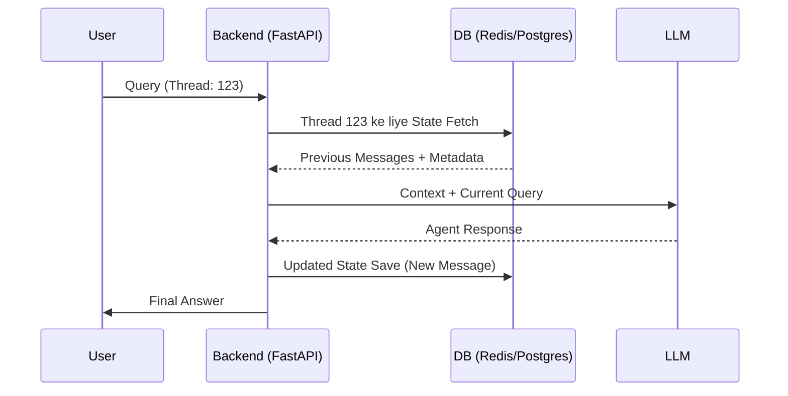

# 💬 Conversation State Management — Dialogue Track Karna
> **Level:** Core Engineering | **Language:** Hinglish | **Goal:** Multi-turn dialogues manage karne aur complex agent interactions me consistency maintain karne ki techniques master karna.

---

## 🧭 1. Beginner-Friendly Hinglish Explanation
Conversation State Management ka matlab hai **"Baat-cheet ka hisaab rakhna"**. 

Socho aap ek agent se ticket book karwa rahe ho. 
Step 1: Aapne kaha "Delhi jaana hai." 
Step 2: Agent ne pucha "Kab?" 
Step 3: Aapne kaha "Kal." 
Agar agent bhool jaye ki aapne Step 1 mein "Delhi" bola tha, toh wo "Kal" ka matlab nahi samajh payega. 

State management ensure karta hai ki agent ko hamesha pata ho:
- Hum kahan hain?
- Pichle steps kya the?
- Agla target kya hai?

---

## 🧠 2. Deep Technical Explanation
2026 me dialogue state management **Thread Isolation** use karne wale **Stateful Agents** ke through handle hota hai.
- **Thread ID:** Har conversation ka unique identifier hota hai. Backend is ID ko database (Redis/Postgres) se specific `history` fetch karne ke liye use karta hai.
- **Turn-taking Logic:** Explicitly manage karna ki agent ko kab "Stop" karke user input ka wait karna chahiye vs kab tool execution continue karna chahiye.
- **Message Truncation:** Turn finish hone ke baad old messages summarize karke ya system-heavy metadata remove karke growing message list manage karna.
- **Branching States:** Complex flows ke liye state branch ho sakti hai (e.g., agent do sub-tasks start karta hai). "Parent" aur "Child" states manage karna critical hai.

---

## 🏗️ 3. Architecture Diagrams


```mermaid
sequenceDiagram
    participant U as User
    participant B as Backend (FastAPI)
    participant D as DB (Redis/Postgres)
    participant L as LLM

    U->>B: Query (Thread: 123)
    B->>D: Thread 123 ke liye State Fetch
    D-->>B: Previous Messages + Metadata
    B->>L: Context + Current Query
    L-->>B: Agent Response
    B->>D: Updated State Save (New Message)
    B->>U: Final Answer
```

---

## 💻 4. Production-Ready Code Example (Threaded Message Management)

```python
from typing import List, Dict

# Simulated database
db: Dict[str, List[dict]] = {}

def get_session_history(thread_id: str) -> List[dict]:
    # Hinglish Logic: Database se puraani baatein nikaalo
    return db.get(thread_id, [])

def save_message(thread_id: str, role: str, content: str):
    if thread_id not in db:
        db[thread_id] = []
    db[thread_id].append({"role": role, "content": content})

def chat_interface(thread_id: str, user_query: str):
    # 1. Context load karein
    history = get_session_history(thread_id)
    
    # 2. New user query add karein
    save_message(thread_id, "user", user_query)
    
    # 3. LLM response simulate karein
    response = f"Mujhe yaad hai aapne kaha tha: '{history[-1]['content']}'" if history else "Aapse milkar accha laga!"
    
    # 4. Response save karein
    save_message(thread_id, "assistant", response)
    return response

# print(chat_interface("T1", "Mera naam Sameer hai."))
# print(chat_interface("T1", "Mera naam kya hai?"))
```

---

## 🌍 5. Real-World Use Cases
- **Customer Support Bots:** 1000s simultaneous users handle karna, jahan har user ki apni unique conversation history hoti hai.
- **Interactive Fiction/Gaming:** Agents jo game throughout aapki choices aur character development remember karte hain.

---

## ❌ 6. Failure Cases
- **Thread Mixing:** Galti se User A ki history User B ko dikha dena (Privacy violation).
- **History Bloat:** Itne messages save ho jana ki LLM ka context window crash ho jaye.
- **Out of Order Messages:** Async requests ki wajah se messages galat order mein save ho jana.

---

## 🛠️ 7. Debugging Guide
- **State Visualizer:** LangGraph ka `get_state` use karke dekhein ki har turn ke baad history kaise dikh rahi hai.
- **Thread Logs:** Har log line mein `thread_id` mandatory rakhein.

---

## ⚖️ 8. Tradeoffs
- **Full History:** Most accurate hoti hai, lekin most expensive aur slow.
- **Summarized History:** Token-efficient hoti hai, lekin conversation ki subtle details lose kar sakti hai.

---

## ✅ 9. Best Practices
- **Atomic Writes:** State ko hamesha ek baar mein save karein (Atomic update) taaki half-saved state ki problem na aaye.
- **Metadata Separation:** Messages alag rakhein aur intermediate reasoning (thoughts) alag metadata mein store karein.

---

## 🛡️ 10. Security Concerns
- **Session Hijacking:** Thread ID guess karke doosre user ki history access karna. Simple numbers ke bajay UUIDs use karein.
- **Sensitive History:** Log files mein history store karte waqt PII data ko mask (hide) karein.

---

## 📈 11. Scaling Challenges
- **Redis vs SQL:** High-speed real-time chats ke liye Redis better hai, long-term archival ke liye SQL.
- **Locking:** Same thread par do requests ek saath aayein toh race condition handle karna.

---

## 💰 12. Cost Considerations
- **Storage Cost:** Millions of chats save karne ki cost. Temporary session data ke liye TTL (Time to Live) use karein.

---

## 📝 13. Interview Questions
1. **"Threaded state management production mein kaise implement karoge?"**
2. **"Message history ko summarize karne ki best strategy kya hai?"**
3. **"Race conditions in multi-agent chat ko kaise rokenge?"**

---

## ⚠️ 14. Common Mistakes
- **No Limit on History:** User se unlimited messages lena aur system crash kar dena.
- **Hard-coded Context:** System prompt ko har user ke liye same rakhna bina context personalize kiye.

---

## 🚀 15. Latest 2026 Industry Patterns
- **Context Caching per Thread:** LLM providers ab thread-based caching offer karte hain jahan shared prefix tokens (System prompt) free hote hain.
- **Branching History:** Users ko action "Undo" karne aur previous turn se new branch start karne dena.

---

> **Final Note:** Conversation management **Continuity** ke baare me hai. Agar user ko lage ki wo har 5 minutes me kisi naye person se baat kar raha hai, to system fail hua hai.
