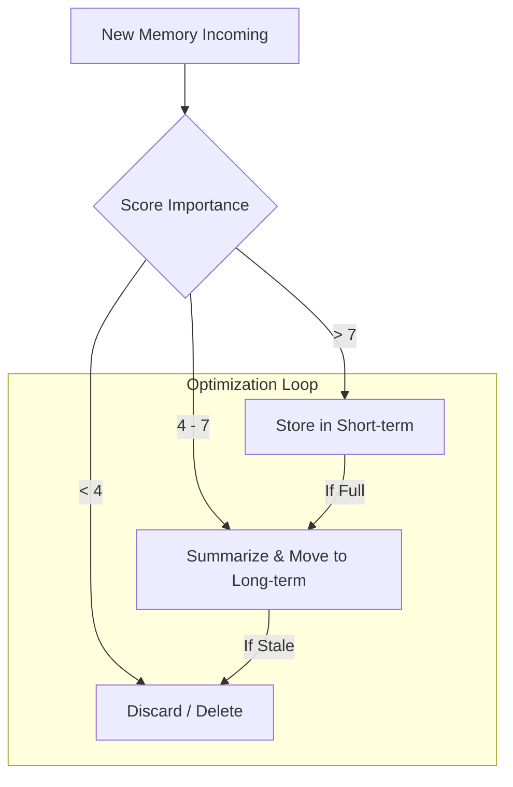

# 📉 Memory Optimization — Pruning the Agent's Mind
> **Level:** Core Engineering | **Language:** Hinglish | **Goal:** Master the techniques to keep agent memory efficient, low-cost, and high-precision through pruning, summarization, and ranking.

---

## 🧭 1. Beginner-Friendly Hinglish Explanation
Memory Optimization ka matlab hai **"Faltu kachra saaf karna"**. 

Agent jaise-jaise user se baat karta hai, uski memory badhti jati hai. Agar hum sab kuch yaad rakhenge, toh do bade nuksaan honge:
1. **Bill bahut badh jayega** (Tokens expensive hain).
2. **Agent confuse ho jayega** (Useless info ki wajah se sahi baat dhoondhna mushkil hoga).

Optimization sikhata hai ki kaise hum "Dudh ka dudh aur pani ka pani" karein—sirf kaam ki baat rakhein aur baaki delete ya summarize kar dein.

---

## 🧠 2. Deep Technical Explanation
Advanced memory optimization involves **Cognitive Pruning** and **Information Compression**.
- **Context Window Management:** Keeping only the last $N$ messages or using **Sliding Window** attention.
- **Incremental Summarization:** Every 10 turns, the agent summarizes the previous 10 messages into a 1-paragraph "State Snapshot" and deletes the raw logs.
- **Importance Scoring:** Using an LLM to score each memory chunk from 1-10. Memories with score < 5 are deleted or moved to cold storage.
- **Semantic Deduplication:** Before adding a new memory to the Vector DB, check if a similar memory already exists. If yes, update it instead of adding a duplicate.
- **Hierarchical Memory:** Moving from "Short-term" to "Medium-term" to "Long-term" storage based on access frequency.

---

## 🏗️ 3. Architecture Diagrams



---

## 💻 4. Production-Ready Code Example (Simple Summarization Logic)

```python
def summarize_old_context(history: list):
    # Hinglish Logic: Purani baaton ka nichod (Summary) nikalo
    to_summarize = history[:-5] # Sab kuch chhod kar last 5 messages rakho
    keep_recent = history[-5:]
    
    summary_text = f"Summary of {len(to_summarize)} messages: [Simulated Summary Content]"
    
    # Return new history with summary at the top
    return [{"role": "system", "content": summary_text}] + keep_recent

# history = [{"role": "user", "content": "..."}] * 20
# optimized_history = summarize_old_context(history)
# print(f"Messages reduced from 20 to {len(optimized_history)}")
```

---

## 🌍 5. Real-World Use Cases
- **Long-term Support Agents:** Summarizing a 3-month long conversation so the agent can quickly understand the "Case History" without reading 5000 messages.
- **Enterprise Search:** Removing duplicate or outdated versions of internal documents from the agent's vector memory.

---

## ❌ 6. Failure Cases
- **Aggressive Summarization:** Summary mein important details (like dates or order IDs) miss ho jate hain.
- **Recursive Hallucination:** Agent summary ki summary banate waqt facts ko badal deta hai (Chinese Whispers effect).
- **Latency Spikes:** Summarization process khud tokens aur time leta hai, jisse user ko response slow milta hai.

---

## 🛠️ 7. Debugging Guide
- **Compare Logs:** Raw history vs Summarized history ko side-by-side rakh kar dekhein ki kya info lose hui.
- **Relevance Metrics:** Retrieval ke waqt "Precision at K" monitor karein. Agar optimization ke baad precision girti hai, toh pruning zyada aggressive hai.

---

## ⚖️ 8. Tradeoffs
- **High Optimization:** Low token cost and low latency but risk of losing critical nuances.
- **No Optimization:** High precision but extremely expensive and eventually crashes the context window.

---

## ✅ 9. Best Practices
- **Never Summarize System Prompts:** Humesha core instructions ko original format mein rakhein.
- **Hybrid Storage:** Use Redis for raw recent messages and Postgres for summarized long-term facts.

---

## 🛡️ 10. Security Concerns
- **Summary Injection:** Attacker summary generation process ko manipulate karke galti se malicious instructions ko "Fact" banwa sakta hai.
- **Data Deletion Policy:** Compliance (GDPR) ke liye memory ko optimize/delete karne ka clear mechanism hona chahiye.

---

## 📈 11. Scaling Challenges
- **Background Processing:** Summarization request/response loop mein nahi, balki background worker (Celery/Redis) mein honi chahiye.

---

## 💰 12. Cost Considerations
- **LLM vs SLM:** Summarization ke liye bade models (GPT-4) ki jagah chote models (Haiku/Flash) use karein to save 90% cost.

---

## 📝 13. Interview Questions
1. **"Memory summarization hallucinations ko kaise rokenge?"**
2. **"FIFO pruning vs Semantic pruning mein kab kya choose karoge?"**
3. **"Token optimization techniques system performance kaise affect karti hain?"**

---

## ⚠️ 14. Common Mistakes
- **Summarizing every turn:** Token consumption badh jayega. Wait for a threshold (e.g., every 20 messages).
- **Losing the 'User Intent':** Summary mein user ka tone ya specific request bhool jana.

---

## 🚀 15. Latest 2026 Industry Patterns
- **Differential Compression:** Only summarizing parts of the context that haven't been accessed recently.
- **Neural Pruning:** Models that are trained to automatically "Forget" irrelevant tokens during the attention phase.

---

> **Expert Tip:** Optimization is about **Signal vs Noise**. Your goal is to maximize the Signal while keeping the Noise (and cost) as low as possible.
