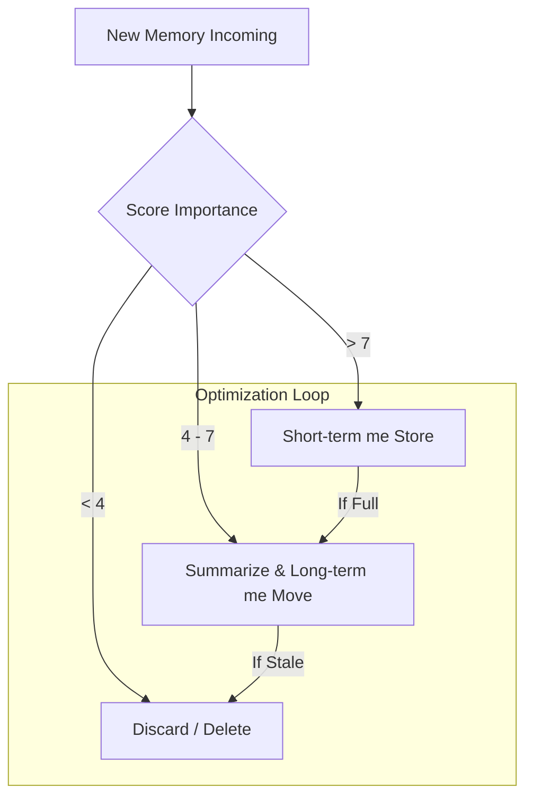

# 📉 Memory Optimization — Agent Ke Mind Ko Prune Karna
> **Level:** Core Engineering | **Language:** Hinglish | **Goal:** Pruning, summarization, aur ranking ke through agent memory ko efficient, low-cost, aur high-precision rakhne ki techniques master karna.

---

## 🧭 1. Beginner-Friendly Hinglish Explanation
Memory Optimization ka matlab hai **"Faltu kachra saaf karna"**. 

Agent jaise-jaise user se baat karta hai, uski memory badhti jati hai. Agar hum sab kuch yaad rakhenge, toh do bade nuksaan honge:
1. **Bill bahut badh jayega** (Tokens expensive hain).
2. **Agent confuse ho jayega** (Useless info ki wajah se sahi baat dhoondhna mushkil hoga).

Optimization sikhata hai ki kaise hum "Dudh ka dudh aur pani ka pani" karein—sirf kaam ki baat rakhein aur baaki delete ya summarize kar dein.

---

## 🧠 2. Deep Technical Explanation
Advanced memory ko optimize karne me **Cognitive Pruning** aur **Information Compression** shamil hota hai.
- **Context Window Management:** Sirf last $N$ messages rakhna ya **Sliding Window** attention use karna.
- **Incremental Summarization:** Har 10 turns par agent previous 10 messages ko 1-paragraph "State Snapshot" me summarize karta hai aur raw logs delete karta hai.
- **Importance Scoring:** Har memory chunk ko 1-10 score dene ke liye LLM use karna. Score < 5 wali memories delete hoti hain ya cold storage me move hoti hain.
- **Semantic Deduplication:** Vector DB me new memory add karne se pehle check karna ki similar memory already exist karti hai ya nahi. Agar haan, duplicate add karne ke bajay use update karo.
- **Hierarchical Memory:** Access frequency ke basis par "Short-term" se "Medium-term" se "Long-term" storage tak move karna.

---

## 🏗️ 3. Architecture Diagrams


```mermaid
graph TD
    M[New Memory Incoming] --> S{Score Importance}
    S -->|> 7| ST[Short-term me Store]
    S -->|4 - 7| LT[Summarize & Long-term me Move]
    S -->|< 4| D[Discard / Delete]
    
    subgraph "Optimization Loop"
    ST -->|If Full| LT
    LT -->|If Stale| D
    end
```

---

## 💻 4. Production-Ready Code Example (Simple Summarization Logic)

```python
def summarize_old_context(history: list):
    # Hinglish Logic: Purani baaton ka nichod (Summary) nikalo
    to_summarize = history[:-5] # Sab kuch chhod kar last 5 messages rakho
    keep_recent = history[-5:]
    
    summary_text = f"{len(to_summarize)} messages ka summary: [Simulated Summary Content]"
    
    # Summary ko top par rakh kar new history return karo
    return [{"role": "system", "content": summary_text}] + keep_recent

# history = [{"role": "user", "content": "..."}] * 20
# optimized_history = summarize_old_context(history)
# print(f"Messages 20 se reduce hokar {len(optimized_history)} ho gaye")
```

---

## 🌍 5. Real-World Use Cases
- **Long-term Support Agents:** 3-month long conversation summarize karna taaki agent 5000 messages read kiye bina "Case History" quickly samajh sake.
- **Enterprise Search:** Agent ki vector memory se internal documents ke duplicate ya outdated versions remove karna.

---

## ❌ 6. Failure Cases
- **Aggressive Summarization:** Summary mein important details (like dates or order IDs) miss ho jate hain.
- **Recursive Hallucination:** Agent summary ki summary banate waqt facts ko badal deta hai (Chinese Whispers effect).
- **Latency Spikes:** Summarization process khud tokens aur time leta hai, jisse user ko response slow milta hai.

---

## 🛠️ 7. Debugging Guide
- **Compare Logs:** Raw history vs Summarized history ko side-by-side rakh kar dekhein ki kya info lose hui.
- **Relevance Metrics:** Retrieval ke waqt "Precision at K" monitor karein. Agar optimization ke baad precision girti hai, toh pruning zyada aggressive hai.

---

## ⚖️ 8. Tradeoffs
- **High Optimization:** Low token cost aur low latency, lekin critical nuances lose hone ka risk.
- **No Optimization:** High precision, lekin extremely expensive aur eventually context window crash kar deta hai.

---

## ✅ 9. Best Practices
- **Never Summarize System Prompts:** Humesha core instructions ko original format mein rakhein.
- **Hybrid Storage:** Raw recent messages ke liye Redis aur summarized long-term facts ke liye Postgres use karein.

---

## 🛡️ 10. Security Concerns
- **Summary Injection:** Attacker summary generation process ko manipulate karke galti se malicious instructions ko "Fact" banwa sakta hai.
- **Data Deletion Policy:** Compliance (GDPR) ke liye memory ko optimize/delete karne ka clear mechanism hona chahiye.

---

## 📈 11. Scaling Challenges
- **Background Processing:** Summarization request/response loop mein nahi, balki background worker (Celery/Redis) mein honi chahiye.

---

## 💰 12. Cost Considerations
- **LLM vs SLM:** Summarization ke liye bade models (GPT-4) ki jagah chote models (Haiku/Flash) use karein to save 90% cost.

---

## 📝 13. Interview Questions
1. **"Memory summarization hallucinations ko kaise rokenge?"**
2. **"FIFO pruning vs Semantic pruning mein kab kya choose karoge?"**
3. **"Token optimization techniques system performance kaise affect karti hain?"**

---

## ⚠️ 14. Common Mistakes
- **Summarizing every turn:** Token consumption badh jayega. Threshold ka wait karein (e.g., every 20 messages).
- **Losing the 'User Intent':** Summary mein user ka tone ya specific request bhool jana.

---

## 🚀 15. Latest 2026 Industry Patterns
- **Differential Compression:** Sirf context ke un parts ko summarize karna jo recently access nahi hue.
- **Neural Pruning:** Aise models jo attention phase ke dauran irrelevant tokens automatically "Forget" karne ke liye trained hote hain.

---

> **Expert Tip:** Optimization **Signal vs Noise** ke baare me hai. Aapka goal Signal maximize karna hai aur Noise (aur cost) ko jitna ho sake low rakhna hai.
