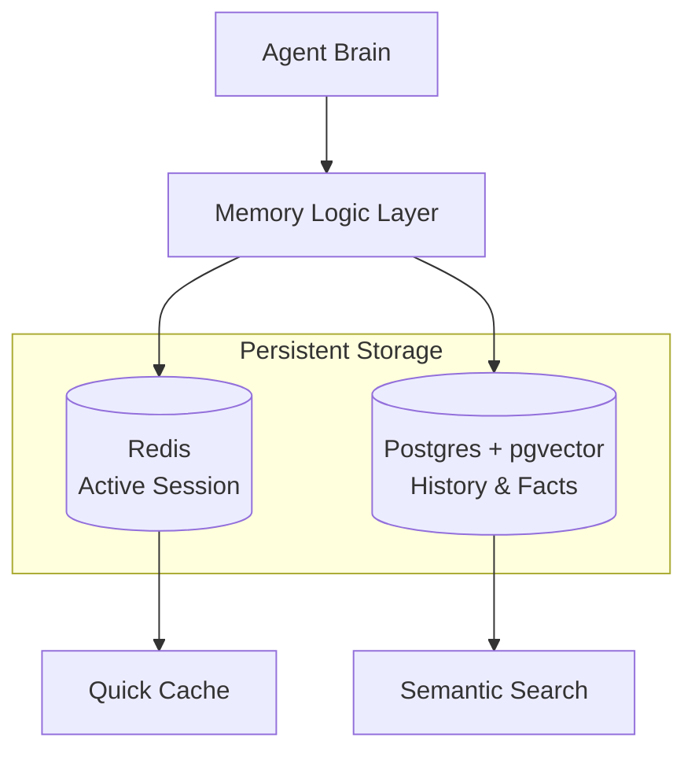

# 💾 Persistent Memory Systems — Building the Agent's Database
> **Level:** Core Engineering | **Language:** Hinglish | **Goal:** Master the infrastructure required to store, retrieve, and manage agent memory using Redis, Postgres, and specialized memory frameworks.

---

## 🧭 1. Beginner-Friendly Hinglish Explanation
Persistent Memory ka matlab hai **"Pakki Yaaddasht"**. 

Agent agar sirf dimaag (LLM) mein info rakhega, toh computer band hote hi sab bhool jayega. Persistent Memory systems agent ko ek **Hard Drive** dete hain. 
- **Redis:** Bahut fast (Instant recall).
- **Postgres:** Bahut reliable (Detailed history).
- **Specialized Systems (Mem0):** Smart memory jo khud decide karti hai kya yaad rakhna hai aur kya bhoolna hai.

Production mein, bina persistence ke aap koi bhi real business app nahi bana sakte.

---

## 🧠 2. Deep Technical Explanation
Persistent memory in 2026 is moving from raw logs to **Structured Knowledge Graphs**.
- **Redis (Cache-based):** Used for session state and fast key-value retrieval. It handles the "Short-term persistence" for active users.
- **Postgres (with pgvector):** The industry standard for "Long-term persistence". It allows storing full message history alongside vector embeddings for hybrid search.
- **Zep / Mem0 Frameworks:** These sit on top of databases. They perform **Automatic Entity Extraction** (e.g., extracting "User works at Google" from a chat) and store it as a fact.
- **Checkpointing:** Specifically in LangGraph, persistence is achieved by saving the `State` object to a durable store after every node execution.

---

## 🏗️ 3. Architecture Diagrams



---

## 💻 4. Production-Ready Code Example (Postgres Persistence with LangGraph)

```python
import sqlite3 # Using SQLite as an example for Postgres
from langgraph.checkpoint.sqlite import SqliteSaver

# In production, use PostgresSaver from langgraph-checkpoint-postgres
def setup_persistence():
    # Hinglish Logic: Ek file/DB banao jahan state save ho sake
    conn = sqlite3.connect("memory.db", check_same_thread=False)
    memory_saver = SqliteSaver(conn)
    return memory_saver

# Usage in Workflow
# workflow = StateGraph(State)
# memory = setup_persistence()
# app = workflow.compile(checkpointer=memory)

# Jab bhi call karein, thread_id dein
# config = {"configurable": {"thread_id": "user_42"}}
# app.invoke(input_data, config)
```

---

## 🌍 5. Real-World Use Cases
- **Enterprise CRM Agents:** Remembering every interaction with a client over 5 years.
- **Health Assistants:** Tracking a patient's symptoms and medication history across months of check-ins.
- **Collaborative Coding:** Multiple agents working on a repo over weeks, remembering why a specific architectural choice was made.

---

## ❌ 6. Failure Cases
- **Database Latency:** Agent 5 seconds tak wait karta hai memory load hone ka (Bad UX).
- **Data Inconsistency:** Agent ko purani state milti hai jabki user ne nayi info de di hai (Sync issue).
- **Storage Explosion:** Billions of small chat rows se database slow ho jana.

---

## 🛠️ 7. Debugging Guide
- **Query the DB:** Direct SQL queries run karke dekhein ki state sahi se save ho rahi hai ya nahi.
- **Check TTL:** Ensure karein ki temporary data actually delete ho raha hai.

---

## ⚖️ 8. Tradeoffs
- **Redis:** Ultra-fast but expensive (RAM usage) and risk of data loss on crash.
- **SQL (Postgres):** Cheaper and robust but slower for real-time turn-by-turn state updates.

---

## ✅ 9. Best Practices
- **Schema Evolution:** Aisa DB design rakhein jo future mein naye fields (like 'sentiment' or 'summary') handle kar sake.
- **Encryption at Rest:** Sensitive memory data ko database mein encrypted format mein store karein.

---

## 🛡️ 10. Security Concerns
- **SQL Injection:** Tool outputs ko direct SQL mein use na karein (use ORMs like SQLAlchemy).
- **Unauthorized Access:** Ensure karein ki ek user doosre user ke persistent thread ko load na kar sake.

---

## 📈 11. Scaling Challenges
- **Vertical vs Horizontal Scaling:** Million concurrent users ke liye database partitioning ya sharding zaruri ho jati hai.

---

## 💰 12. Cost Considerations
- **Managed DB Costs:** AWS RDS ya Pinecone ke monthly bills. Optimization ke liye older logs ko S3 (Cold storage) mein move karein.

---

## 📝 13. Interview Questions
1. **"Redis vs Postgres memory management for agents mein kab kya use karenge?"**
2. **"LangGraph mein 'Checkpointer' kya hota hai?"**
3. **"State persistence system design kaise scale karenge for 1M users?"**

---

## ⚠️ 14. Common Mistakes
- **No Indexing:** History table par `thread_id` par index na banana (Slow queries).
- **Hard-coding Memory:** Agent ke code mein hi variable mein data save karna (Lost on restart).

---

## 🚀 15. Latest 2026 Industry Patterns
- **Vectorized Relational DBs:** Databases like **SurrealDB** or **Postgres** (with pgvector 0.7) that treat vectors and rows as first-class citizens.
- **Cloud-Native Persistence:** Using serverless DBs like **Neon** or **Upstash** that auto-scale for agentic spikes.

---

> **Final Note:** Persistence is about **Trust**. If the agent forgets what the user said 5 minutes ago, the user will stop trusting the agent.
