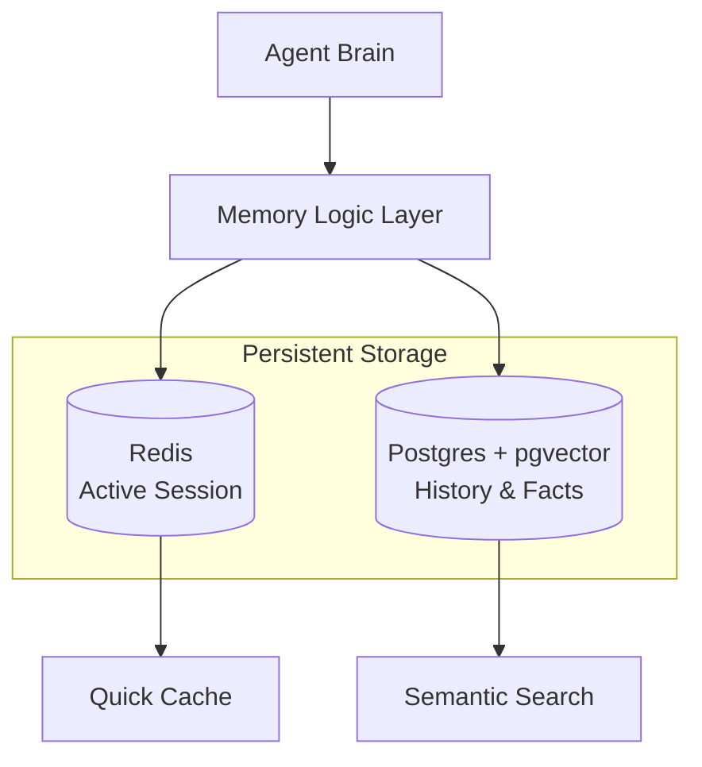

# 💾 Persistent Memory Systems — Agent Ka Database Banana
> **Level:** Core Engineering | **Language:** Hinglish | **Goal:** Redis, Postgres, aur specialized memory frameworks use karke agent memory store, retrieve, aur manage karne ke liye required infrastructure master karna.

---

## 🧭 1. Beginner-Friendly Hinglish Explanation
Persistent Memory ka matlab hai **"Pakki Yaaddasht"**. 

Agent agar sirf dimaag (LLM) mein info rakhega, toh computer band hote hi sab bhool jayega. Persistent Memory systems agent ko ek **Hard Drive** dete hain. 
- **Redis:** Bahut fast (Instant recall).
- **Postgres:** Bahut reliable (Detailed history).
- **Specialized Systems (Mem0):** Smart memory jo khud decide karti hai kya yaad rakhna hai aur kya bhoolna hai.

Production mein, bina persistence ke aap koi bhi real business app nahi bana sakte.

---

## 🧠 2. Deep Technical Explanation
2026 me persistent memory raw logs se **Structured Knowledge Graphs** ki taraf move kar rahi hai.
- **Redis (Cache-based):** Session state aur fast key-value retrieval ke liye use hota hai. Active users ke liye ye "Short-term persistence" handle karta hai.
- **Postgres (with pgvector):** "Long-term persistence" ke liye industry standard. Ye hybrid search ke liye vector embeddings ke saath full message history store karne deta hai.
- **Zep / Mem0 Frameworks:** Ye databases ke top par sit karte hain. Ye **Automatic Entity Extraction** perform karte hain (e.g., chat se "User works at Google" extract karna) aur use fact ke roop me store karte hain.
- **Checkpointing:** Specifically LangGraph me, har node execution ke baad `State` object ko durable store me save karke persistence achieve hoti hai.

---

## 🏗️ 3. Architecture Diagrams


```mermaid
graph TD
    A[Agent Brain] --> LB[Memory Logic Layer]
    LB --> R[(Redis\nActive Session)]
    LB --> PG[(Postgres + pgvector\nHistory & Facts)]
    PG --> S[Semantic Search]
    R --> C[Quick Cache]
    
    subgraph "Persistent Storage"
    R
    PG
    end
```

---

## 💻 4. Production-Ready Code Example (Postgres Persistence with LangGraph)

```python
import sqlite3 # Postgres ke example ke liye SQLite use kar rahe hain
from langgraph.checkpoint.sqlite import SqliteSaver

# Production me langgraph-checkpoint-postgres se PostgresSaver use karein
def setup_persistence():
    # Hinglish Logic: Ek file/DB banao jahan state save ho sake
    conn = sqlite3.connect("memory.db", check_same_thread=False)
    memory_saver = SqliteSaver(conn)
    return memory_saver

# Workflow me usage
# workflow = StateGraph(State)
# memory = setup_persistence()
# app = workflow.compile(checkpointer=memory)

# Jab bhi call karein, thread_id dein
# config = {"configurable": {"thread_id": "user_42"}}
# app.invoke(input_data, config)
```

---

## 🌍 5. Real-World Use Cases
- **Enterprise CRM Agents:** Client ke saath 5 years tak har interaction remember karna.
- **Health Assistants:** Months of check-ins across patient ke symptoms aur medication history track karna.
- **Collaborative Coding:** Multiple agents weeks tak repo par kaam karte hain aur remember karte hain ki specific architectural choice kyu ki gayi thi.

---

## ❌ 6. Failure Cases
- **Database Latency:** Agent 5 seconds tak wait karta hai memory load hone ka (Bad UX).
- **Data Inconsistency:** Agent ko purani state milti hai jabki user ne nayi info de di hai (Sync issue).
- **Storage Explosion:** Billions of small chat rows se database slow ho jana.

---

## 🛠️ 7. Debugging Guide
- **Query the DB:** Direct SQL queries run karke dekhein ki state sahi se save ho rahi hai ya nahi.
- **Check TTL:** Ensure karein ki temporary data actually delete ho raha hai.

---

## ⚖️ 8. Tradeoffs
- **Redis:** Ultra-fast, lekin expensive (RAM usage) aur crash par data loss ka risk.
- **SQL (Postgres):** Cheaper aur robust, lekin real-time turn-by-turn state updates ke liye slower.

---

## ✅ 9. Best Practices
- **Schema Evolution:** Aisa DB design rakhein jo future mein naye fields (like 'sentiment' or 'summary') handle kar sake.
- **Encryption at Rest:** Sensitive memory data ko database mein encrypted format mein store karein.

---

## 🛡️ 10. Security Concerns
- **SQL Injection:** Tool outputs ko direct SQL me use na karein (SQLAlchemy jaise ORMs use karein).
- **Unauthorized Access:** Ensure karein ki ek user doosre user ke persistent thread ko load na kar sake.

---

## 📈 11. Scaling Challenges
- **Vertical vs Horizontal Scaling:** Million concurrent users ke liye database partitioning ya sharding zaruri ho jati hai.

---

## 💰 12. Cost Considerations
- **Managed DB Costs:** AWS RDS ya Pinecone ke monthly bills. Optimization ke liye older logs ko S3 (Cold storage) mein move karein.

---

## 📝 13. Interview Questions
1. **"Redis vs Postgres memory management for agents mein kab kya use karenge?"**
2. **"LangGraph mein 'Checkpointer' kya hota hai?"**
3. **"State persistence system design kaise scale karenge for 1M users?"**

---

## ⚠️ 14. Common Mistakes
- **No Indexing:** History table par `thread_id` par index na banana (Slow queries).
- **Hard-coding Memory:** Agent ke code mein hi variable mein data save karna (Lost on restart).

---

## 🚀 15. Latest 2026 Industry Patterns
- **Vectorized Relational DBs:** **SurrealDB** ya **Postgres** (pgvector 0.7 ke saath) jaise databases jo vectors aur rows ko first-class citizens ki tarah treat karte hain.
- **Cloud-Native Persistence:** **Neon** ya **Upstash** jaise serverless DBs use karna jo agentic spikes ke liye auto-scale karte hain.

---

> **Final Note:** Persistence **Trust** ke baare me hai. Agar agent 5 minutes pehle user ne kya kaha bhool jata hai, user agent par trust karna band kar dega.
