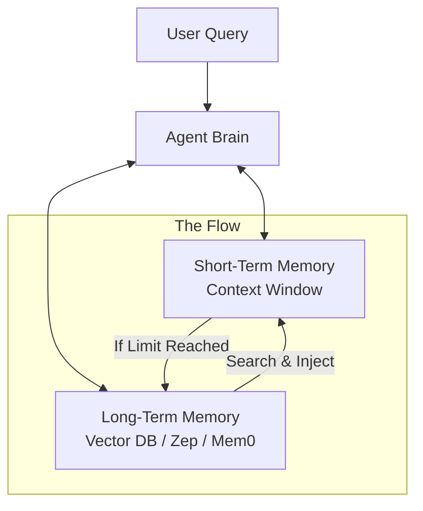

# 🧠 Short-Term vs Long-Term Memory — The Agent's Recall System
> **Level:** Core Engineering | **Language:** Hinglish | **Goal:** Master the architectures that allow agents to remember context both within and across sessions.

---

## 🧭 1. Beginner-Friendly Hinglish Explanation
Agent ki memory uske dimaag ka wo hissa hai jo "Puraani baatein" yaad rakhta hai. 

- **Short-Term Memory (RAM):** Ye current conversation hai. Jaise aap ek dost se baat kar rahe ho aur wo 2 minute pehle wali baat yaad rakhta hai. Lekin agar aap kal miloge, toh wo shayad bhool jaye (agar context window khatam ho gayi).
- **Long-Term Memory (Hard Drive):** Ye wo baatein hain jo humesha ke liye yaad rakhni hain. Jaise user ka naam, uski preferences, ya pichle mahine ki problem ka solution. 

2026 mein, agents ko sirf current chat nahi, balki "Life-long Learning" ki capability chahiye.

---

## 🧠 2. Deep Technical Explanation
Memory in agents is a multi-tier architecture:
- **Short-Term (Context Window):** This is the active context. It uses the LLM's attention mechanism to process the most recent tokens. It is highly precise but limited by the **Context Window Size** (e.g., 128k or 1M tokens).
- **Long-Term (Retrieval Augmented):** This uses **Vector Databases** (Pinecone, Weaviate) or **Graph Databases**. When the agent needs something from the past, it performs a **Semantic Search** to pull relevant snippets back into the short-term context.
- **Working Memory:** A special scratchpad where the agent stores intermediate reasoning results (like a mathematical calculation or a plan) that don't need to stay in the chat history but are needed for the current step.

---

## 🏗️ 3. Architecture Diagrams



---

## 💻 4. Production-Ready Code Example (Memory Tiering)

```python
class AgentMemory:
    def __init__(self):
        self.short_term = [] # RAM
        self.long_term = {}  # Simulated Hard Drive (Vector DB)

    def add_to_memory(self, user_id, message):
        # 1. Add to active context
        self.short_term.append(message)
        
        # 2. Logic to move to Long-term (Hinglish: Agar important hai toh save karo)
        if "preference" in message.lower():
            key = f"pref_{user_id}"
            self.long_term[key] = message
            print(f"Long-term memory updated: {message}")

    def get_context(self, user_id):
        # Combine short-term and relevant long-term
        pref = self.long_term.get(f"pref_{user_id}", "")
        return f"User Preference: {pref}\nRecent Chat: {self.short_term[-5:]}"

# mem = AgentMemory()
# mem.add_to_memory("user_1", "I prefer vegetarian food.")
# print(mem.get_context("user_1"))
```

---

## 🌍 5. Real-World Use Cases
- **Personal AI Tutors:** Remembering a student's weak subjects from the last 10 lessons (Long-term) and answering the current question (Short-term).
- **Coding Agents:** Remembering the project structure (Long-term) while writing the current function (Short-term).

---

## ❌ 6. Failure Cases
- **Memory Hallucination:** Agent long-term memory se galat info fetch karke use sach maan leta hai.
- **Context Pollution:** Long-term memory se itni zyada irrelevant info fetch karna ki Short-term memory (Context) bhar jaye.
- **Privacy Leak:** Ek user ki memory galti se doosre user ke context mein chali jana.

---

## 🛠️ 7. Debugging Guide
- **Memory Trace:** Tool use karke dekhein ki retriever ne long-term memory se kya "Top K" results nikale.
- **Similarity Score:** Vector search ke similarity scores check karein. Agar score 0.5 se kam hai, toh memory discard karein.

---

## ⚖️ 8. Tradeoffs
- **More Long-term Memory:** Better personalization but higher latency and cost (Retrieval steps).
- **Large Context Window:** Higher reasoning quality but prone to "Lost in the middle" and very expensive.

---

## ✅ 9. Best Practices
- **Summarization:** Long-term memory mein poori chat save karne ki jagah uska "Key Points Summary" save karein.
- **Metadata Tagging:** Memory ko timestamps aur categories ke saath tag karein for better filtering.

---

## 🛡️ 10. Security Concerns
- **Sensitive Data Storage:** PII data (Passwords, SSN) ko memory mein save na hone dein.
- **Memory Poisoning:** Hacker agent ko aisi baatein batata hai jo agent "Fact" samajh kar memory mein save kar leta hai aur future mein use karta hai.

---

## 📈 11. Scaling Challenges
- **Vector Indexing:** Million users ki memory ko real-time index aur search karna.
- **Consistency:** Database updates mein lag (delay) hone se agent ko purani memory mil sakti hai.

---

## 💰 12. Cost Considerations
- **Vector DB Pricing:** Monthly cost based on index size and query volume.
- **Compute Cost:** Every memory retrieval is an extra LLM call for "Re-ranking" or "Selection".

---

## 📝 13. Interview Questions
1. **"Short-term vs Long-term memory mein architecture differences kya hain?"**
2. **"Vector DB memory retrieval mein 'Hallucination' kaise trigger hoti hai?"**
3. **"Mem0 ya Zep jaise specialized memory systems kyu use karein?"**

---

## ⚠️ 14. Common Mistakes
- **No Pruning:** Memory ko hamesha badhne dena (It will get slower and more expensive over time).
- **Direct Injection:** Retrieval results ko bina validation ke model ko bhej dena.

---

## 🚀 15. Latest 2026 Industry Patterns
- **Mem0 (Personalized Intelligence):** A graph-based memory that learns user preferences dynamically across every interaction.
- **Episodic Memory:** Agents that can "Replay" a past success or failure scenario to improve their current decision.

---

> **Expert Tip:** Memory is about **Relevance**, not Volume. A 100GB memory is useless if the agent can't find the 10 bytes that matter right now.
