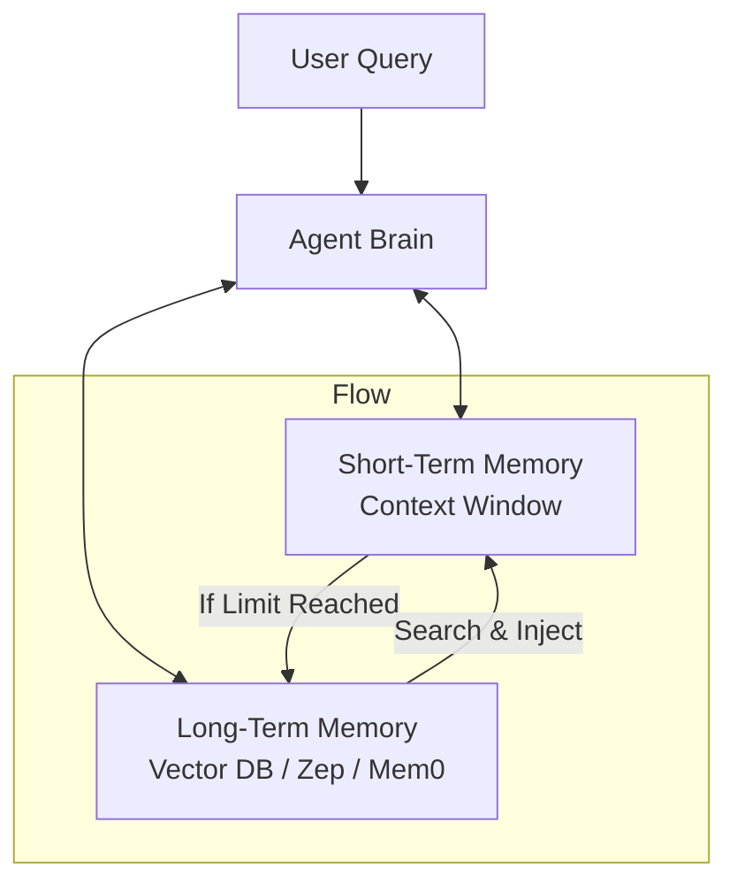

# 🧠 Short-Term vs Long-Term Memory — Agent Ka Recall System
> **Level:** Core Engineering | **Language:** Hinglish | **Goal:** Aisi architectures master karna jo agents ko sessions ke andar aur across context remember karne deti hain.

---

## 🧭 1. Beginner-Friendly Hinglish Explanation
Agent ki memory uske dimaag ka wo hissa hai jo "Puraani baatein" yaad rakhta hai. 

- **Short-Term Memory (RAM):** Ye current conversation hai. Jaise aap ek dost se baat kar rahe ho aur wo 2 minute pehle wali baat yaad rakhta hai. Lekin agar aap kal miloge, toh wo shayad bhool jaye (agar context window khatam ho gayi).
- **Long-Term Memory (Hard Drive):** Ye wo baatein hain jo humesha ke liye yaad rakhni hain. Jaise user ka naam, uski preferences, ya pichle mahine ki problem ka solution. 

2026 mein, agents ko sirf current chat nahi, balki "Life-long Learning" ki capability chahiye.

---

## 🧠 2. Deep Technical Explanation
Agents me memory ek multi-tier architecture hoti hai:
- **Short-Term (Context Window):** Ye active context hota hai. Ye most recent tokens process karne ke liye LLM ka attention mechanism use karta hai. Ye highly precise hota hai, lekin **Context Window Size** (e.g., 128k ya 1M tokens) se limited hota hai.
- **Long-Term (Retrieval Augmented):** Ye **Vector Databases** (Pinecone, Weaviate) ya **Graph Databases** use karta hai. Jab agent ko past se kuch chahiye hota hai, ye relevant snippets ko short-term context me wapas pull karne ke liye **Semantic Search** perform karta hai.
- **Working Memory:** Ek special scratchpad jahan agent intermediate reasoning results store karta hai (jaise mathematical calculation ya plan) jo chat history me rehne ki zarurat nahi rakhte, lekin current step ke liye needed hote hain.

---

## 🏗️ 3. Architecture Diagrams


```mermaid
graph TD
    U[User Query] --> A[Agent Brain]
    A <--> ST[Short-Term Memory\nContext Window]
    A <--> LT[Long-Term Memory\nVector DB / Zep / Mem0]
    
    subgraph "Flow"
    ST -->|If Limit Reached| LT
    LT -->|Search & Inject| ST
    end
```

---

## 💻 4. Production-Ready Code Example (Memory Tiering)

```python
class AgentMemory:
    def __init__(self):
        self.short_term = [] # RAM
        self.long_term = {}  # Simulated Hard Drive (Vector DB)

    def add_to_memory(self, user_id, message):
        # 1. Active context me add karein
        self.short_term.append(message)
        
        # 2. Long-term me move karne ki logic (agar important hai to save karo)
        if "preference" in message.lower():
            key = f"pref_{user_id}"
            self.long_term[key] = message
            print(f"Long-term memory update hui: {message}")

    def get_context(self, user_id):
        # Short-term aur relevant long-term combine karein
        pref = self.long_term.get(f"pref_{user_id}", "")
        return f"User Preference: {pref}\nRecent Chat: {self.short_term[-5:]}"

# mem = AgentMemory()
# mem.add_to_memory("user_1", "Mujhe vegetarian food pasand hai.")
# print(mem.get_context("user_1"))
```

---

## 🌍 5. Real-World Use Cases
- **Personal AI Tutors:** Last 10 lessons se student ke weak subjects remember karna (Long-term) aur current question answer karna (Short-term).
- **Coding Agents:** Current function likhte waqt project structure remember karna (Long-term).

---

## ❌ 6. Failure Cases
- **Memory Hallucination:** Agent long-term memory se galat info fetch karke use sach maan leta hai.
- **Context Pollution:** Long-term memory se itni zyada irrelevant info fetch karna ki Short-term memory (Context) bhar jaye.
- **Privacy Leak:** Ek user ki memory galti se doosre user ke context mein chali jana.

---

## 🛠️ 7. Debugging Guide
- **Memory Trace:** Tool use karke dekhein ki retriever ne long-term memory se kya "Top K" results nikale.
- **Similarity Score:** Vector search ke similarity scores check karein. Agar score 0.5 se kam hai, toh memory discard karein.

---

## ⚖️ 8. Tradeoffs
- **More Long-term Memory:** Better personalization, lekin higher latency aur cost (retrieval steps).
- **Large Context Window:** Higher reasoning quality, lekin "Lost in the middle" ke liye prone aur very expensive.

---

## ✅ 9. Best Practices
- **Summarization:** Long-term memory mein poori chat save karne ki jagah uska "Key Points Summary" save karein.
- **Metadata Tagging:** Memory ko timestamps aur categories ke saath tag karein for better filtering.

---

## 🛡️ 10. Security Concerns
- **Sensitive Data Storage:** PII data (Passwords, SSN) ko memory mein save na hone dein.
- **Memory Poisoning:** Hacker agent ko aisi baatein batata hai jo agent "Fact" samajh kar memory mein save kar leta hai aur future mein use karta hai.

---

## 📈 11. Scaling Challenges
- **Vector Indexing:** Million users ki memory ko real-time index aur search karna.
- **Consistency:** Database updates mein lag (delay) hone se agent ko purani memory mil sakti hai.

---

## 💰 12. Cost Considerations
- **Vector DB Pricing:** Index size aur query volume ke basis par monthly cost.
- **Compute Cost:** Har memory retrieval "Re-ranking" ya "Selection" ke liye extra LLM call hota hai.

---

## 📝 13. Interview Questions
1. **"Short-term vs Long-term memory mein architecture differences kya hain?"**
2. **"Vector DB memory retrieval mein 'Hallucination' kaise trigger hoti hai?"**
3. **"Mem0 ya Zep jaise specialized memory systems kyu use karein?"**

---

## ⚠️ 14. Common Mistakes
- **No Pruning:** Memory ko hamesha badhne dena (time ke saath ye slower aur more expensive ho jayegi).
- **Direct Injection:** Retrieval results ko bina validation ke model ko bhej dena.

---

## 🚀 15. Latest 2026 Industry Patterns
- **Mem0 (Personalized Intelligence):** Graph-based memory jo har interaction across user preferences dynamically learn karti hai.
- **Episodic Memory:** Agents jo current decision improve karne ke liye past success ya failure scenario "Replay" kar sakte hain.

---

> **Expert Tip:** Memory **Relevance** ke baare me hai, volume ke baare me nahi. 100GB memory useless hai agar agent right now matter karne wale 10 bytes find nahi kar sakta.
